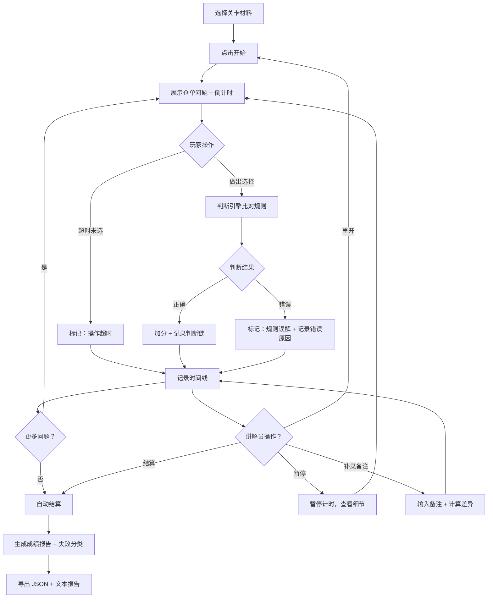

## 1. 产品概述

"期货仓单抢修队"是一款面向科普馆教学场景的浏览器交互工具，帮助讲解员小夏将老师错题本中的零散材料转化为可互动、可复盘的教学流程。工具通过模拟期货仓单业务的应急处理场景，让学员在限时决策中理解规则、锻炼响应速度，并完整记录每一步判断过程供后续复盘。

- **核心价值**：将静态错题本转化为动态教学演练，判断过程可追溯、失败原因可量化、复盘结果可导出
- **目标用户**：科普馆讲解员（操作）、授课老师（评分备注）、学员（参与演练）、后续教研人员（查阅复盘）

## 2. 核心功能

### 2.1 用户角色

| 角色 | 使用方式 | 核心能力 |
|------|----------|----------|
| 讲解员小夏 | 前台操作 | 载入关卡、控制流程、补录备注、导出结果 |
| 授课老师 | 提供材料 | 预置关卡参数、评分备注标准 |
| 学员 | 参与演练 | 限时做出操作选择 |
| 教研人员 | 查阅复盘 | 查看历史记录、理解判断逻辑 |

### 2.2 功能模块

1. **演练控制台**：开始、暂停、重开、结算四大控制，实时显示倒计时与当前状态
2. **决策面板**：展示当前仓单问题、可选操作、玩家选择记录
3. **判断引擎**：实时比对玩家操作与规则，给出中间判断与原因
4. **时间线回放**：完整记录每一步操作、判断、评分，支持逐帧回放
5. **结算与导出**：生成"人话版"成绩报告，区分规则误解 vs 操作超时，支持 JSON + 文本双格式导出
6. **备注补录**：支持讲解员在演练中临时追加备注，自动计算补录前后差异

### 2.3 页面详情

| 页面名称 | 模块名称 | 功能描述 |
|----------|----------|----------|
| 主演练页 | 控制台区 | 四大控制按钮（开始/暂停/重开/结算）、关卡选择、倒计时显示 |
| 主演练页 | 问题展示区 | 当前仓单问题描述、规则提示、可选操作按钮 |
| 主演练页 | 实时判断区 | 每次选择后立即显示判断结果、原因、扣分项 |
| 主演练页 | 时间线区 | 按时间顺序展示所有操作、判断、备注，支持点击回放 |
| 结算弹窗 | 成绩总览 | 总分、正确率、平均响应时间、失败类型分布 |
| 结算弹窗 | 失败分析 | 逐条列出失败项，标注"规则误解"或"操作超时"及具体原因 |
| 结算弹窗 | 导出面板 | 一键导出 JSON（含完整判断链）和可读文本报告 |
| 备注补录弹窗 | 补录表单 | 选择时间点、输入备注、自动计算差异说明 |

## 3. 核心流程

### 3.1 主流程描述

1. 讲解员从关卡库选择一组"期货仓单抢修队"材料（含关卡参数、玩家选择记录、评分备注）
2. 点击"开始"启动演练，倒计时开始，按顺序展示仓单问题
3. 玩家（或预录记录）在限时内选择操作，判断引擎实时给出判断与原因
4. 讲解员可随时"暂停"查看细节、"重开"回到起点，或提前"结算"
5. 演练中讲解员可随时在任意时间点补录备注，系统自动标记补录位置并生成差异说明
6. 所有操作、判断、备注、计时数据完整记录于时间线
7. 结算时系统统计成绩，区分"规则误解"与"操作超时"两类失败
8. 导出包含完整判断链的 JSON 和"人话版"文本报告，便于后续人员理解

### 3.2 流程图

## 4. 用户界面设计

### 4.1 设计风格

- **美学方向**：工业应急指挥风格，深色主题配琥珀色强调，营造"抢修队"的紧张专业感
- **主色调**：深炭灰 `#1a1a1a` 背景，琥珀橙 `#f59e0b` 强调，警报红 `#ef4444` 标记错误，成功绿 `#10b981` 标记正确
- **排版**：等宽字体 `JetBrains Mono` 显示数据与时间，`Noto Sans SC` 作为正文字体，清晰的信息层级
- **按钮风格**：立体工业按钮，带边框和发光 hover 效果，控制按钮用醒目的色块区分
- **布局**：三栏布局——左控制台、中问题区、右时间线，信息密度适中但层次感强
- **动效**：倒计时紧张感动画（最后10秒红光闪烁）、判断结果滑入动画、时间线节点点亮效果

### 4.2 页面设计概述

| 页面名称 | 模块名称 | UI 元素 |
|----------|----------|----------|
| 主演练页 | 控制台区 | 四个大按钮（开始琥珀色、暂停灰色、重开蓝色、结算红色），关卡选择下拉，大号倒计时数字，状态指示灯 |
| 主演练页 | 问题展示区 | 卡片式问题描述，规则提示折叠面板，2-4个操作大按钮，每个按钮带快捷键提示 |
| 主演练页 | 实时判断区 | 判断结果横幅（绿/红），原因说明文本，扣分项标签，规则引用条目 |
| 主演练页 | 时间线区 | 垂直时间线，每个节点带时间戳、操作摘要、状态图标，点击展开详情，当前节点高亮 |
| 结算弹窗 | 成绩总览 | 大号总分，环形进度图显示正确率，数据卡片显示平均响应时间、失败类型分布饼图 |
| 结算弹窗 | 失败分析 | 列表形式，每条带失败类型标签（橙=超时，红=规则）、具体原因、关联规则编号 |
| 结算弹窗 | 导出面板 | 两个导出按钮，JSON 含技术字段说明，文本预览框显示"人话版"报告 |
| 备注补录弹窗 | 补录表单 | 时间点选择器，备注输入框，差异预览区显示补录前后对比 |

### 4.3 响应性

- **桌面优先**：1280px 以上为三栏完整布局
- **平板适配**：1024px 以下改为上下布局，时间线移至底部可折叠
- **触控优化**：操作按钮最小 48x48px，重要按钮加大触控区域

## 5. 数据与规则说明

### 5.1 测试用例覆盖

| 测试场景 | 验证目的 | 数据样例 |
|----------|----------|----------|
| 空值处理 | 字段缺失时的鲁棒性 | 某条记录 `playerChoice` 为 `null`，`ruleReference` 为空字符串 |
| 重复项处理 | 重复操作的识别与合并 | 同一时间戳出现两条相同选择记录 |
| 边界记录 | 临界时间点的判断 | 玩家选择发生在倒计时 0ms 时刻，判断是否算超时 |
| 补录差异 | 备注追加后的对比 | 先跑完基础流程，再在第3步补录"学员犹豫了5秒"，生成差异说明 |

### 5.2 失败类型判定规则

1. **操作超时**：玩家未在规定时间内做出选择，或选择时间 > 时间限制
2. **规则误解**：玩家做出了选择，但不符合该场景下的正确操作规则
3. 判断引擎必须为每次失败给出至少一条具体原因，引用相关规则编号
