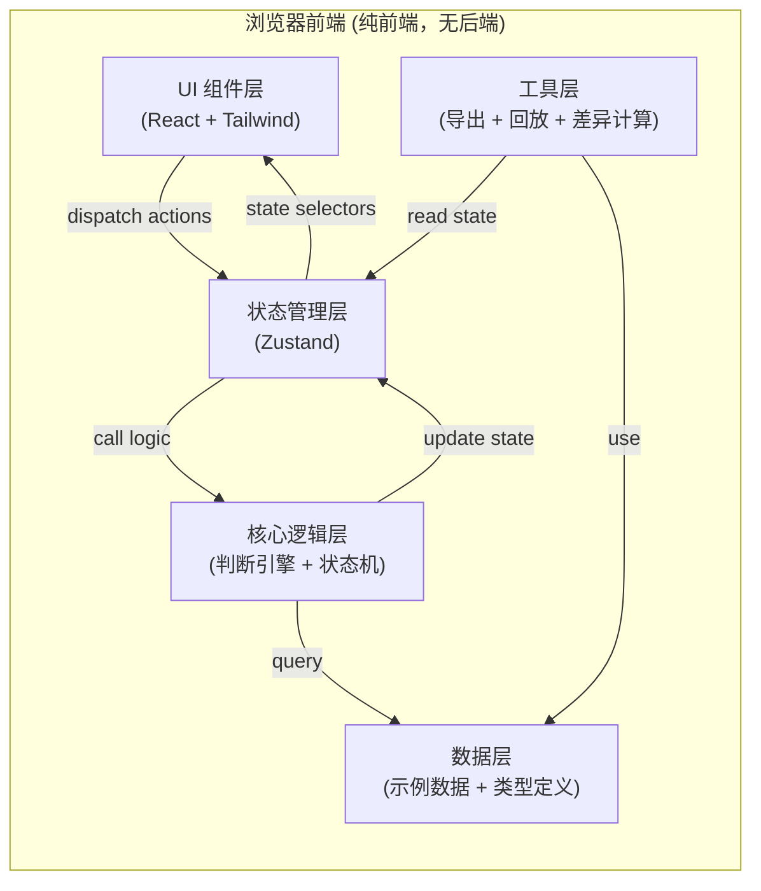

## 1. 架构设计



## 2. 技术描述

- **前端框架**：React@18 + TypeScript + Vite@5
- **样式方案**：Tailwind CSS@3
- **状态管理**：Zustand（轻量级，适合单页应用）
- **图标库**：Lucide React
- **后端**：无（纯浏览器应用，数据本地存储于 localStorage）
- **数据**：内置示例关卡数据，支持 JSON 导入导出
- **初始化工具**：vite-init

## 3. 路由定义

| 路由 | 页面 | 说明 |
|------|------|------|
| `/` | 主演练页 | 核心功能页面，包含控制台、问题区、时间线 |
| `/replay/:sessionId` | 回放页 | 独立回放某个历史演练记录（可选，首期用弹窗实现） |

首期仅单页应用，所有功能在 `/` 路由下通过弹窗和面板切换实现。

## 4. 数据模型

### 4.1 核心类型定义

```typescript
// 仓单问题
interface WarehouseReceiptProblem {
  id: string;
  order: number;
  title: string;
  description: string;
  timeLimit: number; // 秒
  options: ProblemOption[];
  correctOptionId: string;
  ruleReferences: string[]; // 关联规则编号
  scoring: {
    correct: number;
    wrong: number;
    timeout: number;
  };
}

interface ProblemOption {
  id: string;
  label: string;
  description?: string;
  shortcut?: string;
}

// 规则定义
interface BusinessRule {
  id: string;
  code: string;
  title: string;
  description: string;
}

// 关卡
interface Level {
  id: string;
  name: string;
  description: string;
  problems: WarehouseReceiptProblem[];
  rules: BusinessRule[];
  preRecordedChoices?: PlayerChoiceRecord[]; // 预录的玩家选择
  teacherNotes?: TeacherNote[]; // 老师预置备注
}

// 玩家选择记录
interface PlayerChoiceRecord {
  problemId: string;
  optionId: string | null; // null 表示未选择（空值测试用例）
  responseTime: number; // 毫秒，0 表示边界情况
  timestamp: number; // Unix 时间戳
}

// 老师备注
interface TeacherNote {
  problemId?: string; // 可选，关联到特定问题
  timestamp: number;
  content: string;
  author: string;
}

// 时间线事件（运行时生成）
type TimelineEventType = 
  | 'problem_start' 
  | 'player_choice' 
  | 'judgment' 
  | 'timeout' 
  | 'note_added' 
  | 'control_action' // 暂停/重开等
  | 'session_end';

interface TimelineEvent {
  id: string;
  type: TimelineEventType;
  timestamp: number;
  sessionTime: number; // 相对于会话开始的毫秒数
  problemId?: string;
  data: Record<string, unknown>;
}

// 判断结果
interface JudgmentResult {
  isCorrect: boolean;
  failureType?: 'rule_misunderstanding' | 'operation_timeout';
  scoreChange: number;
  reasons: string[]; // 具体原因，至少一条
  ruleReferences: string[];
  judgmentChain: JudgmentStep[]; // 完整判断链，便于追溯
}

interface JudgmentStep {
  step: string;
  condition: string;
  result: boolean;
  note?: string;
}

// 会话状态
type SessionStatus = 'idle' | 'running' | 'paused' | 'completed';

interface GameSession {
  id: string;
  levelId: string;
  status: SessionStatus;
  startTime: number | null;
  endTime: number | null;
  pausedTime: number;
  totalPausedDuration: number;
  currentProblemIndex: number;
  currentProblemStartTime: number | null;
  remainingTime: number;
  score: number;
  events: TimelineEvent[];
  judgments: Record<string, JudgmentResult>; // problemId -> result
  playerChoices: Record<string, PlayerChoiceRecord>;
  notes: TeacherNote[];
  originalNotesCount: number; // 用于计算补录差异
}

// 结算报告
interface SettlementReport {
  sessionId: string;
  levelName: string;
  totalScore: number;
  maxScore: number;
  correctCount: number;
  wrongCount: number;
  timeoutCount: number;
  totalProblems: number;
  accuracy: number;
  avgResponseTime: number;
  failureBreakdown: {
    ruleMisunderstanding: number;
    operationTimeout: number;
  };
  problemDetails: ProblemResult[];
  humanReadableSummary: string;
  supplementaryNoteDiff: string | null; // 补录备注差异说明
}

interface ProblemResult {
  problemId: string;
  problemTitle: string;
  isCorrect: boolean;
  failureType?: 'rule_misunderstanding' | 'operation_timeout';
  playerChoice: string | null;
  correctChoice: string;
  responseTime: number;
  scoreChange: number;
  reasons: string[];
  rules: string[];
}
```

### 4.2 状态管理 (Zustand Store)

```typescript
interface GameState {
  // 数据
  levels: Level[];
  rules: BusinessRule[];
  
  // 当前会话
  currentLevelId: string | null;
  session: GameSession | null;
  
  // 回放
  replayMode: boolean;
  replayEventIndex: number;
  
  // UI 状态
  showSettlement: boolean;
  showNoteEditor: boolean;
  selectedEventId: string | null;
  
  // Actions
  loadLevel: (levelId: string) => void;
  startSession: () => void;
  pauseSession: () => void;
  resumeSession: () => void;
  restartSession: () => void;
  settleSession: () => SettlementReport;
  makeChoice: (optionId: string) => void;
  addNote: (problemId: string | null, content: string) => string;
  nextProblem: () => void;
  tickTimer: () => void;
  startReplay: (sessionId: string) => void;
  replayNext: () => void;
  replayPrev: () => void;
  exportReport: (format: 'json' | 'text') => string;
  reset: () => void;
}
```

### 4.3 判断引擎核心逻辑

```typescript
// 判断引擎：根据问题、玩家选择、响应时间生成判断结果
function judgeProblem(
  problem: WarehouseReceiptProblem,
  choice: PlayerChoiceRecord | null,
  rules: BusinessRule[]
): JudgmentResult {
  const chain: JudgmentStep[] = [];
  
  // 步骤1：检查是否有操作
  chain.push({
    step: '检查玩家是否做出选择',
    condition: 'playerChoice != null && playerChoice.optionId != null',
    result: choice?.optionId != null
  });
  
  if (!choice || choice.optionId == null) {
    return {
      isCorrect: false,
      failureType: 'operation_timeout',
      scoreChange: problem.scoring.timeout,
      reasons: ['玩家未在规定时间内做出任何操作选择'],
      ruleReferences: ['RULE-TIMEOUT-001'],
      judgmentChain: chain
    };
  }
  
  // 步骤2：检查响应时间
  const timeLimitMs = problem.timeLimit * 1000;
  chain.push({
    step: '检查响应时间是否超时',
    condition: `responseTime (${choice.responseTime}ms) <= timeLimit (${timeLimitMs}ms)`,
    result: choice.responseTime <= timeLimitMs,
    note: `边界值：${choice.responseTime}ms vs ${timeLimitMs}ms`
  });
  
  const isTimeout = choice.responseTime > timeLimitMs;
  
  // 步骤3：检查选择正确性
  chain.push({
    step: '检查操作选择是否正确',
    condition: `optionId (${choice.optionId}) == correctOptionId (${problem.correctOptionId})`,
    result: choice.optionId === problem.correctOptionId
  });
  
  const isCorrectChoice = choice.optionId === problem.correctOptionId;
  
  // 生成结果
  if (isTimeout) {
    return {
      isCorrect: false,
      failureType: 'operation_timeout',
      scoreChange: problem.scoring.timeout,
      reasons: [
        `操作超时：响应时间 ${choice.responseTime}ms 超过限制 ${timeLimitMs}ms`,
        isCorrectChoice 
          ? '注意：虽然选择本身是正确的，但因超时仍判定失败'
          : `同时，选择的操作"${getOptionLabel(problem, choice.optionId)}"也不符合规则`
      ],
      ruleReferences: ['RULE-TIMEOUT-001', ...problem.ruleReferences],
      judgmentChain: chain
    };
  }
  
  if (!isCorrectChoice) {
    const correctOption = problem.options.find(o => o.id === problem.correctOptionId);
    const chosenOption = problem.options.find(o => o.id === choice.optionId);
    return {
      isCorrect: false,
      failureType: 'rule_misunderstanding',
      scoreChange: problem.scoring.wrong,
      reasons: [
        `规则误解：选择了"${chosenOption?.label || choice.optionId}"，正确操作应为"${correctOption?.label || problem.correctOptionId}"`,
        `违反规则：${problem.ruleReferences.map(r => getRuleText(rules, r)).join('；')}`
      ],
      ruleReferences: problem.ruleReferences,
      judgmentChain: chain
    };
  }
  
  return {
    isCorrect: true,
    scoreChange: problem.scoring.correct,
    reasons: ['操作正确，符合业务规则'],
    ruleReferences: problem.ruleReferences,
    judgmentChain: chain
  };
}
```

## 5. 项目结构

```
src/
├── components/           # React 组件
│   ├── ConsolePanel.tsx      # 控制台（开始/暂停/重开/结算）
│   ├── ProblemArea.tsx       # 问题展示与操作区
│   ├── JudgmentBanner.tsx    # 实时判断横幅
│   ├── Timeline.tsx          # 时间线
│   ├── TimelineEvent.tsx     # 时间线单个事件
│   ├── SettlementModal.tsx   # 结算弹窗
│   ├── NoteEditorModal.tsx   # 备注补录弹窗
│   ├── ExportPanel.tsx       # 导出面板
│   ├── CountdownTimer.tsx    # 倒计时组件
│   └── ReplayControls.tsx    # 回放控制
├── hooks/                # 自定义 Hooks
│   ├── useGameTimer.ts       # 游戏计时器
│   └── useKeyboardShortcuts.ts # 快捷键
├── store/                # Zustand 状态管理
│   └── useGameStore.ts
├── data/                 # 示例数据
│   ├── levels.ts            # 关卡数据（含测试用例）
│   └── rules.ts             # 业务规则
├── types/                # TypeScript 类型定义
│   └── index.ts
├── utils/                # 工具函数
│   ├── judgmentEngine.ts    # 判断引擎
│   ├── reportGenerator.ts   # 报告生成（含人话版）
│   ├── exportUtils.ts       # 导出工具
│   └── diffCalculator.ts    # 差异计算（补录备注）
├── pages/                # 页面
│   └── MainPage.tsx
├── App.tsx
├── main.tsx
└── index.css
```

## 6. 示例数据设计

### 6.1 关卡 1：期货仓单抢修队 - 基础演练

包含 5 个问题，覆盖以下测试场景：
1. 正常流程（正确操作）
2. 规则误解（选择错误选项）
3. 操作超时（响应时间超限）
4. **边界测试**：响应时间 = 时间限制（0ms 偏差）
5. **空值测试**：`playerChoice.optionId = null`
6. **重复项测试**：同一时间戳两条相同记录（去重逻辑）

### 6.2 内置规则

| 规则编号 | 内容 |
|----------|------|
| RULE-001 | 仓单信息不完整时，应先补全信息再入库 |
| RULE-002 | 仓单质检不合格时，应退回而非入库 |
| RULE-003 | 货主信息与系统不符时，需核实后再处理 |
| RULE-004 | 紧急情况下可走绿色通道，但需事后补审批 |
| RULE-TIMEOUT-001 | 每道操作必须在规定时间内完成，超时判定失败 |
