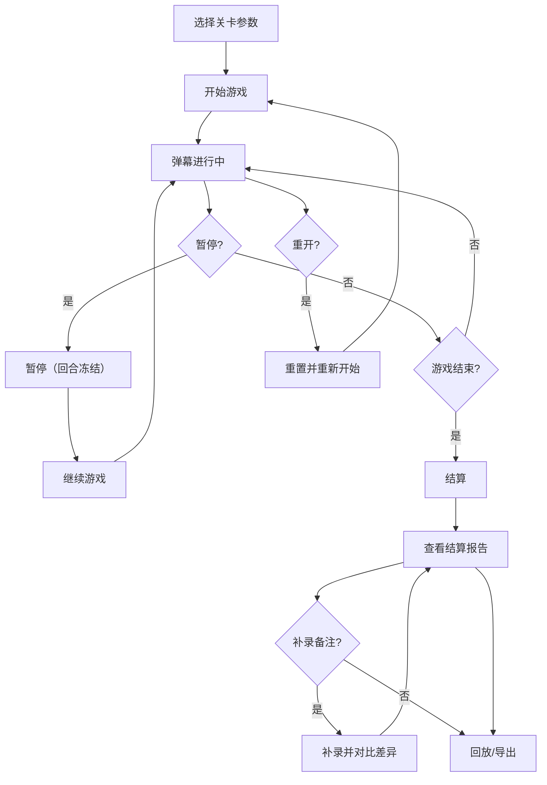

## 1. 产品概述

"量子音符弹幕"是一款面向科普馆课堂场景的弹幕节奏小游戏管理工具，解决课堂计分表临时凑合导致暂停/续接后局面混乱、记录与导出脱节的问题。目标用户为科普馆讲解员小夏及其同事，核心价值：让弹幕游戏的开始→暂停→继续→重开→结算→回放全流程可追踪、可补录、可导出，不依赖课堂计分表翻旧账。

## 2. 核心功能

### 2.1 用户角色

| 角色 | 进入方式 | 核心权限 |
|------|----------|----------|
| 讲解员（操作者） | 直接进入 | 启动/暂停/继续/重开局、补录备注、导出成绩与回放 |
| 老师（审阅者） | 查看导出 | 查看结算报告、回放记录、评分备注 |

### 2.2 功能模块

1. **游戏操控台**：开始、暂停、继续、重开，实时显示当前回合数与状态
2. **关卡与玩家面板**：展示当前关卡参数、玩家选择记录、实时得分
3. **备注补录**：对已结束的回合补充老师评分备注，记录补录时间与操作人
4. **结算中心**：展示单局/多局结算结果，含结算原因、处理建议（业务同事可照做的提醒）
5. **回放器**：按时间线回放弹幕过程，支持回合跳转
6. **导出中心**：导出人类可读的成绩单与回放记录（Markdown/文本格式）

### 2.3 页面详情

| 页面名称 | 模块名称 | 功能描述 |
|----------|----------|----------|
| 操控台页 | 游戏控制栏 | 开始/暂停/继续/重开按钮，状态指示灯，当前回合数，累计时间 |
| 操控台页 | 关卡参数区 | 当前关卡名、难度、音符类型、速度倍率等参数展示 |
| 操控台页 | 弹幕画布 | 弹幕音符下落/飘过动画，玩家命中反馈 |
| 操控台页 | 玩家记录区 | 当前局玩家选择记录、得分明细、连击数 |
| 结算页 | 结算总览 | 总分、评级、结算原因、回合统计、处理建议 |
| 结算页 | 备注补录面板 | 对各回合添加/编辑老师评分备注，标注补录时间 |
| 结算页 | 差异对比 | 补录前后的分数/评级差异高亮显示 |
| 回放页 | 回放时间线 | 回合跳转、播放/暂停、进度条 |
| 回放页 | 回放画布 | 重新播放弹幕动画 |
| 导出页 | 导出配置 | 选择导出范围（单局/多局）、格式（Markdown/纯文本） |
| 导出页 | 预览与下载 | 导出内容预览、一键下载 |

## 3. 核心流程

1. 讲解员选择关卡参数，点击"开始"启动一局游戏
2. 弹幕音符按关卡参数出现，玩家做出选择（命中/错过），系统实时计分
3. 可随时暂停（暂停后回合数冻结），继续后从暂停点恢复，回合数递增不跳
4. 游戏结束（关卡完成/手动结束）进入结算，展示总分、评级、结算原因
5. 老师可补录评分备注，系统自动记录补录时间，对比补录前后差异
6. 可进入回放模式，按时间线回放整局过程
7. 导出人类可读的成绩单和回放记录

## 4. 用户界面设计

### 4.1 设计风格

- **主色调**：深空蓝 (#0a0e27) 搭配量子紫 (#8b5cf6) 和电子青 (#06d6a0) 作为强调色，营造量子科技氛围
- **按钮风格**：圆角矩形，微发光边框效果，hover 时发光增强
- **字体**：标题使用 "Orbitron" 科幻字体，正文使用 "Noto Sans SC" 保证中文可读性
- **布局风格**：左侧操控面板 + 右侧主画布/内容区的双栏布局
- **图标/动效**：音符粒子飘散效果，状态切换时有脉冲动画

### 4.2 页面设计概览

| 页面名称 | 模块名称 | UI 元素 |
|----------|----------|---------|
| 操控台页 | 游戏控制栏 | 发光按钮组、状态指示灯（绿/黄/红）、回合数计数器、计时器 |
| 操控台页 | 关卡参数区 | 参数卡片，深色半透明背景，参数标签+值 |
| 操控台页 | 弹幕画布 | 全宽画布，音符从上方飘落，命中时粒子爆裂效果 |
| 操控台页 | 玩家记录区 | 滚动列表，每行显示选择+得分，连击时高亮 |
| 结算页 | 结算总览 | 大字评级、雷达图、回合统计表、处理建议卡片 |
| 结算页 | 备注补录面板 | 可编辑文本框、保存按钮、补录时间戳标签 |
| 结算页 | 差异对比 | 左右对比布局，变化项标红/标绿 |
| 回放页 | 回放时间线 | 底部时间轴，回合节点可点击，播放控制按钮 |
| 导出页 | 导出配置 | 复选框/单选组，格式选择下拉 |
| 导出页 | 预览与下载 | 预览面板（等宽字体）+下载按钮 |

### 4.3 响应式策略

- 桌面优先设计，1024px 以上双栏布局
- 768-1024px 弹幕画布缩小，控制面板折叠为顶部工具栏
- 768px 以下单栏布局，画布全宽，控制按钮置底

### 4.4 3D 场景说明

不涉及 3D 场景。弹幕动画使用 Canvas 2D 绘制，粒子效果用 CSS 动画辅助。
