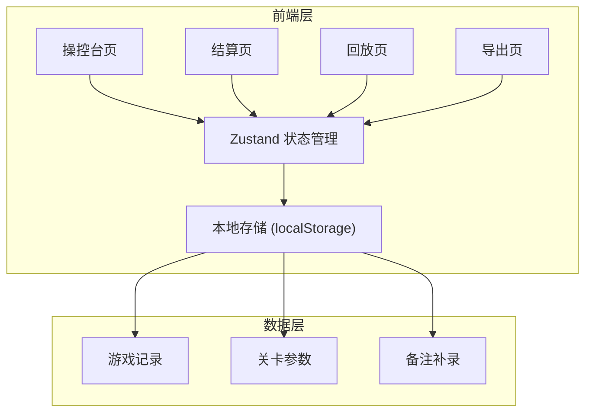
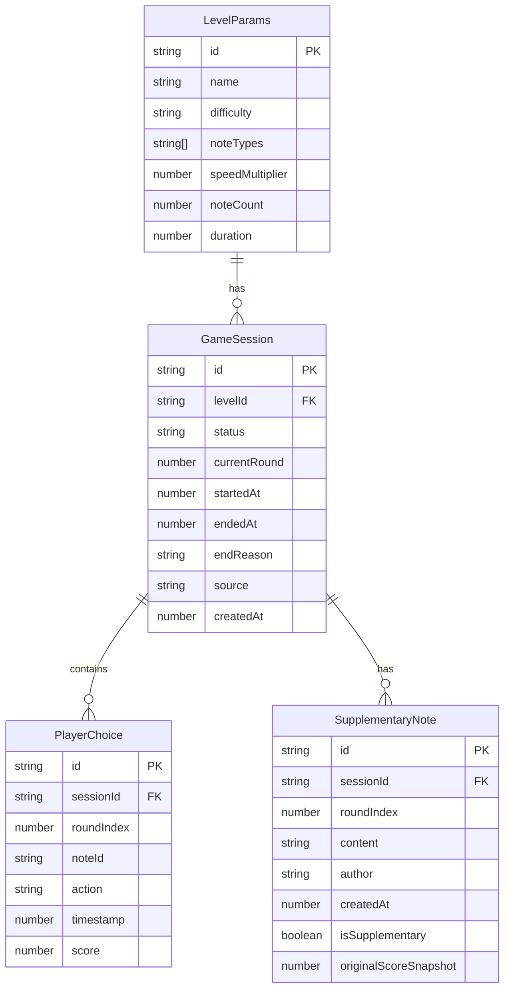

## 1. 架构设计



纯前端应用，所有数据存储在 localStorage，无需后端服务。状态管理使用 Zustand，数据流转清晰可追踪。

## 2. 技术说明

- **前端**：React@18 + TypeScript + Tailwind CSS@3 + Vite
- **初始化工具**：vite-init（react-ts 模板）
- **状态管理**：Zustand
- **路由**：react-router-dom
- **后端**：无（纯前端，数据存 localStorage）
- **数据库**：无（localStorage + 内存状态）

## 3. 路由定义

| 路由 | 用途 |
|------|------|
| `/` | 操控台页：游戏主界面，含控制栏、弹幕画布、玩家记录 |
| `/settlement` | 结算页：结算报告、备注补录、差异对比 |
| `/replay` | 回放页：时间线回放弹幕过程 |
| `/export` | 导出页：导出配置、预览与下载 |

## 4. API 定义

无后端 API。所有数据通过 Zustand store 管理，持久化到 localStorage。

核心数据接口定义如下：

```typescript
interface LevelParams {
  id: string
  name: string
  difficulty: 'easy' | 'medium' | 'hard'
  noteTypes: string[]
  speedMultiplier: number
  noteCount: number
  duration: number
}

interface PlayerChoice {
  roundIndex: number
  noteId: string
  action: 'hit' | 'miss' | 'wrong'
  timestamp: number
  score: number
}

interface GameSession {
  id: string
  levelParams: LevelParams
  status: 'idle' | 'playing' | 'paused' | 'ended'
  currentRound: number
  startedAt: number | null
  pausedAt: number | null
  totalPausedDuration: number
  endedAt: number | null
  endReason: string
  playerChoices: PlayerChoice[]
  notes: SupplementaryNote[]
  source: string
  createdAt: number
}

interface SupplementaryNote {
  id: string
  roundIndex: number
  content: string
  author: string
  createdAt: number
  isSupplementary: boolean
  originalScoreSnapshot: number
}

interface SettlementResult {
  sessionId: string
  totalScore: number
  grade: string
  endReason: string
  roundStats: RoundStat[]
  suggestions: string[]
  generatedAt: number
}

interface RoundStat {
  roundIndex: number
  score: number
  hits: number
  misses: number
  combo: number
}
```

## 5. 服务端架构图

无后端服务。

## 6. 数据模型

### 6.1 数据模型定义



### 6.2 初始样例数据

预置 3 组关卡参数、2 局游戏记录（含暂停/继续场景）、3 条玩家选择记录、2 条老师评分备注（其中 1 条为补录），确保覆盖暂停→继续→结算→补录→差异对比→导出全流程。
