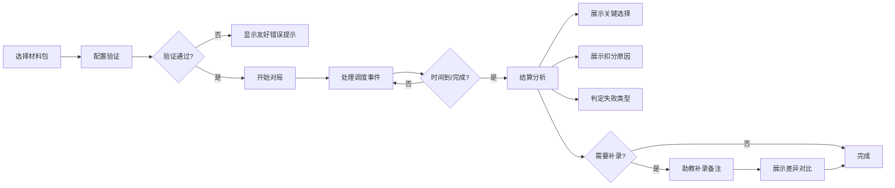

## 1. 产品概述
城市公交调度棋是一款面向课堂教学的快速决策模拟工具，解决传统课堂计分表临时拼凑、遇到例外情况容易混乱的问题。通过1-2分钟的快速对局，让学生在模拟公交调度场景中练习决策判断能力。

- 核心目的：提供结构化的公交调度决策训练，记录完整判断过程
- 目标用户：课堂学生、课程助教
- 核心价值：快速反馈、可追溯、支持补录和返工

## 2. 核心功能

### 2.1 用户角色
| 角色 | 注册方式 | 核心权限 |
|------|----------|----------|
| 学生用户 | 无需注册 | 进行游戏、查看结算、继续处理 |
| 课程助教 | 无需注册 | 配置材料、补录备注、查看差异 |

### 2.2 功能模块
1. **关卡选择页**：材料包列表、样例选择、配置验证提示
2. **游戏进行页**：事件展示、决策选择、资源状态、计时器
3. **结算详情页**：关键选择回放、扣分原因说明、失败类型判定
4. **补录处理页**：备注添加、差异对比、历史追溯

### 2.3 页面详情
| 页面名称 | 模块名称 | 功能描述 |
|----------|----------|----------|
| 关卡选择页 | 材料包列表 | 显示可用材料包、标记样例材料、显示配置状态 |
| 关卡选择页 | 配置验证 | 自动检测空关卡、重复事件、边界值错误，友好提示 |
| 游戏进行页 | 事件展示 | 显示当前公交调度事件、历史选择记录 |
| 游戏进行页 | 决策面板 | 提供调度选项、显示资源消耗 |
| 游戏进行页 | 状态面板 | 实时资源、剩余时间、已处理事件数 |
| 结算详情页 | 决策回放 | 逐条展示关键选择及判断依据 |
| 结算详情页 | 扣分分析 | 详细说明每项扣分原因、规则依据 |
| 结算详情页 | 失败判定 | 区分"规则理解错误"和"操作超时"两类失败 |
| 补录处理页 | 备注添加 | 助教可临时补录备注说明 |
| 补录处理页 | 差异展示 | 清晰显示补录前后的差异 |
| 补录处理页 | 审计信息 | 保留原始来源、处理时间、操作人信息 |

## 3. 核心流程

学生选择材料包 → 系统验证配置 → 开始对局（1-2分钟）→ 依次处理调度事件 → 时间到或全部处理完成 → 结算页面展示关键选择和扣分原因 → 可选择继续补录材料 → 助教补录备注 → 展示差异和完整审计追踪

## 4. 用户界面设计

### 4.1 设计风格
- **主色调**：深蓝 #1e3a5f（专业、稳重），搭配公交黄 #fbbf24（活力、醒目）
- **辅助色**：成功绿 #10b981，警告橙 #f59e0b，错误红 #ef4444
- **按钮风格**：圆角8px，悬停有微妙阴影和颜色变化
- **字体**：标题使用 Noto Sans SC Bold，正文使用 Noto Sans SC Regular
- **布局风格**：卡片式布局，清晰的区域分隔，层次分明
- **图标风格**：简约线性图标，配合公交相关emoji（🚌 ⏱️ 📋）

### 4.2 页面设计概述
| 页面名称 | 模块名称 | UI元素 |
|----------|----------|--------|
| 关卡选择页 | 材料包卡片 | 卡片阴影、hover效果、状态标签、配置状态指示 |
| 游戏进行页 | 事件卡片 | 大号事件标题、选项按钮组、进度条动画 |
| 游戏进行页 | 状态栏 | 顶部固定、资源图标化、倒计时动态显示 |
| 结算详情页 | 决策时间线 | 纵向时间线、对错标记、扣分高亮 |
| 结算详情页 | 扣分面板 | 表格展示、规则引用、颜色编码 |
| 补录处理页 | 差异对比 | 左右分栏、新增内容高亮、审计信息元数据 |

### 4.3 响应式
- 桌面端优先设计，适配平板和移动端
- 游戏页面保持核心操作区域居中，确保触控友好
- 结算页面在小屏幕上改为单列布局

### 4.4 动画与交互
- 页面切换：淡入淡出过渡
- 选择反馈：按钮点击有缩放动画
- 倒计时：最后10秒变红并闪烁
- 决策提交：正确选择绿色波纹，错误选择红色抖动
- 时间线展开：平滑展开动画
