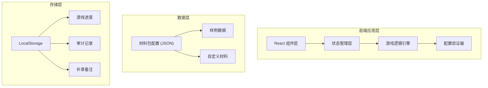

## 1. 架构设计



## 2. 技术描述

- **前端框架**: React@18 + TypeScript
- **构建工具**: Vite@5
- **样式方案**: TailwindCSS@3
- **路由管理**: React Router@6
- **状态管理**: React Context + useReducer (轻量级)
- **图标库**: Lucide React
- **数据持久化**: LocalStorage
- **动画**: Framer Motion

## 3. 路由定义

| 路由 | 页面名称 | 用途 |
|------|----------|------|
| / | 首页/关卡选择 | 材料包列表、配置验证、开始游戏入口 |
| /game/:materialId | 游戏进行页 | 处理调度事件、实时决策 |
| /result/:gameId | 结算详情页 | 展示关键选择、扣分原因、失败类型 |
| /supplement/:gameId | 补录处理页 | 添加备注、查看差异、审计追踪 |

## 4. 核心数据模型

### 4.1 材料包配置 (MaterialPackage)

```typescript
interface MaterialPackage {
  id: string;
  name: string;
  description: string;
  source: string;           // 原始来源
  createdAt: string;        // 创建时间
  createdBy: string;        // 创建人（如"课程助教小何"）
  isSample: boolean;        // 是否为样例
  gameDuration: number;     // 游戏时长（秒），默认90秒
  initialResources: Resources;
  events: GameEvent[];
}

interface Resources {
  buses: number;           // 可用公交数量
  drivers: number;         // 可用司机数量
  budget: number;          // 预算
  reputation: number;      // 声誉值
}

interface GameEvent {
  id: string;
  title: string;
  description: string;
  type: 'normal' | 'emergency' | 'rework';  // 普通/紧急/返工
  options: EventOption[];
  ruleHint?: string;        // 规则提示（用于结算说明）
}

interface EventOption {
  id: string;
  text: string;
  resourceCost: Partial<Resources>;
  isCorrect: boolean;
  scoreChange: number;      // 分数变化（正加分，负扣分）
  feedback: string;         // 选择后的反馈
  ruleReference: string;    // 规则引用（用于扣分说明）
}
```

### 4.2 游戏状态 (GameState)

```typescript
interface GameState {
  id: string;
  materialId: string;
  materialName: string;
  startTime: string;
  endTime?: string;
  status: 'playing' | 'completed' | 'failed';
  failureType?: 'rule_misunderstanding' | 'timeout';  // 失败类型
  currentEventIndex: number;
  resources: Resources;
  score: number;
  decisions: DecisionRecord[];
  totalTimeUsed: number;    // 总用时（秒）
}

interface DecisionRecord {
  eventId: string;
  eventTitle: string;
  selectedOptionId: string;
  selectedOptionText: string;
  isCorrect: boolean;
  scoreChange: number;
  timeTaken: number;        // 该决策用时（秒）
  timestamp: string;
  ruleReference: string;
}
```

### 4.3 补录记录 (SupplementRecord)

```typescript
interface SupplementRecord {
  gameId: string;
  supplementedAt: string;
  supplementedBy: string;
  notes: string;
  originalScore: number;
  adjustedScore?: number;
  adjustments: AdjustmentItem[];
}

interface AdjustmentItem {
  field: string;
  oldValue: any;
  newValue: any;
  reason: string;
}
```

### 4.4 配置验证结果 (ValidationResult)

```typescript
interface ValidationResult {
  isValid: boolean;
  errors: ValidationError[];
  warnings: ValidationWarning[];
}

interface ValidationError {
  type: 'empty_level' | 'duplicate_event' | 'resource_out_of_bounds' | 'missing_correct_option';
  message: string;
  location?: string;
  suggestion: string;
}

interface ValidationWarning {
  type: string;
  message: string;
}
```

## 5. 核心模块设计

### 5.1 游戏引擎 (GameEngine)

```typescript
class GameEngine {
  validateMaterial(material: MaterialPackage): ValidationResult;
  startGame(materialId: string): GameState;
  processDecision(optionId: string): GameState;
  checkGameEnd(): boolean;
  calculateScore(): number;
  determineFailureType(): 'rule_misunderstanding' | 'timeout' | null;
}
```

### 5.2 配置验证器 (ConfigValidator)

```typescript
class ConfigValidator {
  checkEmptyEvents(events: any[]): ValidationError | null;
  checkDuplicateEvents(events: any[]): ValidationError | null;
  checkResourceBoundaries(resources: any): ValidationError | null;
  checkCorrectOptions(events: any[]): ValidationError | null;
}
```

### 5.3 审计追踪器 (AuditTrail)

```typescript
class AuditTrail {
  recordDecision(decision: DecisionRecord): void;
  recordSupplement(supplement: SupplementRecord): void;
  getGameHistory(gameId: string): GameState;
  getSupplementHistory(gameId: string): SupplementRecord[];
}
```

## 6. 样例数据设计

### 样例1：顺利处理场景（基础调度）
- 3个普通事件
- 资源充足
- 正确选择路径清晰

### 样例2：返工场景（高峰期调度）
- 包含1个返工事件
- 需要先错误选择后修正
- 展示扣分原因和规则引用

## 7. 本地存储结构

```
bus-dispatch-chess/
  ├── materials/          # 材料包缓存
  ├── games/              # 游戏记录
  ├── supplements/        # 补录记录
  └── preferences/        # 用户偏好
```
