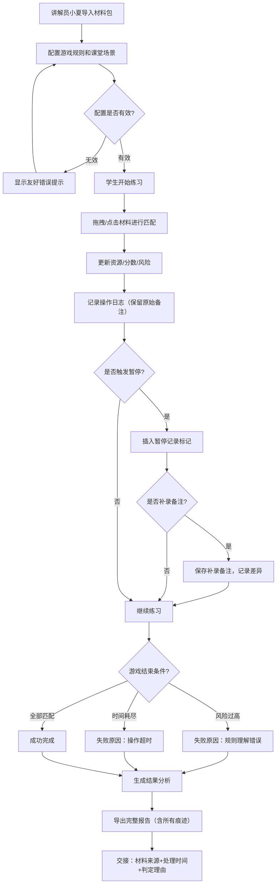

## 1. 产品概述

"保险理赔逃脱屋"是一款面向保险专业学生的练习工具，通过游戏化的材料匹配方式训练学生对保险理赔材料的整理和判断能力。工具专为科普馆讲解员小夏设计，帮助其高效组织课堂练习，保留完整的学生操作痕迹，便于教学评估和工作交接。

- 核心问题：解决学生练习记录与导出结果脱节、乱备注被清洗、失败反馈模糊等教学痛点
- 目标用户：科普馆讲解员小夏（教师端）、保险专业学生（练习端）
- 产品价值：游戏化学习 + 完整操作留痕 + 智能失败诊断 + 无缝交接支持

---

## 2. 核心功能

### 2.1 用户角色

| 角色 | 登录方式 | 核心权限 |
|------|---------|---------|
| 讲解员（小夏） | 本地配置进入 | 导入练习材料、配置游戏参数、补录备注、导出完整报告、查看所有学生记录 |
| 学生 | 课堂直接使用 | 进行材料匹配练习、查看个人成绩、导出个人练习报告 |

### 2.2 功能模块

1. **游戏主界面**：材料拖拽区、目标匹配区、资源/分数/风险仪表盘、操作历史面板
2. **材料配置页**：导入理赔材料包、设置匹配规则、配置边界条件和暂停点
3. **结果分析页**：分数统计、失败原因诊断、操作时间线、备注补录区
4. **导出报告页**：完整记录导出、差异对比、交接信息展示

### 2.3 页面详情

| 页面名称 | 模块名称 | 功能描述 |
|---------|---------|---------|
| 游戏主界面 | 材料拖拽区 | 显示待匹配的保险理赔材料卡片，支持拖拽和点击操作，每次操作即时影响资源/分数/风险 |
| 游戏主界面 | 目标匹配区 | 显示理赔案例的材料需求槽位，拖入正确材料得分，错误材料增加风险 |
| 游戏主界面 | 仪表盘 | 实时显示当前资源值、分数、风险值、剩余时间 |
| 游戏主界面 | 操作历史 | 滚动显示所有操作记录，保留原始备注，不做清洗 |
| 材料配置页 | 材料包管理 | 导入/编辑理赔材料小包，支持临时补录备注 |
| 材料配置页 | 规则配置 | 设置匹配规则、时间限制、风险阈值、边界分数条件 |
| 材料配置页 | 课堂场景 | 预设新手误操作、边界分数、暂停记录等课堂场景 |
| 结果分析页 | 失败诊断 | 智能判断失败原因："规则理解错误"或"操作超时"，给出具体依据 |
| 结果分析页 | 时间线分析 | 按时间轴展示所有操作，标记暂停点和补录备注 |
| 结果分析页 | 差异对比 | 高亮显示原始记录与补录备注的差异 |
| 导出报告页 | 完整导出 | 导出含所有操作、备注、失败原因、原始来源、处理时间的完整报告 |
| 导出报告页 | 交接信息 | 展示材料来源、处理时间、判定理由，便于他人接手 |
| 错误提示页 | 配置错误 | 坏配置时友好提示具体问题，不白屏 |

---

## 3. 核心流程

---

## 4. 用户界面设计

### 4.1 设计风格

**极简工业风（Minimalist Industrial）**
- 主色调：深炭灰 (#1a1a2e) + 警示橙 (#ff6b35) + 冷静蓝 (#4ecdc4) + 纸质米白 (#f7f3e9)
- 按钮风格：直角矩形、细线边框、轻微按压动效，避免圆润可爱风格
- 字体：标题用"JetBrains Mono"（等宽工业感），正文用"Noto Sans SC"
- 布局：模块化卡片布局，清晰的视觉层级，强调数据可读性
- 图标风格：线性极简图标，避免花哨装饰，用颜色区分状态（蓝=正常，橙=警告，红=危险）

**设计原则**：
- 不堆砌素材，所有视觉元素服务于功能
- 操作反馈即时可见，资源/分数/风险变化有动效提示
- 历史记录区保持"乱"的真实感，不做过度美化
- 备注差异用明显的边框和背景色区分

### 4.2 页面设计概述

| 页面名称 | 模块名称 | UI元素 |
|---------|---------|--------|
| 游戏主界面 | 材料拖拽区 | 卡片式材料展示，拖拽时阴影加深，松手回弹动效，错误匹配时红色边框震动 |
| 游戏主界面 | 目标匹配区 | 槽位式布局，正确匹配时绿色边框+分数飘动，错误时红色闪烁+风险值跳动 |
| 游戏主界面 | 仪表盘 | 顶部横条展示，数值变化时有数字滚动动效，风险值过高时背景渐变为橙红色 |
| 游戏主界面 | 操作历史 | 左侧固定宽度滚动区，时间戳+操作内容+备注，不同类型用不同色块标记 |
| 结果分析页 | 失败诊断 | 大号字体显示失败类型，下方列出具体判定依据（哪几次操作导致） |
| 结果分析页 | 差异对比 | 原始记录灰色，补录备注黄色背景+边框，标注"补录于XX时间" |
| 导出报告页 | 交接信息 | 顶部固定区域，清晰列出：材料来源包、处理开始/结束时间、关键判定点说明 |
| 错误提示页 | 配置错误 | 居中卡片，具体错误信息用技术术语+通俗解释双栏展示，提供"返回修改"按钮 |

### 4.3 响应式设计

- 桌面优先设计，最小支持 1280px 宽度
- 操作区采用固定比例布局，避免在小屏幕上元素挤压
- 历史记录区在窄屏时可折叠收起
- 触摸设备优化拖拽手感，增加点击 fallback

### 4.4 动效设计

- 材料拖拽：跟随鼠标，透明度 80%，阴影加深
- 匹配成功：卡片落入槽位，"+10分"绿色文字向上飘动淡出
- 匹配错误：卡片红色边框震动，风险值"+5"橙色跳动
- 分数变化：数字滚动动画，从旧值平滑过渡到新值
- 暂停触发：屏幕半透明遮罩，"已暂停"文字居中，时间线插入标记
- 页面加载：模块按顺序淡入，操作区最后出现
