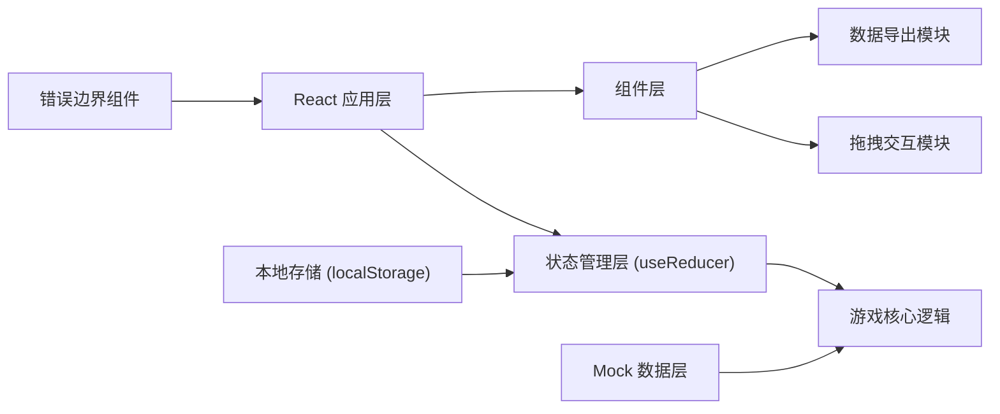
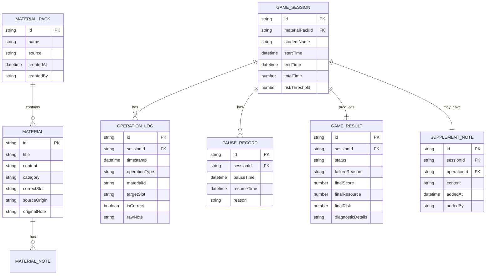

## 1. 架构设计



---

## 2. 技术描述

- **前端框架**: React@18 + TypeScript + Vite@5
- **样式方案**: TailwindCSS@3 + CSS 变量（主题管理）
- **拖拽实现**: react-dnd (HTML5 后端) + 触摸 fallback
- **状态管理**: React useReducer + Context（轻量级，避免过度设计）
- **数据持久化**: localStorage（无需后端，适合课堂单机使用）
- **导出功能**: 原生 JSON/CSV 导出 + 打印友好的 HTML 报告
- **动画库**: framer-motion（复杂动效）+ CSS transitions（简单动效）
- **后端**: 无（纯前端应用，所有数据本地处理）
- **初始化工具**: vite-init

---

## 3. 路由定义

| 路由 | 页面组件 | 用途 |
|------|---------|------|
| `/` | `GamePage` | 游戏主界面 - 材料匹配练习 |
| `/config` | `ConfigPage` | 材料配置页 - 导入材料、设置规则 |
| `/result` | `ResultPage` | 结果分析页 - 分数统计、失败诊断 |
| `/export` | `ExportPage` | 导出报告页 - 完整记录导出、交接信息 |
| `/error` | `ErrorPage` | 错误提示页 - 配置错误展示 |
| `*` | `NotFoundPage` | 404 页面 |

---

## 4. 数据模型

### 4.1 数据模型定义



### 4.2 TypeScript 类型定义

```typescript
// 材料类型
interface Material {
  id: string;
  title: string;
  content: string;
  category: 'identity' | 'policy' | 'medical' | 'accident' | 'other';
  correctSlot: string;
  sourceOrigin: string;
  originalNote?: string;
}

// 材料包
interface MaterialPack {
  id: string;
  name: string;
  source: string;
  createdAt: string;
  createdBy: string;
  materials: Material[];
  slots: GameSlot[];
}

// 游戏槽位
interface GameSlot {
  id: string;
  label: string;
  description: string;
  acceptedCategories: string[];
}

// 游戏状态
interface GameState {
  sessionId: string;
  status: 'idle' | 'playing' | 'paused' | 'completed' | 'failed';
  score: number;
  resource: number;
  risk: number;
  riskThreshold: number;
  timeRemaining: number;
  totalTime: number;
  materials: Material[];
  slots: GameSlot[];
  placedMaterials: Record<string, string>;
  operationLogs: OperationLog[];
  pauseRecords: PauseRecord[];
  supplementNotes: SupplementNote[];
  materialPack: MaterialPack;
  studentName: string;
  startTime: string;
  endTime?: string;
  failureReason?: 'rule_misunderstanding' | 'timeout';
  diagnosticDetails?: string[];
}

// 操作日志
interface OperationLog {
  id: string;
  timestamp: string;
  operationType: 'place' | 'remove' | 'click';
  materialId: string;
  targetSlot?: string;
  isCorrect?: boolean;
  rawNote?: string;
  scoreDelta?: number;
  riskDelta?: number;
  resourceDelta?: number;
}

// 暂停记录
interface PauseRecord {
  id: string;
  pauseTime: string;
  resumeTime?: string;
  reason: string;
  isIntentional: boolean;
}

// 补录备注
interface SupplementNote {
  id: string;
  operationId?: string;
  content: string;
  addedAt: string;
  addedBy: string;
}

// 游戏结果
interface GameResult {
  sessionId: string;
  status: 'completed' | 'failed';
  failureReason?: 'rule_misunderstanding' | 'timeout';
  finalScore: number;
  finalResource: number;
  finalRisk: number;
  diagnosticDetails: string[];
  exportMetadata: ExportMetadata;
}

// 导出元数据
interface ExportMetadata {
  exportedAt: string;
  materialSource: string;
  processingStartTime: string;
  processingEndTime: string;
  keyDecisions: string[];
  handler: string;
}

// 配置验证错误
interface ConfigError {
  field: string;
  technicalMessage: string;
  userMessage: string;
}
```

---

## 5. 核心模块说明

### 5.1 游戏核心逻辑模块 (`src/game/engine.ts`)
- 材料匹配验证
- 分数/资源/风险计算
- 失败原因诊断
- 边界条件检测

### 5.2 状态管理模块 (`src/state/gameReducer.ts`)
- useReducer 实现游戏状态管理
- 操作日志记录
- 暂停/恢复处理
- 备注补录处理

### 5.3 拖拽交互模块 (`src/components/dnd/`)
- MaterialCard 可拖拽组件
- SlotDropZone 放置区域
- 拖拽状态视觉反馈
- 触摸设备 fallback

### 5.4 导出模块 (`src/utils/export.ts`)
- JSON 完整导出（含所有操作痕迹）
- CSV 操作日志导出
- HTML 打印报告生成
- 交接信息格式化

### 5.5 配置验证模块 (`src/utils/validation.ts`)
- 材料包格式验证
- 规则完整性检查
- 友好错误提示生成

---

## 6. Mock 数据说明

内置示例材料包（`src/data/mockMaterials.ts`）：
- 1 个小型汽车保险理赔案例
- 8 份材料：身份证、保单、事故认定书、医疗发票、维修清单、驾驶证、行驶证、银行流水
- 5 个匹配槽位：身份证明、保单信息、事故证明、费用证明、其他材料
- 预设 2 条新手误操作记录
- 预设 1 个边界分数场景
- 预设 1 条故意暂停记录
- 包含多条"乱备注"示例
