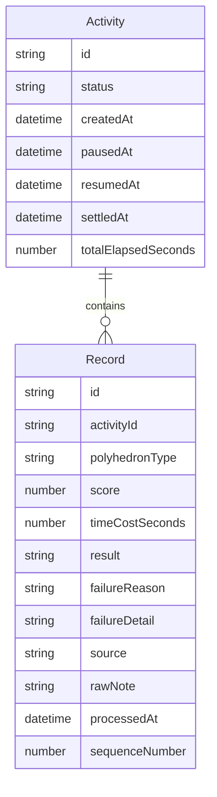

## 1. 架构设计

纯前端应用，数据存储在浏览器 localStorage，无需后端服务。

```mermaid
flowchart TD
    "浏览器" --> "React SPA"
    "React SPA" --> "Zustand 状态管理"
    "Zustand 状态管理" --> "localStorage 持久化"
    "React SPA" --> "组件层"
    "组件层" --> "活动控制台"
    "组件层" --> "记录面板"
    "组件层" --> "失败反馈"
    "组件层" --> "复盘报告"
    "组件层" --> "回放"
    "React SPA" --> "导出工具"
    "导出工具" --> "JSON/CSV 文件"
```

## 2. 技术说明

- 前端：React@18 + TypeScript + Tailwind CSS@3 + Vite
- 初始化工具：vite-init
- 状态管理：Zustand（含 persist 中间件自动持久化到 localStorage）
- 后端：无（纯前端，数据存 localStorage）
- 图标：lucide-react
- 字体：Google Fonts（Noto Serif SC + Noto Sans SC）

## 3. 路由定义

| 路由 | 用途 |
|------|------|
| / | 主页面：活动控制台 + 记录面板 |
| /report/:activityId | 复盘报告页 |
| /replay/:activityId | 回放页 |

## 4. 数据模型

### 4.1 数据模型定义



### 4.2 类型定义

```typescript
type ActivityStatus = 'idle' | 'running' | 'paused' | 'settled'
type RecordResult = 'success' | 'failure' | 'pending_review'
type FailureReason = 'rule_misunderstanding' | 'operation_timeout' | 'boundary_score' | 'other_exception'
type RecordSource = 'realtime' | 'group_supplement' | 'old_standard'

interface Activity {
  id: string
  status: ActivityStatus
  createdAt: string
  pausedAt: string | null
  resumedAt: string | null
  settledAt: string | null
  totalElapsedSeconds: number
}

interface ExplorerRecord {
  id: string
  activityId: string
  sequenceNumber: number
  polyhedronType: string
  score: number
  timeCostSeconds: number
  result: RecordResult
  failureReason: FailureReason | null
  failureDetail: string | null
  source: RecordSource
  rawNote: string
  processedAt: string
}
```

## 5. 状态管理设计

使用 Zustand，核心 store 包含：

- `currentActivity`: 当前活动对象
- `records`: 当前活动的记录列表
- `activities`: 所有历史活动列表（用于复盘和回放）
- 操作方法：startActivity, pauseActivity, resumeActivity, settleActivity, restartActivity, addRecord, addSupplementRecord, updateRecordNote

## 6. 导出格式

### 6.1 CSV 导出

包含字段：序号、多面体类型、得分、耗时、结果、失败原因、失败详情、来源、原始备注、处理时间

### 6.2 JSON 导出

完整 Activity + Records 数据结构，便于二次处理

### 6.3 回放导出

JSON 格式，含时间轴事件序列（含暂停事件）
