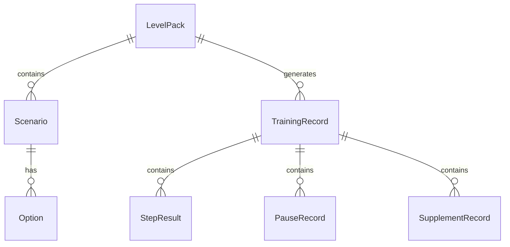

## 1. 架构设计

纯前端应用，数据存储在浏览器 localStorage 中，无需后端服务。

```mermaid
flowchart TD
    "React 前端" --> "Zustand 状态管理"
    "Zustand 状态管理" --> "localStorage 持久化"
    "React 前端" --> "React Router 路由"
    "React 前端" --> "Tailwind CSS 样式"
    "Zustand 状态管理" --> "关卡包数据"
    "Zustand 状态管理" --> "训练记录"
    "Zustand 状态管理" --> "补录记录"
```

## 2. 技术选型

- **前端框架**：React@18 + TypeScript
- **构建工具**：Vite
- **样式方案**：Tailwind CSS@3
- **路由**：react-router-dom@6
- **状态管理**：Zustand（含 persist 中间件实现 localStorage 持久化）
- **图标**：lucide-react
- **字体**：Noto Sans SC（Google Fonts CDN）
- **后端**：无，纯前端
- **数据库**：localStorage（模拟数据持久化）

## 3. 路由定义

| 路由 | 用途 |
|------|------|
| `/` | 首页 - 关卡包选择、快速开始、操作说明 |
| `/training` | 训练页 - 场景对话与选择 |
| `/result/:id` | 结算页 - 本局得分与扣分明细 |
| `/history` | 记录页 - 所有局次历史、补录入口 |
| `/history/:id` | 单局详情 - 某一局的完整链路 |
| `/summary` | 汇总页 - 统计概览、异常追踪 |

## 4. 数据模型

### 4.1 核心类型定义

```typescript
interface LevelPack {
  id: string
  name: string
  description: string
  difficulty: "入门" | "进阶" | "挑战"
  scenarios: Scenario[]
}

interface Scenario {
  id: string
  customerMessage: string
  context: string
  options: Option[]
  correctOptionId: string
  timeLimit: number
  scoringRule: string
}

interface Option {
  id: string
  label: string
  text: string
  isCorrect: boolean
  deduction?: {
    points: number
    reason: string
    type: "规则未理解" | "操作超时" | "选择错误"
  }
}

interface TrainingRecord {
  id: string
  levelPackId: string
  levelPackName: string
  startTime: number
  endTime: number
  totalScore: number
  maxScore: number
  passed: boolean
  needsManualReview: boolean
  steps: StepResult[]
  pauses: PauseRecord[]
  supplements: SupplementRecord[]
  source: "系统记录" | "投影补录"
  failureDiagnosis?: {
    type: "规则未理解" | "操作偏慢"
    detail: string
  }
}

interface StepResult {
  scenarioId: string
  customerMessage: string
  selectedOptionId: string
  selectedOptionText: string
  correctOptionId: string
  correctOptionText: string
  isCorrect: boolean
  timeTaken: number
  timeLimit: number
  timedOut: boolean
  deduction?: {
    points: number
    reason: string
    type: "规则未理解" | "操作超时" | "选择错误"
  }
}

interface PauseRecord {
  stepIndex: number
  timestamp: number
  duration: number
  reason?: string
}

interface SupplementRecord {
  id: string
  timestamp: number
  content: string
  source: "投影补录" | "老师备注"
  previousScore?: number
  newScore?: number
  changedFields: string[]
}
```

### 4.2 数据模型 ER 图



## 5. 状态管理设计

使用 Zustand 创建以下 store：

- **useLevelStore**：关卡包数据、当前选中的关卡包
- **useTrainingStore**：当前训练状态（进行中的步骤、计时器、暂停状态）
- **useRecordStore**：训练记录 CRUD、补录操作、历史查询
- **useSummaryStore**：汇总统计计算（派生自 RecordStore）

## 6. 项目文件结构

```
src/
  components/
    Header.tsx
    LevelCard.tsx
    ScenarioCard.tsx
    OptionButton.tsx
    ScoreBreakdown.tsx
    DeductionItem.tsx
    FailureDiagnosis.tsx
    RecordCard.tsx
    SupplementForm.tsx
    DiffView.tsx
    StatsCard.tsx
    ExceptionTable.tsx
    InstructionsPanel.tsx
  pages/
    Home.tsx
    Training.tsx
    Result.tsx
    History.tsx
    RecordDetail.tsx
    Summary.tsx
  stores/
    levelStore.ts
    trainingStore.ts
    recordStore.ts
    summaryStore.ts
  data/
    levelPacks.ts
    sampleRecords.ts
  types/
    index.ts
  utils/
    scoring.ts
    format.ts
  App.tsx
  main.tsx
```
