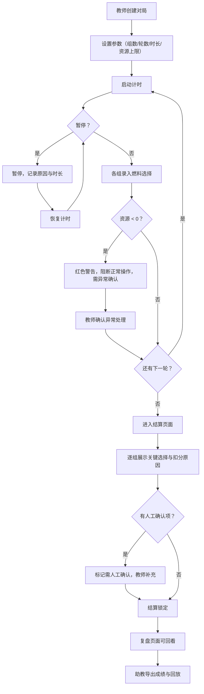

## 1. 产品概述

"火箭燃料配平赛"是一个面向课堂的实时竞赛工具，用于让学生在 1-2 分钟内完成一轮火箭燃料配比决策，结算后立刻看到关键选择与扣分原因。解决传统投影大屏临时凑方案导致课堂节奏拖沓、结算不清、异常数据无处可查的问题。

- 目标用户：授课教师（主控）、课程助教（复盘与导出）、课堂学生（参赛者）
- 核心价值：将散落在投影大屏备注、口头说明里的竞赛流程变成可追溯、可导出、像人话的完整记录

## 2. 核心功能

### 2.1 用户角色

| 角色 | 进入方式 | 核心权限 |
|------|----------|----------|
| 教师 | 直接进入控制台 | 创建比赛、启停计时、确认人工记录、导出成绩 |
| 助教 | 直接进入控制台 | 查看复盘、导出成绩与回放 |
| 学生 | 通过投影大屏观看 | 查看实时状态与结算结果 |

### 2.2 功能模块

1. **控制台页面**：创建对局、设置参数、启停计时、录入分数、暂停/恢复
2. **比赛页面（投影大屏）**：实时展示当前轮次、各组选择、剩余资源、倒计时
3. **结算页面**：逐组展示关键选择、扣分明细、资源异常警告、排名
4. **复盘页面**：历史对局列表、单局回放、筛选与搜索、保留原始乱备注
5. **导出功能**：成绩单与回放报告，文字像人话，含扣分原因与异常标注

### 2.3 页面详情

| 页面名称 | 模块名称 | 功能描述 |
|----------|----------|----------|
| 控制台 | 对局创建 | 输入参赛组数、轮数、每轮时长（默认 90 秒）、资源上限 |
| 控制台 | 实时控制 | 启动/暂停/恢复计时，手动录入各组选择与资源消耗 |
| 控制台 | 异常处理 | 资源为负时红色警告且不允许继续正常操作，弹出异常确认框 |
| 控制台 | 旧口径补录 | 从投影大屏补录历史记录，保留来源标记"投影大屏补录" |
| 比赛页面 | 实时状态 | 倒计时、当前轮次、各组燃料选择与剩余资源 |
| 比赛页面 | 暂停覆盖 | 暂停时大屏显示暂停原因与暂停时长 |
| 结算页面 | 逐组结算 | 每组的关键选择、各项扣分原因、资源是否为负、最终得分 |
| 结算页面 | 排名汇总 | 按总分排名，标注异常组（资源为负、需人工确认） |
| 复盘页面 | 对局列表 | 所有历史对局，含样例数据（顺利记录、需确认记录、旧口径补录） |
| 复盘页面 | 单局回放 | 逐轮展示选择与结果，保留投影大屏原始乱备注 |
| 复盘页面 | 筛选搜索 | 按日期、状态（正常/异常/需确认）筛选 |
| 导出 | 成绩单 | CSV/TXT 格式，含扣分原因列，异常行标注 |
| 导出 | 回放报告 | 可读文本，逐轮叙述，像人话，助教可直接使用 |

## 3. 核心流程

教师创建对局 → 设置参数 → 启动计时 → 各组做出燃料选择 → 教师录入/确认 → 系统实时计算资源与扣分 → 倒计时结束或手动结束 → 进入结算页面 → 展示每组关键选择与扣分原因 → 教师确认或标记人工确认项 → 结算锁定 → 可在复盘页面回看 → 助教导出成绩与回放

## 4. 用户界面设计

### 4.1 设计风格

- **主色调**：深空灰 (#1a1a2e) + 火焰橙 (#ff6b35) + 警告红 (#e63946) + 成功绿 (#2a9d8f)
- **按钮风格**：圆角微凸，主操作用火焰橙实心，危险操作用警告红描边
- **字体**：标题用 Orbitron（科技感），正文用 Noto Sans SC（中文友好），数据用 JetBrains Mono
- **布局**：左侧控制面板 + 右侧大屏投影区，投影区内容字大行疏
- **图标**：火箭、燃料桶、计时器、警告三角、暂停按钮等简洁线框图标
- **氛围**：深色太空主题背景，微弱星点粒子，关键操作有脉冲发光反馈

### 4.2 页面设计概览

| 页面名称 | 模块名称 | UI 元素 |
|----------|----------|----------|
| 控制台 | 对局创建 | 表单卡片：组数/轮数/时长输入框，资源上限滑块，开始按钮 |
| 控制台 | 实时控制 | 计时器大字，各组状态卡片（可点击录入），暂停/恢复按钮 |
| 控制台 | 异常处理 | 红色遮罩弹窗，显示负值数量，确认/修正按钮 |
| 控制台 | 旧口径补录 | 侧抽屉表单，来源自动标记"投影大屏补录"，备注文本框 |
| 比赛页面 | 实时状态 | 全屏深色背景，顶部大倒计时，中部各组卡片，底部当前轮次 |
| 比赛页面 | 暂停覆盖 | 半透明遮罩，居中暂停原因文字与已暂停时长 |
| 结算页面 | 逐组结算 | 纵向卡片列表，每组卡片内：选择摘要、扣分明细表、资源条、异常标记 |
| 结算页面 | 排名汇总 | 底部固定排名条，前三名突出，异常组标红 |
| 复盘页面 | 对局列表 | 表格+标签（顺利/需确认/旧口径），搜索栏，日期筛选 |
| 复盘页面 | 单局回放 | 时间轴式布局，每轮一个节点，展开显示详情与原始备注 |
| 导出 | 导出面板 | 按钮组（成绩CSV/回放TXT），预览区 |

### 4.3 响应式策略

- 桌面优先设计，投影大屏（1920×1080）为主要显示场景
- 控制台在笔记本屏幕（1366×768）上可用
- 复盘与导出支持平板横屏查看

### 4.4 样例数据要求

| 记录类型 | 说明 |
|----------|------|
| 顺利记录 | 全程正常，无异常，资源未为负，扣分项清楚 |
| 需人工确认记录 | 出现边界分数（如扣分恰好在阈值上）、或新手误操作导致资源为负需教师确认 |
| 旧口径补录记录 | 来源标记"投影大屏补录"，备注含原始乱备注文本，数据可能有不一致 |
