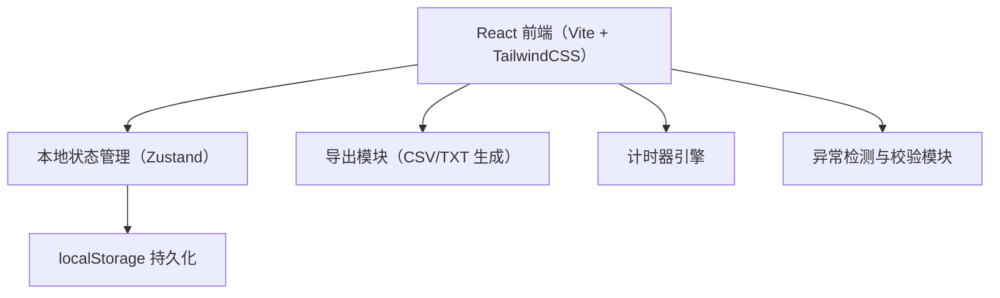
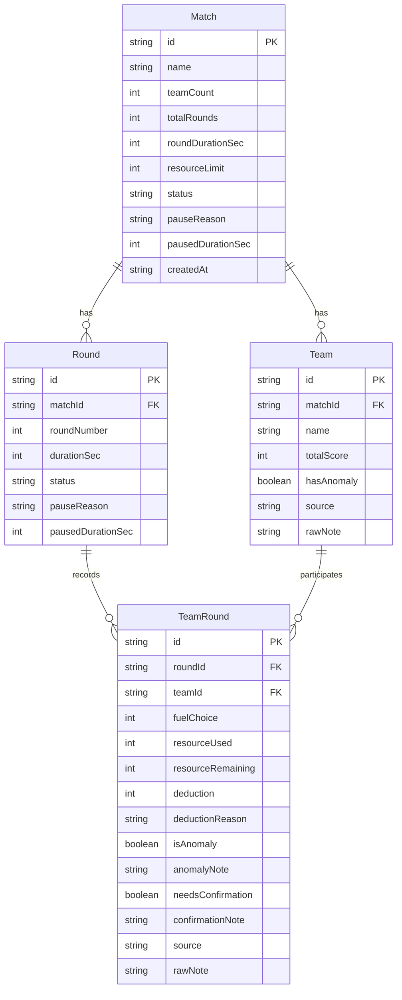

## 1. 架构设计



纯前端应用，无后端服务。所有数据存储在浏览器 localStorage，导出功能在客户端生成文件下载。

## 2. 技术说明

- **前端框架**：React@18 + TypeScript
- **样式方案**：TailwindCSS@3
- **构建工具**：Vite
- **状态管理**：Zustand（轻量，适合单页应用）
- **数据持久化**：localStorage
- **后端**：无
- **数据库**：无（localStorage + 内存）

## 3. 路由定义

| 路由 | 用途 |
|------|------|
| `/` | 控制台首页：对局创建与实时控制 |
| `/match/:id` | 比赛页面：投影大屏实时展示 |
| `/match/:id/settlement` | 结算页面：逐组扣分明细与排名 |
| `/replay` | 复盘页面：历史对局列表与搜索 |
| `/replay/:id` | 单局回放：时间轴逐轮详情 |

## 4. 数据模型

### 4.1 数据模型定义



### 4.2 核心类型定义

```typescript
type MatchStatus = "setup" | "playing" | "paused" | "settled" | "locked"
type RoundStatus = "pending" | "active" | "paused" | "completed"
type DataSource = "normal" | "projection_screen" | "manual_correction"

interface Match {
  id: string
  name: string
  teamCount: number
  totalRounds: number
  roundDurationSec: number
  resourceLimit: number
  status: MatchStatus
  pauseReason: string
  pausedDurationSec: number
  createdAt: string
}

interface Team {
  id: string
  matchId: string
  name: string
  totalScore: number
  hasAnomaly: boolean
  source: DataSource
  rawNote: string
}

interface Round {
  id: string
  matchId: string
  roundNumber: number
  durationSec: number
  status: RoundStatus
  pauseReason: string
  pausedDurationSec: number
}

interface TeamRound {
  id: string
  roundId: string
  teamId: string
  fuelChoice: number
  resourceUsed: number
  resourceRemaining: number
  deduction: number
  deductionReason: string
  isAnomaly: boolean
  anomalyNote: string
  needsConfirmation: boolean
  confirmationNote: string
  source: DataSource
  rawNote: string
}
```

### 4.3 扣分规则引擎

| 条件 | 扣分 | 原因文案 |
|------|------|----------|
| 燃料选择偏离最优值 ±10% 以内 | 0 | 选择合理，无扣分 |
| 燃料选择偏离最优值 10%-30% | -5 | 燃料配比偏差中等，偏离最优值 {delta}% |
| 燃料选择偏离最优值 >30% | -10 | 燃料配比严重偏离，偏离最优值 {delta}% |
| 资源剩余为负 | -15 且阻断 | 资源超支，已降至 {value}，需确认处理 |
| 资源恰好用尽（=0） | 0 但标记 | 资源恰好耗尽，边界情况，建议确认 |
| 超时未提交 | -8 | 本轮超时未提交选择 |

### 4.4 样例数据初始化

应用启动时检测 localStorage 是否为空，若为空则写入三条样例记录：

1. **顺利记录**：3 组 3 轮，全部正常完成，资源未为负
2. **需人工确认记录**：3 组 3 轮，其中一组第 2 轮资源为负，一组扣分恰好在阈值边界
3. **旧口径补录记录**：2 组 2 轮，source 为 `projection_screen`，rawNote 含投影大屏原始乱备注文本

## 5. 导出格式定义

### 5.1 成绩单 CSV

```
组名,总得分,第1轮选择,第1轮扣分,第1轮扣分原因,第2轮选择,第2轮扣分,第2轮扣分原因,...,是否异常,异常说明,数据来源,原始备注
```

### 5.2 回放报告 TXT

```
===== 火箭燃料配平赛 回放报告 =====
对局：{name}
日期：{date}
轮数：{totalRounds}  每轮时长：{duration}秒

── 第 1 轮 ──
A组：选择燃料 45，消耗资源 40，剩余 60，扣分 0（选择合理，无扣分）
B组：选择燃料 52，消耗资源 50，剩余 50，扣分 -5（燃料配比偏差中等，偏离最优值 18%）
C组：资源为负（-5），扣分 -15，⚠️ 需确认：资源超支，已降至 -5

── 暂停记录 ──
第 2 轮暂停 45 秒，原因：学生提问

── 最终排名 ──
1. A组 85分
2. B组 70分 ⚠️
3. C组 55分 ⚠️ 需人工确认
```
