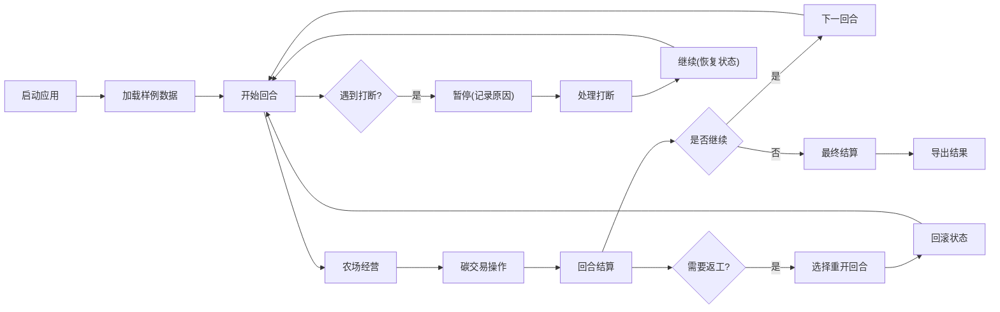

## 1. 产品概述

"碳交易农场经营"是一款面向课堂教学的模拟经营类浏览器应用，替代传统课堂计分表，帮助社团老师小林稳定管理碳交易模拟课堂的全流程。

- 解决问题：课堂计分表在暂停、例外情况处理时易混乱，回合数和结算原因不稳定
- 目标用户：社团老师小林（管理员）、课堂参与学生
- 核心价值：从样例到结果一站式管理，暂停/继续/重开状态稳定，补录差异清晰可见

## 2. 核心特性

### 2.1 用户角色

| 角色 | 注册方式 | 核心权限 |
|------|----------|----------|
| 老师（小林） | 直接使用 | 完整控制：开始/暂停/重开/结算/补录/回放 |
| 学生 | 无需注册 | 查看当前回合、交易操作、个人农场状态 |

### 2.2 功能模块

1. **主控台**：回合控制、状态显示、全局操作按钮
2. **农场面板**：各农场碳配额、土地、作物状态展示
3. **碳交易市场**：买卖碳配额、价格波动、交易记录
4. **历史记录**：回合流水、操作日志、暂停标记
5. **补录系统**：旧口径数据录入、差异对比、人工确认
6. **回放系统**：按回合回放、状态重现、结算原因追溯

### 2.3 页面详情

| 页面名称 | 模块名称 | 功能描述 |
|----------|----------|----------|
| 主控台 | 回合控制 | 开始、暂停、继续、重开、结算按钮，当前回合数、结算原因显示 |
| 主控台 | 状态概览 | 当前市场碳价、总碳配额、各农场排名 |
| 农场详情 | 农场列表 | 5个农场的碳配额、土地面积、作物类型、当前收益 |
| 农场详情 | 交易操作 | 买入/卖出碳配额，输入数量，实时计算成本 |
| 历史记录 | 回合流水 | 按时间轴展示每回合的关键事件、交易记录 |
| 历史记录 | 暂停标记 | 标记暂停时间、暂停原因、恢复时间 |
| 补录系统 | 数据录入 | 从课堂计分表补录旧口径数据，支持备注 |
| 补录系统 | 差异对比 | 高亮显示补录前后数据差异，需人工确认 |
| 回放系统 | 回合回放 | 选择回合数，重现当时状态，展示结算原因 |
| 回放系统 | 全程回放 | 自动按顺序播放所有回合，可暂停/加速 |

## 3. 核心流程

### 3.1 正常上课流程

小林老师启动应用 → 加载样例数据包 → 开始第1回合 → 学生操作农场和交易 → 回合结束自动结算 → 显示结果 → 继续下一回合... → 全部回合结束 → 最终结算 → 导出结果

### 3.2 暂停与恢复流程

上课中遇到打断 → 点击"暂停"（记录暂停原因和时间戳）→ 处理打断事件 → 返回点击"继续" → 回合数和状态完整恢复 → 继续经营

### 3.3 补录流程

课后小林发现遗漏数据 → 进入补录系统 → 选择补录回合 → 录入课堂计分表旧口径数据 → 系统高亮显示差异 → 小林人工确认 → 数据更新并标注"补录"标记 → 差异记录永久保存

### 3.4 重开流程

需要返工某回合 → 点击"重开"选择目标回合 → 确认结算原因 → 状态回滚到该回合开始 → 重新经营 → 新结果与旧结果对比保存

## 4. 用户界面设计

### 4.1 设计风格

- **主色调**：森林绿 `#2d5a3d`（农业+环保主题）、土黄 `#c9a962`（土地）
- **辅助色**：碳灰 `#4a5568`（交易）、天蓝 `#4299e1`（信息提示）
- **按钮风格**：直角、细边框、悬停轻微上浮、点击凹陷
- **字体**：标题用 `ZCOOL XiaoWei`（文艺衬线），正文用 `Noto Sans SC`（清晰易读）
- **布局风格**：左右分栏，左侧导航+状态，右侧主内容区，卡片式分组
- **图标**：使用 lucide-react 线性图标，农场用🌱，交易用💹，暂停用⏸️

### 4.2 页面设计概述

| 页面名称 | 模块名称 | UI 元素 |
|----------|----------|---------|
| 主控台 | 回合控制 | 顶部固定条，大号回合数字，按钮组横向排列，状态灯红绿指示 |
| 主控台 | 状态概览 | 三栏卡片：市场碳价、总配额、农场排名，数字动画过渡 |
| 农场详情 | 农场列表 | 网格布局 2×3，每张农场卡片显示头像、配额条形图、土地图标 |
| 农场详情 | 交易操作 | 底部固定操作栏，数字输入框，买入/卖出按钮对立配色 |
| 历史记录 | 回合流水 | 时间轴布局，左侧圆点标记回合，右侧内容卡片，暂停用黄色三角标记 |
| 补录系统 | 数据录入 | 表单布局，旧数据灰显，新数据输入框绿色边框 |
| 补录系统 | 差异对比 | 表格布局，差异行红色背景，前后数值并排对比 |
| 回放系统 | 回合回放 | 播放器风格控制条，进度条可拖动，状态面板半透明覆盖 |

### 4.3 响应式

- **Desktop-first**：优先保证 1280px+ 课堂投影效果
- **平板适配**：1024px 时农场卡片改为 1×5 横向滚动
- **手机适配**：768px 以下转为单列，导航折叠为汉堡菜单
- **触控优化**：按钮最小高度 44px，交易滑块替代输入框

## 5. 样例数据规格

### 5.1 预设样例数据包（小林先跑的小包）

1. **顺利记录**（回合3）：农场A正常卖出10吨碳配额，价格50元/吨，盈利500元
2. **需人工确认记录**（回合5）：农场B买入20吨，但价格波动超出阈值，需小林确认后生效
3. **故意打断的暂停记录**（回合7中间）：模拟课堂突发情况，暂停后继续，回合数保持7
4. **旧口径补录记录**（回合2）：从课堂计分表补录，旧口径按40元/吨计算，新口径按45元/吨，差异清晰展示

### 5.2 异常处理规则

- 坏配置（如数据格式错误）：不白屏，显示红色提示框 "数据加载失败：XX字段格式错误，请检查样例数据包"，提供"恢复默认数据"按钮
- 边界分数（如负数碳配额）：黄色警告标记，文字说明 "警告：该农场碳配额不足，需在下回合补足"
- 新手误操作（如重复点击）：防抖处理 + Toast 提示 "操作已记录，请勿重复点击"
