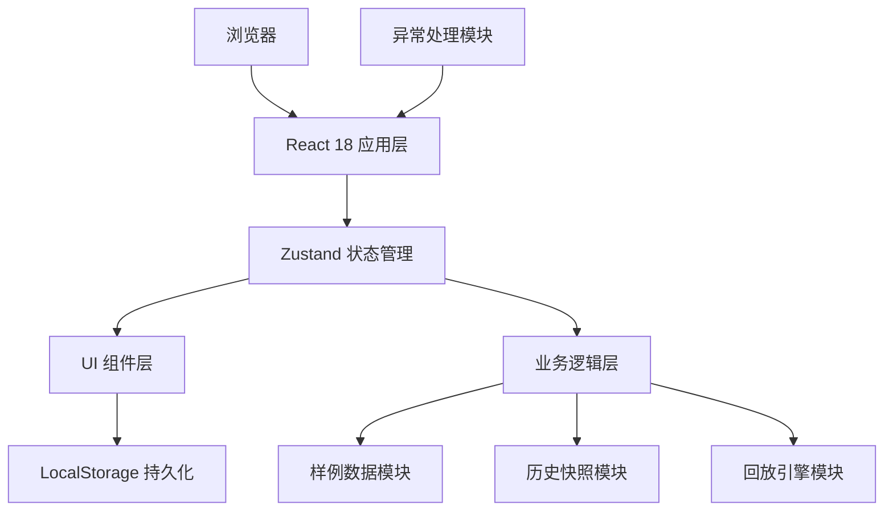
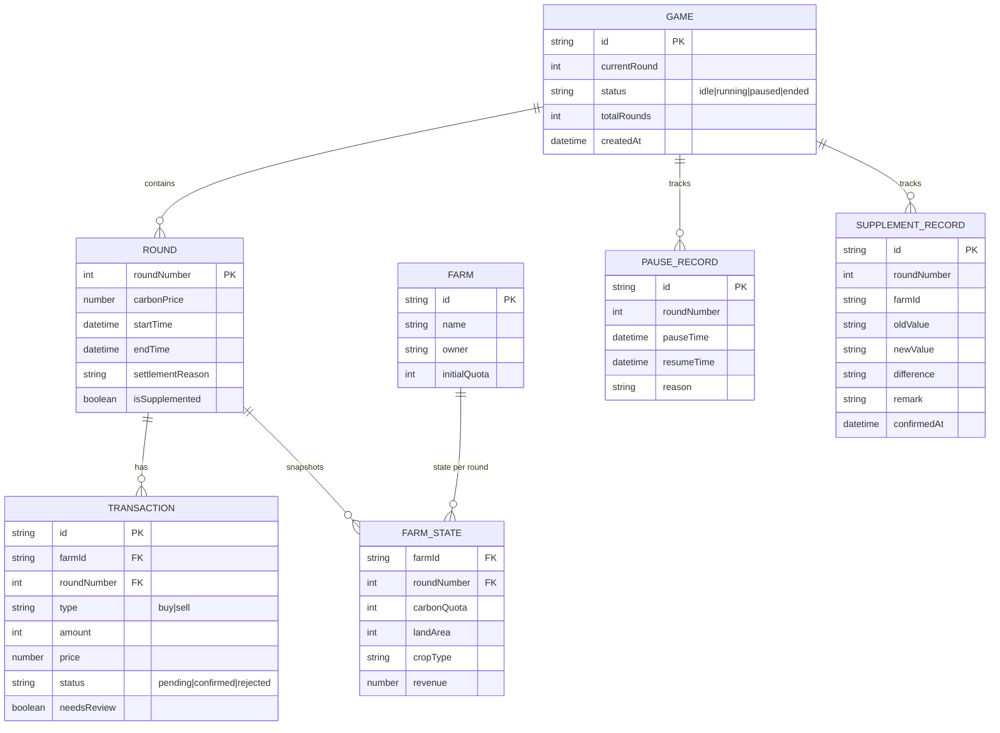

## 1. 架构设计

纯前端单页应用，无需后端服务，数据持久化到浏览器 LocalStorage。



## 2. 技术描述

- **前端**：React@18 + TypeScript@5 + Vite@5 + TailwindCSS@3
- **状态管理**：Zustand@4（轻量、支持时间旅行、适合回放入场）
- **路由**：React Router DOM@6（单页面多视图切换）
- **图标**：lucide-react（线性图标库）
- **初始化工具**：vite-init
- **后端**：无（纯前端应用）
- **数据库**：浏览器 LocalStorage + IndexedDB（存储历史快照）
- **Mock 数据**：内置样例数据包，无需联网

## 3. 路由定义

| 路由 | 页面组件 | 用途 |
|------|----------|------|
| `/` | `Dashboard` | 主控台：回合控制、状态概览 |
| `/farms` | `FarmList` | 农场列表与交易操作 |
| `/history` | `History` | 历史记录与时间轴 |
| `/supplement` | `Supplement` | 补录系统与差异对比 |
| `/replay` | `Replay` | 回放系统 |

## 4. 数据模型

### 4.1 核心数据结构



### 4.2 Zustand Store 定义

```typescript
interface GameState {
  // 游戏状态
  game: Game | null;
  farms: Farm[];
  currentRoundState: Round | null;
  farmStates: FarmState[];
  transactions: Transaction[];
  pauseRecords: PauseRecord[];
  supplementRecords: SupplementRecord[];
  
  // 回合控制
  startGame: () => void;
  pauseGame: (reason: string) => void;
  resumeGame: () => void;
  restartFromRound: (round: number, reason: string) => void;
  settleRound: () => void;
  nextRound: () => void;
  endGame: () => void;
  
  // 交易操作
  submitTransaction: (tx: Omit<Transaction, 'id' | 'status'>) => void;
  confirmTransaction: (txId: string) => void;
  rejectTransaction: (txId: string) => void;
  
  // 补录
  supplementData: (record: Omit<SupplementRecord, 'id' | 'confirmedAt'>) => void;
  
  // 历史快照
  getSnapshotAtRound: (round: number) => GameSnapshot;
  
  // 回放
  isReplaying: boolean;
  replayRound: number | null;
  startReplay: (fromRound?: number) => void;
  stopReplay: () => void;
  stepReplay: (direction: 'prev' | 'next') => void;
}
```

## 5. 关键技术实现

### 5.1 状态稳定性保障

- **历史快照机制**：每回合开始和结束时自动生成完整状态快照，存入 IndexedDB
- **回合号单调递增**：暂停/继续不改变回合号，重开明确记录"从第X回合返工"
- **结算原因必录**：每次结算、重开、暂停都要求填写原因，永久保存

### 5.2 回放入场

- 基于历史快照的时间旅行，直接渲染指定回合的完整状态
- 回放模式下所有操作按钮禁用，确保只读
- 支持 0.5x/1x/2x 倍速自动播放

### 5.3 差异对比算法

```typescript
function calculateDifference(
  oldData: FarmState, 
  newData: FarmState
): DifferenceReport {
  const diffs: FieldDiff[] = [];
  for (const key of Object.keys(oldData)) {
    if (oldData[key] !== newData[key]) {
      diffs.push({
        field: key,
        oldValue: oldData[key],
        newValue: newData[key],
        delta: Number(newData[key]) - Number(oldData[key])
      });
    }
  }
  return { hasChanges: diffs.length > 0, diffs };
}
```

### 5.4 异常处理边界

- 顶层 ErrorBoundary 捕获渲染异常，显示友好提示
- 数据加载时 Schema 校验，不合法数据触发降级流程
- 所有状态变更操作包裹 try-catch，失败时回滚到上一有效快照

## 6. 项目目录结构

```
src/
├── components/          # 可复用组件
│   ├── ControlBar.tsx   # 顶部控制栏
│   ├── FarmCard.tsx     # 农场卡片
│   ├── TradeForm.tsx    # 交易表单
│   ├── Timeline.tsx     # 时间轴
│   ├── DiffTable.tsx    # 差异对比表
│   ├── ReplayPlayer.tsx # 回放控制器
│   └── AlertBox.tsx     # 提示框
├── pages/               # 页面组件
│   ├── Dashboard.tsx
│   ├── FarmList.tsx
│   ├── History.tsx
│   ├── Supplement.tsx
│   └── Replay.tsx
├── store/               # Zustand store
│   └── useGameStore.ts
├── types/               # TypeScript 类型定义
│   └── index.ts
├── data/                # 样例数据
│   └── sampleData.ts
├── utils/               # 工具函数
│   ├── snapshot.ts      # 快照管理
│   ├── diff.ts          # 差异计算
│   ├── validate.ts      # 数据校验
│   └── storage.ts       # 持久化
├── hooks/               # 自定义 hooks
│   ├── useReplay.ts
│   └── useToast.ts
├── App.tsx
├── main.tsx
└── index.css
```
