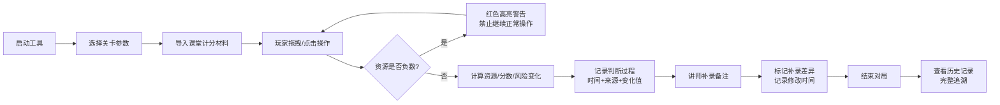
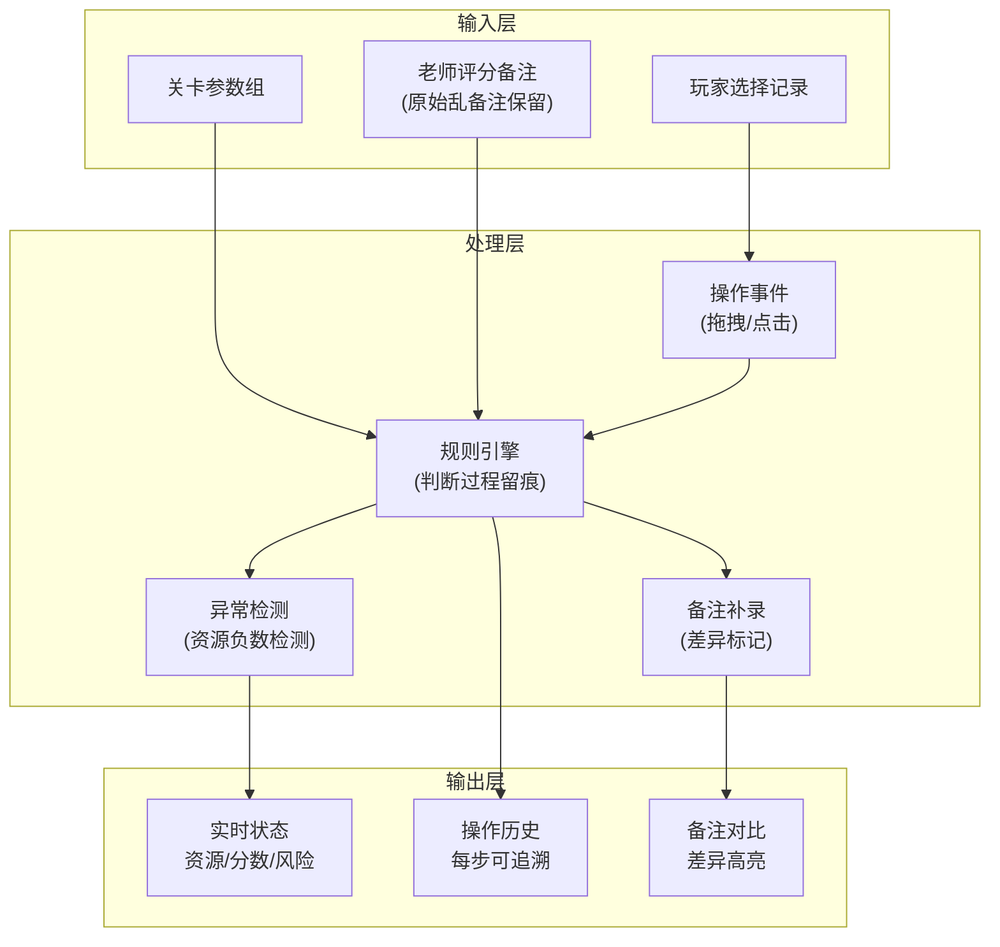

## 1. 产品概述

"微积分滑板公园"是专为培训讲师老冯设计的课堂计分管理工具，用于整理课堂计分表中的零散材料，实现资源、分数、风险的实时联动计算，同时完整保留原始备注和判断过程。

- **核心目的**：让课堂计分表里的乱材料能对得上，每次玩家操作（拖拽/点击）都实时影响资源、分数或风险
- **目标用户**：培训讲师老冯及后续接手的其他讲师
- **核心价值**：保留完整判断痕迹，异常状态（资源负数）不隐藏，补录备注可追溯差异

## 2. 核心特性

### 2.1 用户角色

| 角色 | 登录方式 | 核心权限 |
|------|----------|----------|
| 培训讲师 | 本地直接使用 | 管理关卡参数、记录玩家操作、补录评分备注、查看历史记录 |

### 2.2 功能模块

1. **主游戏面板**：滑板公园可视化区域，资源/分数/风险实时显示，拖拽/点击交互
2. **关卡管理**：关卡参数配置、多组关卡切换、参数导入导出
3. **计分系统**：实时计算、操作历史、判断过程留痕
4. **备注管理**：原始备注保留、补录备注、差异对比
5. **历史记录**：单局操作回放、来源追踪、处理时间记录

### 2.3 页面详情

| 页面名称 | 模块名称 | 功能描述 |
|-----------|-------------|---------------------|
| 主面板 | 状态仪表盘 | 实时显示当前资源、分数、风险值，负数资源高亮红色警告 |
| 主面板 | 滑板公园交互区 | 可拖拽/点击的元素，每次操作触发资源/分数/风险变化 |
| 主面板 | 操作记录流 | 实时显示每一步操作的时间、内容、计算过程、数值变化 |
| 关卡管理 | 关卡列表 | 显示已有的几组关卡参数，支持切换和导入 |
| 关卡管理 | 参数编辑 | 查看和编辑当前关卡的各项参数配置 |
| 备注管理 | 原始备注区 | 完整保留课堂计分表中的"乱备注"，不做清洗 |
| 备注管理 | 补录备注区 | 讲师临时补充的备注，自动记录时间和来源 |
| 备注管理 | 差异对比 | 高亮显示补录前后的差异，标注修改人、修改时间 |
| 历史记录 | 单局列表 | 列出所有历史对局，支持筛选和搜索 |
| 历史记录 | 对局详情 | 完整回放一局的所有操作、数值变化、备注记录、判断过程 |

## 3. 核心流程

### 主工作流程

培训讲师老冯启动工具 → 选择一组关卡参数 → 导入课堂计分表材料（含原始备注）→ 玩家进行拖拽/点击操作 → 系统实时计算资源/分数/风险变化并记录判断过程 → 讲师补录备注 → 系统标记补录差异 → 结束对局 → 查看完整历史记录

### 数据流转过程

## 4. 用户界面设计

### 4.1 设计风格

- **设计方向**：学术风+工业风混合，参考黑板/滑板场的结合感。故意保留"不整齐"的痕迹，呼应"乱备注不清洗"的需求
- **主色调**：深灰黑板底 (`#1a1a2e`) + 粉笔白 (`#f5f5f5`) + 滑板橙 (`#ff6b35`) + 警告红 (`#e63946`) + 数学蓝 (`#457b9d`)
- **按钮风格**：粗边框、轻微倾斜、手写感，模拟粉笔板书效果
- **字体**：标题使用手写风格字体（如 Caveat），正文使用等宽字体（如 JetBrains Mono）模拟代码/板书感
- **布局风格**：不对称网格布局，故意留出"乱"的空间，备注区使用便利贴样式错落排列
- **图标/emoji**：使用滑板🛹、积分📊、警告⚠️、粉笔✏️、黑板📋等emoji，避免精致的SVG图标

### 4.2 页面设计概览

| 页面名称 | 模块名称 | UI元素 |
|-----------|-------------|-------------|
| 主面板 | 状态仪表盘 | 三个大数字卡片，资源负数时卡片变红抖动，数值后附带变化箭头 |
| 主面板 | 滑板公园交互区 | 黑板背景上的可拖拽滑板元素，拖到不同区域触发不同计算，拖动时有粉笔轨迹 |
| 主面板 | 操作记录流 | 时间线样式，每条记录包含时间戳、操作描述、计算公式、变化前后数值 |
| 关卡管理 | 关卡列表 | 卡片式列表，选中卡片有橙色粉笔边框，支持拖拽排序 |
| 备注管理 | 原始备注区 | 黄色便利贴样式，文字使用手写字体，保留原始换行和错别字 |
| 备注管理 | 补录备注区 | 蓝色便利贴样式，边缘标注"补录"印章和时间，与原始备注有视觉区分 |
| 备注管理 | 差异对比 | 删除线+红色标注删除内容，下划线+绿色标注新增内容 |
| 历史记录 | 对局详情 | 折叠面板，展开后显示完整时间线，支持按操作类型筛选 |

### 4.3 响应性

- **桌面优先**：主交互区域保持1024px以上宽度，三栏布局（状态区+交互区+记录区）
- **平板适配**：768px时改为上下两栏，交互区在上，记录区在下
- **触控优化**：拖拽元素最小48x48px，点击区域增加触控反馈

### 4.4 动效设计

- **页面加载**：黑板擦除效果，从左到右渐显内容
- **拖拽操作**：粉笔跟随轨迹，松手时触发数值变化动画（数字滚动+粒子效果）
- **资源负数**：红色警告边框闪烁，卡片轻微抖动，伴随"嗡"的提示音
- **补录备注**：便利贴从屏幕外滑入，盖在原始备注旁边，有"啪"的盖章效果
- **状态变化**：数值变化时有0.3秒的数字滚动动画，变化量用绿色+或红色-显示

## 5. 数据追溯设计

### 5.1 不可篡改记录

- 每条操作记录包含：`操作ID + 时间戳(精确到毫秒) + 操作类型 + 原始值 + 变化量 + 计算规则ID + 操作人 + 来源标识`
- 原始备注一旦导入不可修改，补录备注单独存储并关联原始记录ID
- 所有时间使用服务器时间（或本地不可修改的时间戳），禁止手动调整

### 5.2 差异标记规则

- 补录备注与原始备注并排显示
- 使用 `<del>` 标记删除内容，`<ins>` 标记新增内容
- 差异处悬浮显示：`修改人：老冯 | 修改时间：2026-06-01 14:30:22 | 原因：临时调整`
