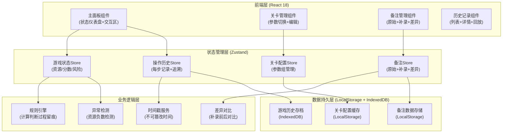
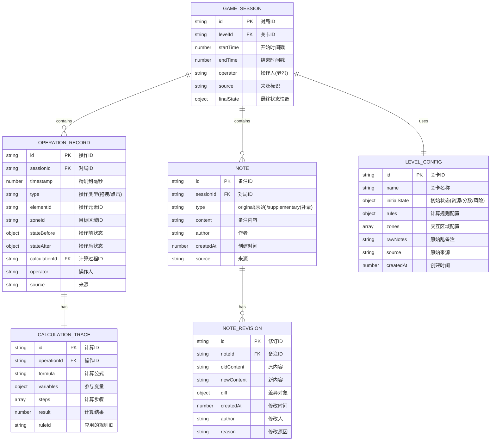

## 1. 架构设计



## 2. 技术描述

- **前端框架**：React 18 + TypeScript
- **构建工具**：Vite 5
- **样式方案**：TailwindCSS 3 + CSS Variables
- **状态管理**：Zustand 4 (轻量，支持时间旅行调试)
- **拖拽交互**：@dnd-kit/core + @dnd-kit/sortable (性能好，支持复杂拖拽)
- **数据持久化**：
  - LocalStorage：存储关卡配置、当前游戏状态、备注
  - IndexedDB：存储完整历史对局记录（数据量大）
- **UI组件**：手写组件，不使用UI库，保持"黑板粉笔"风格
- **图标**：直接使用emoji，不引入图标库
- **动画**：Framer Motion + 手写CSS Keyframes

## 3. 路由定义

| 路由 | 页面/组件 | 用途 |
|-------|-----------|---------|
| `/` | 主面板 | 游戏主界面，包含状态仪表盘、滑板公园交互区、操作记录流 |
| `/levels` | 关卡管理 | 管理多组关卡参数，支持切换、导入、导出、编辑 |
| `/history` | 历史记录 | 查看所有历史对局列表和详细回放 |
| `/help` | 使用说明 | 启动说明、切换关卡方法、查看历史操作指南 |

## 4. 数据模型

### 4.1 核心数据模型



### 4.2 TypeScript 类型定义

```typescript
// 游戏状态
interface GameState {
  resources: number;
  score: number;
  risk: number;
  isNegative: boolean;
}

// 交互区域
interface Zone {
  id: string;
  name: string;
  x: number;
  y: number;
  width: number;
  height: number;
  effect: {
    resources?: number;
    score?: number;
    risk?: number;
    formula?: string;
  };
  style: Record<string, string>;
}

// 可拖拽元素
interface DraggableElement {
  id: string;
  label: string;
  emoji: string;
  baseValue: number;
}

// 操作记录
interface OperationRecord {
  id: string;
  sessionId: string;
  timestamp: number;
  type: 'drag' | 'click';
  elementId: string;
  zoneId?: string;
  stateBefore: GameState;
  stateAfter: GameState;
  calculationTrace: CalculationTrace;
  operator: string;
  source: string;
}

// 计算过程留痕
interface CalculationTrace {
  id: string;
  operationId: string;
  formula: string;
  variables: Record<string, number>;
  steps: Array<{
    description: string;
    value: number;
  }>;
  result: number;
  ruleId: string;
}

// 备注
interface Note {
  id: string;
  sessionId: string;
  type: 'original' | 'supplementary';
  content: string;
  author: string;
  createdAt: number;
  source: string;
  revisions?: NoteRevision[];
}

// 备注修订（差异）
interface NoteRevision {
  id: string;
  noteId: string;
  oldContent: string;
  newContent: string;
  diff: DiffChunk[];
  createdAt: number;
  author: string;
  reason: string;
}

interface DiffChunk {
  value: string;
  added?: boolean;
  removed?: boolean;
}

// 关卡配置
interface LevelConfig {
  id: string;
  name: string;
  description: string;
  initialState: GameState;
  zones: Zone[];
  elements: DraggableElement[];
  rawNotes: string;
  rules: CalculationRule[];
  source: string;
  createdAt: number;
}

// 计算规则
interface CalculationRule {
  id: string;
  name: string;
  condition: string;
  formula: string;
  description: string;
}

// 游戏对局
interface GameSession {
  id: string;
  levelId: string;
  levelName: string;
  startTime: number;
  endTime?: number;
  operator: string;
  source: string;
  currentState: GameState;
  records: OperationRecord[];
  notes: Note[];
  finalState?: GameState;
}
```

## 5. 核心算法

### 5.1 资源负数检测算法

```typescript
function checkNegativeResources(state: GameState): {
  isNegative: boolean;
  violations: string[];
} {
  const violations: string[] = [];
  
  if (state.resources < 0) {
    violations.push(`资源为负数: ${state.resources}`);
  }
  
  if (state.risk > 100) {
    violations.push(`风险超过阈值: ${state.risk} > 100`);
  }
  
  return {
    isNegative: violations.length > 0,
    violations,
  };
}
```

### 5.2 备注差异对比算法

使用 diff 库比较原始备注和补录备注：

```typescript
function diffNotes(oldContent: string, newContent: string): DiffChunk[] {
  // 按字符级差分，保留完整差异
  const dmp = new diff_match_patch();
  const diffs = dmp.diff_main(oldContent, newContent);
  dmp.diff_cleanupSemantic(diffs);
  
  return diffs.map(([type, value]) => ({
    value,
    added: type === 1,
    removed: type === -1,
  }));
}
```

### 5.3 规则引擎计算

```typescript
function applyRule(
  rule: CalculationRule,
  currentState: GameState,
  elementValue: number
): {
  newState: GameState;
  trace: CalculationTrace;
} {
  // 记录计算步骤，完整留痕
  const steps = [];
  const variables = {
    resources: currentState.resources,
    score: currentState.score,
    risk: currentState.risk,
    elementValue,
  };
  
  // 解析公式并计算
  // ...公式解析逻辑...
  
  return {
    newState,
    trace: {
      id: generateId(),
      operationId: '',
      formula: rule.formula,
      variables,
      steps,
      result: calculatedValue,
      ruleId: rule.id,
    },
  };
}
```

## 6. 存储设计

### 6.1 LocalStorage 键名

```typescript
const STORAGE_KEYS = {
  CURRENT_SESSION: 'skatepark_current_session',
  LEVELS: 'skatepark_levels',
  CURRENT_LEVEL_ID: 'skatepark_current_level_id',
  OPERATOR_NAME: 'skatepark_operator_name',
};
```

### 6.2 IndexedDB 数据库结构

```typescript
// 数据库名：skatepark_db
// 版本：1

interface DBSchema {
  sessions: {
    key: string; // id
    indexes: {
      'by-startTime': number;
      'by-levelId': string;
      'by-operator': string;
    };
  };
  records: {
    key: string; // id
    indexes: {
      'by-sessionId': string;
      'by-timestamp': number;
    };
  };
  notes: {
    key: string; // id
    indexes: {
      'by-sessionId': string;
      'by-type': string;
    };
  };
}
```

## 7. 内置Mock数据

预置3组关卡参数，模拟课堂计分表材料：

1. **关卡一：导数入门坡道** - 基础资源管理
2. **关卡二：积分曲面碗池** - 中等复杂度计算
3. **关卡三：极限微积分U池** - 高风险高回报

每组包含：
- 初始状态：资源100、分数0、风险10
- 3-5个交互区域，不同的计算公式
- 2-4个可拖拽元素（🛹🛼🥅🎯等）
- 原始"乱备注"（包含换行、错别字、口语化描述）
- 老师评分备注示例
