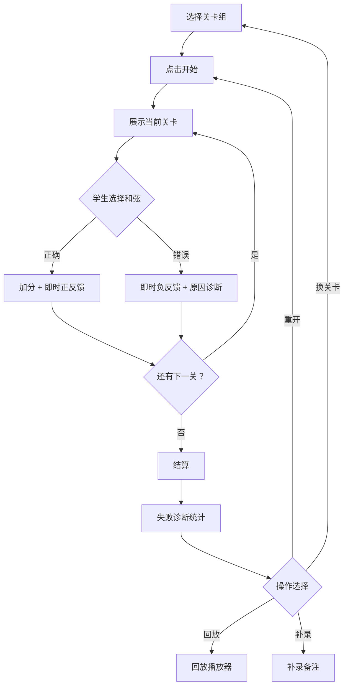
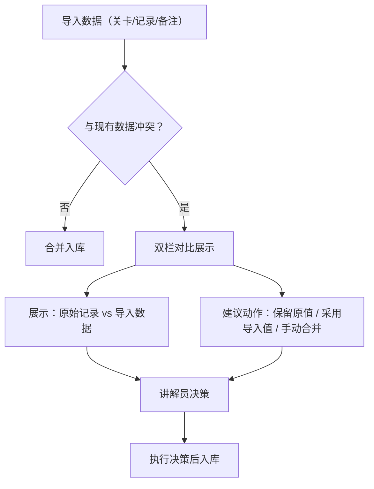
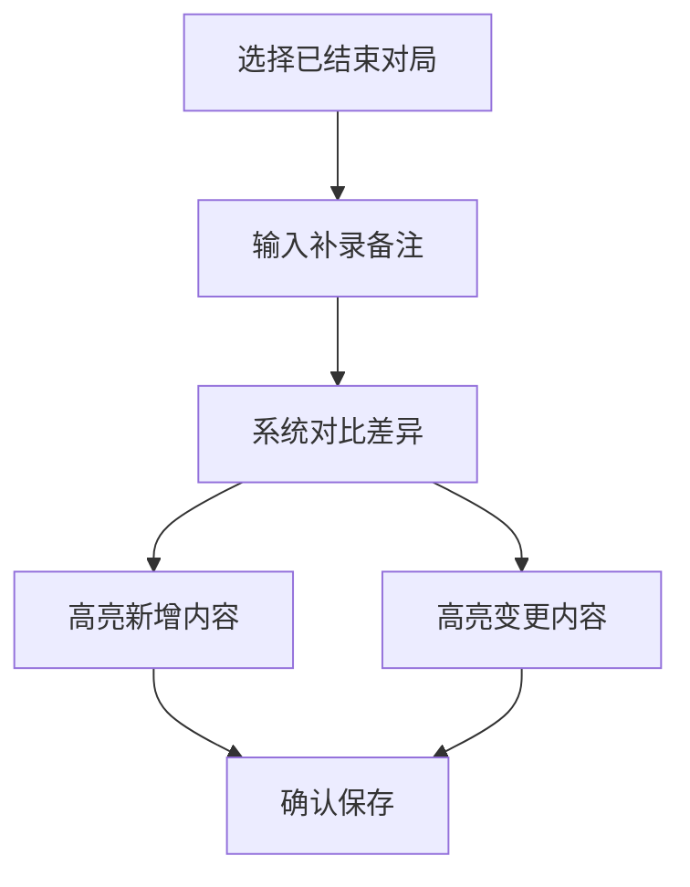

## 1. 产品概述

"爵士和弦寻宝"是一款面向科普馆场景的浏览器端音乐教育互动游戏，帮助孩子们在闯关中理解爵士和弦构成与连接规则。核心目标是让科普馆讲解员小夏能够快速上手、无需翻阅老师错题本即可掌握每局游戏的全过程与结果。

- **目标用户**：科普馆讲解员（主导操作）、参与互动的儿童/学生
- **核心价值**：将枯燥的和弦知识变成可感知的寻宝闯关，同时为讲解员提供完整的操作记录、失败诊断与回放能力，减少事后翻找证据的工作量

## 2. 核心功能

### 2.1 用户角色

| 角色 | 使用方式 | 核心权限 |
|------|----------|----------|
| 讲解员（主导者） | 浏览器操作 | 启动/暂停/重开游戏、导入关卡数据、查看历史与回放、补录备注 |
| 学生（参与者） | 在讲解员引导下操作 | 在游戏界面做出和弦选择、查看即时反馈 |

### 2.2 功能模块

1. **游戏主界面**：关卡展示、和弦选择交互、计时器、得分面板
2. **控制面板**：开始、暂停、重开、结算、回放按钮
3. **失败诊断面板**：区分"规则未理解"与"操作过慢"的具体反馈
4. **数据导入面板**：导入关卡参数、玩家选择记录、老师评分备注
5. **补录与冲突面板**：补录备注、显示补录差异、冲突证据对比
6. **历史记录面板**：按局查看历史、回放操作序列

### 2.3 页面详情

| 页面名称 | 模块名称 | 功能描述 |
|----------|----------|----------|
| 游戏主界面 | 关卡区域 | 展示当前关卡目标和弦、可选和弦按钮、提示信息 |
| 游戏主界面 | 控制栏 | 开始/暂停/重开/结算/回放五个操作按钮，状态联动 |
| 游戏主界面 | 得分与计时 | 实时计分、倒计时/正计时显示、连击提示 |
| 游戏主界面 | 反馈浮层 | 每次选择后即时反馈正确/错误及具体原因 |
| 结算页 | 结果总览 | 本局得分、用时、正确率、失败原因分类统计 |
| 结算页 | 失败诊断 | 按关卡列出失败点，标注"规则未理解"或"操作过慢" |
| 结算页 | 回放入口 | 点击任一失败关卡可直接跳转回放 |
| 数据导入页 | 关卡参数导入 | 支持 JSON 格式导入关卡配置 |
| 数据导入页 | 选择记录导入 | 导入历史玩家选择记录 |
| 数据导入页 | 评分备注导入 | 导入老师的评分备注 |
| 补录页 | 备注补录 | 对已完成局追加讲解员备注 |
| 补录页 | 差异展示 | 补录后自动对比，高亮新增/变更内容 |
| 补录页 | 冲突检测 | 导入数据与已有记录冲突时，双栏对比展示双方证据和建议动作 |
| 历史页 | 对局列表 | 按时间排列的历史对局，支持筛选 |
| 历史页 | 回放播放器 | 逐步回放对局操作，支持快进/暂停 |

## 3. 核心流程

### 3.1 游戏主流程

讲解员选择关卡组 → 点击开始 → 学生依次选择和弦 → 系统即时反馈 → 关卡通过/失败 → 进入下一关或触发结算 → 结算页展示诊断 → 可选回放或补录备注

### 3.2 数据导入与冲突处理流程

### 3.3 补录备注差异流程

## 4. 用户界面设计

### 4.1 设计风格

- **主色调**：深靛蓝 (#1a1a2e) 为底，金色 (#e6a817) 为强调色，呼应爵士乐的深夜与金色调
- **辅助色**：暗紫 (#4a3f6b) 用于卡片背景，翡翠绿 (#2ecc71) 表示正确，珊瑚红 (#e74c3c) 表示错误
- **按钮风格**：圆角 12px，轻微投影，金色描边按钮作为主操作
- **字体**：标题使用 Playfair Display（衬线，爵士风），正文使用 Noto Sans SC（中文友好）
- **布局**：居中主舞台 + 左侧控制栏 + 右侧信息栏，桌面优先
- **图标**：使用 Lucide React 图标库
- **动画**：和弦选择时有波纹扩散效果，正确/错误有脉冲动画，计时器用环形进度条

### 4.2 页面设计概览

| 页面名称 | 模块名称 | UI 元素 |
|----------|----------|---------|
| 游戏主界面 | 关卡区域 | 深色卡片、目标和弦大字展示、6-8个可选和弦按钮（金色边框） |
| 游戏主界面 | 控制栏 | 5个图标按钮纵向排列，当前状态高亮，暂停/进行中视觉区分 |
| 游戏主界面 | 得分与计时 | 左上角得分数字、右上角环形倒计时、中间连击徽章 |
| 结算页 | 结果总览 | 大号总分居中、环形正确率图、用时柱状图 |
| 结算页 | 失败诊断 | 关卡列表，每项带标签"规则未理解"/"操作过慢"，点击展开详情 |
| 数据导入页 | 导入区域 | 拖拽上传区 + JSON文本粘贴区，导入后预览表格 |
| 补录页 | 差异展示 | 双栏对比，新增内容绿色高亮，变更内容黄色高亮，冲突红色高亮 |
| 历史页 | 对局列表 | 时间轴布局，每局缩略信息卡片，点击展开详情 |

### 4.3 响应式

- 桌面优先设计（1440px 基准）
- 平板（768px-1024px）：控制栏折叠为底部栏
- 手机（<768px）：单列布局，信息栏折叠为抽屉

### 4.4 3D 场景

不适用，本项目为 2D 交互界面。

## 5. 游戏机制详细说明

### 5.1 关卡结构

每个关卡包含：
- **目标和弦**：学生需要找到的正确和弦（如 Cmaj7 → 需选择 C E G B）
- **选项集**：6-8个和弦组成音组合供选择
- **时间限制**：每关限时（如 15 秒）
- **提示文本**：该关卡涉及的乐理知识点简述

### 5.2 失败诊断逻辑

- **规则未理解**：选择了一个在音程关系上完全不匹配的选项（如选了小三和弦的音去配大七和弦）
- **操作过慢**：超时未作答，或答对但耗时超过阈值的 80%

### 5.3 计分规则

- 基础分：正确选择 +100
- 时间奖励：在 50% 时间内完成额外 +50
- 连击奖励：连续正确 ×1.5 倍率
- 失败不扣分，但记录诊断标签

### 5.4 预置关卡组

提供 3 组预置关卡：
1. **入门组**（5关）：大三和弦、小三和弦识别
2. **进阶组**（8关）：七和弦构成（maj7, m7, dom7, dim7）
3. **挑战组**（10关）：和弦连接与进行（ii-V-I 等）

## 6. 说明文档要求

应用内置"使用说明"入口，覆盖：
- 如何启动一局游戏
- 如何切换关卡组
- 如何查看一局的历史与回放
- 如何导入数据
- 如何补录备注及查看差异
- 冲突处理操作指引
