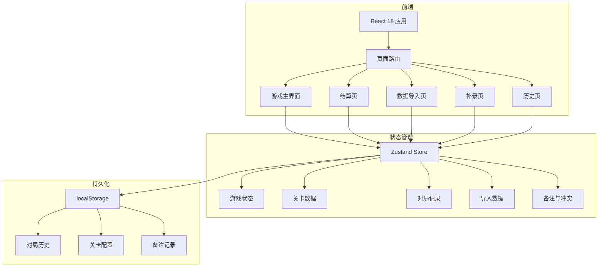
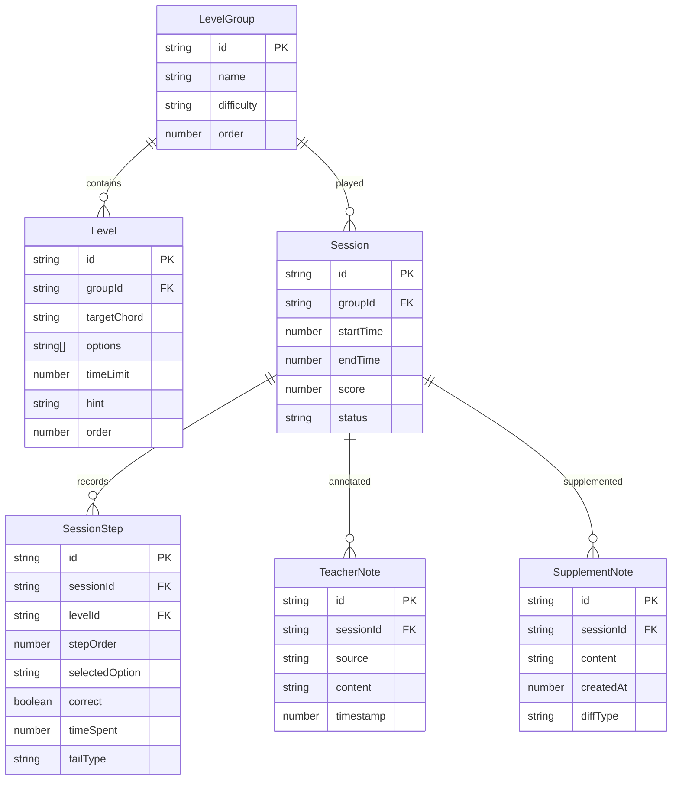

## 1. 架构设计



## 2. 技术说明

- **前端**：React@18 + TypeScript + Tailwind CSS@3 + Vite
- **初始化工具**：vite-init（react-ts 模板）
- **后端**：无（纯前端，数据存 localStorage）
- **数据库**：localStorage（结构化 JSON 存储）
- **状态管理**：Zustand
- **路由**：react-router-dom v6

## 3. 路由定义

| 路由 | 用途 |
|------|------|
| `/` | 游戏主界面（含关卡选择、游戏操作、控制栏） |
| `/settlement/:sessionId` | 结算页（对局结果、失败诊断、回放入口） |
| `/import` | 数据导入页（关卡参数、选择记录、评分备注） |
| `/supplement/:sessionId` | 补录页（追加备注、差异展示、冲突检测） |
| `/history` | 历史页（对局列表、回放播放器） |
| `/help` | 使用说明页 |

## 4. 数据模型

### 4.1 数据模型定义



### 4.2 数据定义

#### LevelGroup（关卡组）

```typescript
interface LevelGroup {
  id: string;
  name: string;
  difficulty: "beginner" | "intermediate" | "advanced";
  order: number;
}
```

#### Level（关卡）

```typescript
interface Level {
  id: string;
  groupId: string;
  targetChord: string;
  targetNotes: string[];
  options: LevelOption[];
  timeLimit: number;
  hint: string;
  order: number;
}

interface LevelOption {
  id: string;
  label: string;
  notes: string[];
  isCorrect: boolean;
}
```

#### Session（对局）

```typescript
interface Session {
  id: string;
  groupId: string;
  startTime: number;
  endTime: number | null;
  score: number;
  combo: number;
  maxCombo: number;
  status: "playing" | "paused" | "completed" | "abandoned";
}
```

#### SessionStep（对局步骤）

```typescript
interface SessionStep {
  id: string;
  sessionId: string;
  levelId: string;
  stepOrder: number;
  selectedOption: string | null;
  correct: boolean;
  timeSpent: number;
  failType: "rule_misunderstood" | "too_slow" | null;
  timestamp: number;
}
```

#### TeacherNote（老师评分备注）

```typescript
interface TeacherNote {
  id: string;
  sessionId: string;
  source: "import" | "supplement";
  content: string;
  timestamp: number;
}
```

#### SupplementNote（补录备注）

```typescript
interface SupplementNote {
  id: string;
  sessionId: string;
  content: string;
  createdAt: number;
  diffType: "added" | "changed" | "conflict";
  previousContent?: string;
}
```

## 5. 核心模块划分

### 5.1 游戏状态机

游戏状态流转：`idle → playing ↔ paused → completed`

- `idle`：初始状态，可选择关卡组
- `playing`：游戏进行中，计时器运行
- `paused`：暂停状态，计时器停止，可继续或重开
- `completed`：结算状态，展示结果与诊断

### 5.2 Zustand Store 结构

```typescript
interface GameStore {
  gameStatus: "idle" | "playing" | "paused" | "completed";
  currentGroupId: string | null;
  currentLevelIndex: number;
  currentSession: Session | null;
  sessionSteps: SessionStep[];
  timer: number;

  startGame: (groupId: string) => void;
  pauseGame: () => void;
  resumeGame: () => void;
  restartGame: () => void;
  endGame: () => void;
  selectOption: (optionId: string) => void;
  tick: () => void;
}
```

### 5.3 数据导入与冲突检测

- 导入时逐字段对比已有记录
- 冲突判定：同一 sessionId 下，已有字段值与导入值不同
- 冲突展示：双栏（左=原始，右=导入），每字段独立标记
- 不自动合并，由讲解员逐项决策

### 5.4 补录差异

- 补录后，系统自动与该对局已有备注对比
- 新增内容：绿色高亮
- 变更内容：黄色高亮 + 显示旧值
- 冲突内容：红色高亮 + 双栏展示

## 6. 预置数据

应用内置 3 组关卡数据，存于 `src/data/levels.ts`：

1. **入门组** - "爵士和弦第一课"（5关，大三/小三和弦）
2. **进阶组** - "七和弦探秘"（8关，各类七和弦）
3. **挑战组** - "和弦进行大冒险"（10关，ii-V-I等进行）

每组关卡包含完整的 targets、options、timeLimit、hint 数据。
