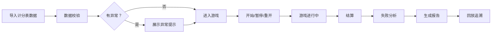

## 1. 产品概述

链上钱包防守塔 - 一款用于培训讲师老冯的游戏化教学工具，将课堂计分表转化为可交互的浏览器应用。解决培训过程可视化、可追溯、可分析的完整解决方案。

- 核心价值：
  - 替代手工计分表，实现培训全流程数字化
  - 支持异常情况处理，保留原始备注信息
  - 提供详细失败分析，帮助定位问题根因
  - 支持回放和证据追溯，减少重复核对

## 2. 核心功能

### 2.1 用户角色
| 角色 | 使用方式 | 核心权限 |
|------|----------|--------|
| 培训讲师老冯 | 浏览器直接使用 | 导入数据、开始/暂停/重开游戏、查看结算分析、导出结果回放
| 学员 | 参与游戏 | 操作防守塔、查看个人成绩

### 2.2 功能模块

1. **游戏主界面**：游戏画布、控制面板、实时状态显示
2. **数据导入**：课堂计分表导入、数据校验、异常提示
3. **游戏控制**：开始、暂停、重开、结算、回放
4. **分析报告**：失败原因分析、证据展示、冲突对比

### 2.3 页面详情
| 页面名称 | 模块名称 | 功能描述 |
|-----------|----------|---------|
| 游戏主页面 | 游戏画布 | 可视化展示防守塔游戏过程，显示钱包状态、攻击波次、资源
| 游戏主页面 | 控制面板 | 开始/暂停/重开/结算/回放按钮
| 数据导入页面 | 文件上传 | 支持Excel/CSV导入，数据预览
| 分析报告页面 | 失败分析 | 区分规则理解错误 vs 操作速度问题
| 分析报告页面 | 冲突检测 | 展示计分表与导入数据冲突证据

## 3. 核心流程

用户导入课堂计分表数据 → 系统校验数据完整性 → 展示异常提示（空关卡、重复事件、边界值）→ 开始游戏 → 实时记录操作 → 暂停/重开 → 结算分析 → 生成报告 → 回放追溯

## 4. 用户界面设计

### 4.1 设计风格
- 主色调：科技蓝 (#165DFF
- 辅助色：警示橙 (#FF7D00
- 成功绿：#00B42A
- 危险红：#F53F3F
- 字体：思源黑体 + JetBrains Mono
- 卡片式布局，深色主题，科技感
- 按钮：圆角8px，悬停阴影
- 图标：Lucide 线性图标

### 4.2 页面设计
| 页面名称 | 模块名称 | UI元素 |
|-----------|----------|--------|
| 游戏主页面 | 游戏画布 | 网格布局、防守塔图标、攻击动画、状态栏
| 游戏主页面 | 控制面板 | 操作按钮组、计时器、资源显示
| 数据导入 | 上传区域 | 拖拽上传、文件预览、异常高亮
| 分析报告 | 分析卡片 | 原因分类、证据列表、建议动作

### 4.3 响应式
桌面端优先，支持平板自适应
触控优化，按钮最小44x44px

### 4.4 动画效果
- 波次攻击动画
- 防守塔建造动画
- 资源变化数字跳动
- 状态切换平滑过渡
- 错误提示抖动动画
