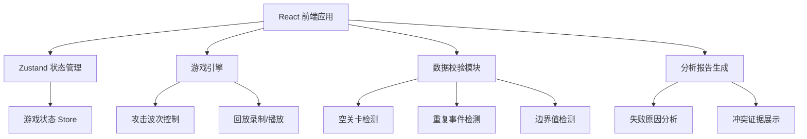

## 1. 架构设计



## 2. 技术栈说明

- 前端框架：React@18 + TypeScript
- 构建工具：Vite@5
- 样式方案：Tailwind CSS@3
- 状态管理：Zustand@4
- 图标库：Lucide React
- 文件处理：内置File API + CSV解析
- 数据持久化：LocalStorage

## 3. 路由定义

| 路由 | 页面 | 功能 |
|------|------|------|
| / | 游戏主页 | 主游戏界面，包含游戏画布和控制面板 |
| /import | 数据导入 | 课堂计分表导入和数据预览 |
| /report | 分析报告 | 结算报告、失败分析、证据展示 |
| /replay | 回放页面 | 游戏过程回放 |

## 4. 数据模型

### 4.1 游戏配置

```typescript
interface GameConfig {
  id: string;
  name: string;
  levels: Level[];
  events: GameEvent[];
  resources: ResourceConfig;
  remarks?: string;
}

interface Level {
  id: number;
  name: string;
  waveCount: number;
  difficulty: number;
  isEmpty?: boolean;
}

interface GameEvent {
  id: string;
  type: 'attack' | 'defense' | 'resource';
  timestamp: number;
  description: string;
  isDuplicate?: boolean;
}

interface ResourceConfig {
  maxCoins: number;
  maxHealth: number;
  outOfBounds?: boolean;
}
```

### 4.2 游戏状态

```typescript
interface GameState {
  status: 'idle' | 'playing' | 'paused' | 'ended';
  currentLevel: number;
  currentWave: number;
  health: number;
  coins: number;
  towers: Tower[];
  enemies: Enemy[];
  startTime?: number;
  pauseTime?: number;
  totalPlayTime: number;
  actions: ActionRecord[];
}

interface ActionRecord {
  timestamp: number;
  type: 'build' | 'upgrade' | 'sell' | 'pause';
  position: { x: number; y: number };
  responseTime?: number;
}
```

### 4.3 分析报告

```typescript
interface AnalysisReport {
  isSuccess: boolean;
  failureReason?: 'rule_understanding' | 'slow_operation' | 'mixed';
  evidence: Evidence[];
  conflicts: DataConflict[];
  suggestions: string[];
}

interface Evidence {
  id: string;
  type: 'action' | 'event' | 'resource';
  description: string;
  timestamp: number;
  source: string;
}

interface DataConflict {
  field: string;
  scoreboardValue: string;
  importedValue: string;
  suggestion: string;
}
```

## 5. 核心模块

### 5.1 数据校验模块
- 空关卡检测：检查level配置是否缺失必要字段
- 重复事件检测：基于事件ID和时间戳检测重复
- 边界值检测：验证资源值是否在合理范围内
- 备注保留：原样保留原始计分表的备注信息

### 5.2 游戏引擎模块
- 波次控制：按配置生成敌人波次
- 碰撞检测：塔与敌人的攻击判定
- 状态管理：开始/暂停/重开/结算状态切换
- 回放录制：记录所有操作和事件时间线

### 5.3 分析模块
- 响应时间分析：计算操作间隔判断是否操作慢
- 规则符合度：检查操作是否违反游戏规则
- 失败归因：基于证据数据判断失败原因
- 冲突检测：对比计分表和导入数据差异

## 6. 错误处理

- 错误边界组件捕获渲染错误
- 配置校验失败显示友好提示
- 数据导入失败保留原始文件供检查
- 不自动修复问题，仅展示证据和建议
