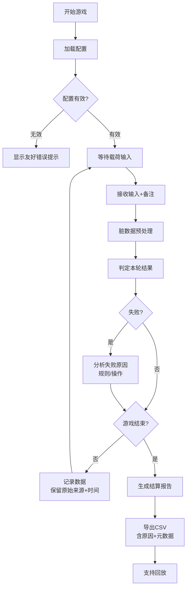
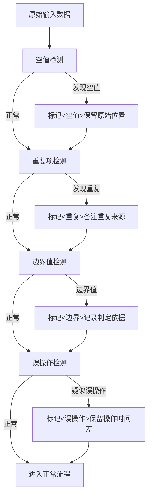

## 1. 产品概述

"桥梁载荷闯关"是面向课堂教学场景的计分互动工具，专为处理真实课堂中产生的"脏数据"而设计。核心目标是让课堂计分表里的混乱材料（新手误操作、边界分数、暂停打断记录、空值、重复项）能被正确对应和追溯，不因为追求整齐而洗掉原始备注。

- 主要用户：课堂组织者、活动策划阿蓝
- 解决问题：真实课堂数据与游戏结果脱节、失败原因模糊、数据可追溯性差
- 产品价值：让脏数据有交代、让失败有原因、让交接有依据

---

## 2. 核心特征

### 2.1 用户角色
| 角色 | 使用方式 | 核心需求 |
|------|----------|----------|
| 课堂组织者 | 现场操作游戏、录入数据 | 快速控制流程、处理突发情况、保留原始记录 |
| 活动策划阿蓝 | 审核结果、交接工作 | 数据可追溯、原因清晰、导出完整 |

### 2.2 功能模块
1. **游戏控制台**：开始、暂停、重开、结算、回放
2. **数据录入层**：分数录入、备注添加、异常标记
3. **脏数据处理器**：空值补全、重复项标记、边界记录识别、误操作区分
4. **失败分析引擎**：规则理解判定、操作速度分析、原因分类输出
5. **结果导出模块**：CSV导出、完整元数据、原始来源追溯
6. **回放系统**：时间线回放、操作轨迹还原

### 2.3 页面详情
| 页面名称 | 模块名称 | 功能描述 |
|-----------|-------------|---------------------|
| 主控制台 | 游戏控制区 | 开始/暂停/重开/结算/回放按钮，状态指示灯 |
| 主控制台 | 载荷显示区 | 当前载荷、目标载荷、桥梁状态可视化 |
| 主控制台 | 数据录入区 | 分数输入、备注框、异常标记按钮 |
| 主控制台 | 记录列表区 | 所有操作记录列表，带原始备注和处理标记 |
| 结算面板 | 结果汇总区 | 总分、各关详情、失败原因分析 |
| 结算面板 | 导出控制区 | CSV导出、元数据预览 |
| 回放面板 | 时间线区 | 可拖动时间轴、关键节点标记 |
| 回放面板 | 详情展示区 | 每个时间点的载荷、操作、备注完整展示 |

---

## 3. 核心流程

### 3.1 游戏主流程

### 3.2 脏数据处理流程

---

## 4. 用户界面设计

### 4.1 设计风格
- **主色调**：工程黄 `#F5A623` 作为主色，配深灰 `#2C3E50` 背景，警示红 `#E74C3C` 标记失败
- **按钮风格**：工业风方角按钮，带轻微立体投影，禁用状态明显灰化
- **字体**：等宽字体 `JetBrains Mono` 用于数据显示，`Noto Sans SC` 用于说明文字，突出工程感和数据可读性
- **布局风格**：模块化分区，清晰的边框分隔，类似工业控制台的布局
- **视觉元素**：桥梁结构示意图、载荷仪表盘、状态指示灯、数据流水号

### 4.2 页面设计概览
| 页面名称 | 模块名称 | UI元素 |
|-----------|-------------|-------------|
| 主控制台 | 游戏控制区 | 5个大型工业按钮，状态LED指示灯，当前阶段显示 |
| 主控制台 | 载荷显示区 | 仪表盘式载荷指示器，桥梁形变动画，安全区域标记 |
| 主控制台 | 数据录入区 | 大号数字输入框，多行备注框，异常标记复选框组 |
| 主控制台 | 记录列表区 | 斑马纹表格，每行带状态色标，悬停显示原始数据 |
| 结算面板 | 结果汇总区 | 分卡片展示：总分、通关情况、失败原因分布图表 |
| 结算面板 | 导出控制区 | 导出按钮，元数据预览面板，原始来源信息 |
| 回放面板 | 时间线区 | 可拖动时间轴，关键节点彩色标记，播放控制 |
| 回放面板 | 详情展示区 | 同步显示当时的载荷、输入、备注、判定结果 |

### 4.3 响应式
- 桌面优先设计，保证课堂投影时的清晰度
- 平板适配：控制区域放大，便于触控
- 字体使用相对单位，确保投影可读性
- 关键数据区（载荷、分数）使用大号字体

### 4.4 动效设计
- 载荷增加时桥梁有轻微形变动画
- 失败时有明显但不刺眼的红色闪烁提示
- 新记录加入列表时有滑入动画
- 回放时时间轴进度条平滑移动
- 按钮点击有按压反馈动效
- 状态切换有淡入淡出过渡

---

## 5. 非功能性需求

### 5.1 数据完整性
- 所有原始输入数据100%保留，不做覆盖式清洗
- 每条记录附带：原始值、处理后值、处理时间、处理人标记
- 备注字段永不自动截断或清理

### 5.2 错误处理
- 配置错误不白屏，显示具体错误原因和修改建议
- 脏数据不崩溃，显示"已标记"状态而非报错
- 导出失败时提供复制到剪贴板的备选方案

### 5.3 可追溯性
- 每条记录包含：来源（手动录入/导入）、处理时间戳、判定依据
- 失败原因必须二选一或同时标记："规则未理解" / "操作超时"
- 导出文件包含完整元数据头，说明各字段含义
