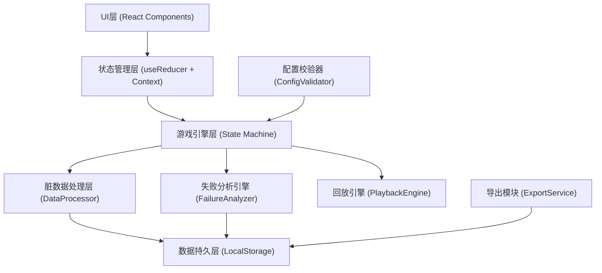
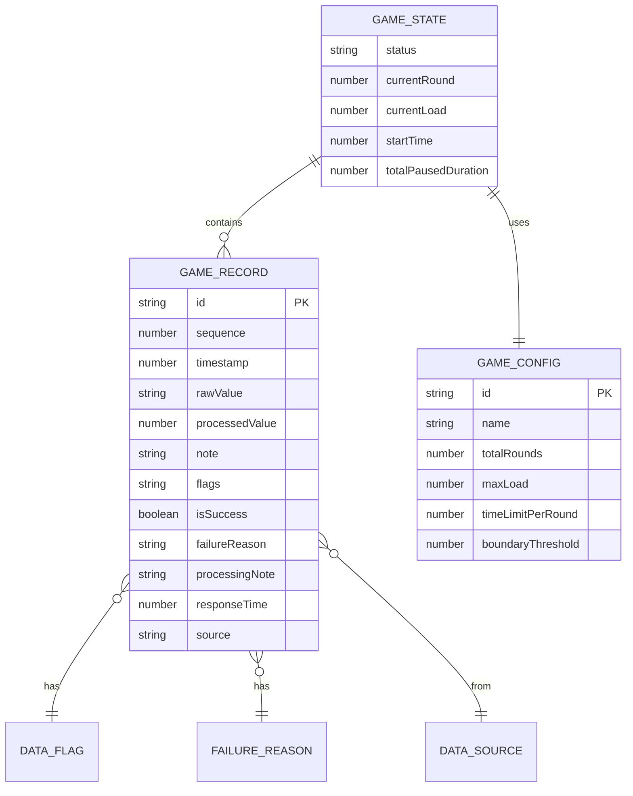

## 1. 架构设计



---

## 2. 技术描述

- **前端框架**: React@18 + TypeScript + Vite@5
- **样式方案**: TailwindCSS@3 + 自定义CSS变量（工业风格主题）
- **状态管理**: React useReducer + Context API（轻量级，避免过度设计）
- **图标库**: Lucide React（工业风格线性图标）
- **数据持久化**: LocalStorage（浏览器本地存储，无需后端）
- **动画方案**: CSS Animations + Framer Motion（关键帧动画）
- **图表可视化**: Recharts（失败原因分布图）
- **初始化工具**: npm create vite@latest

---

## 3. 核心模块与文件结构

```
src/
├── types/
│   └── index.ts              # 所有类型定义
├── config/
│   └── gameConfig.ts         # 游戏配置、关卡数据、阈值定义
├── engine/
│   ├── gameStateMachine.ts   # 游戏状态机核心
│   ├── dataProcessor.ts      # 脏数据处理器
│   ├── failureAnalyzer.ts    # 失败原因分析引擎
│   └── playbackEngine.ts     # 回放引擎
├── services/
│   ├── exportService.ts      # CSV导出服务
│   └── storageService.ts     # 本地存储服务
├── hooks/
│   ├── useGameEngine.ts      # 游戏引擎Hook
│   └── useDirtyData.ts       # 脏数据处理Hook
├── components/
│   ├── GameControls.tsx      # 控制按钮区
│   ├── LoadDisplay.tsx       # 载荷显示区
│   ├── DataInput.tsx         # 数据录入区
│   ├── RecordList.tsx        # 记录列表区
│   ├── SettlementPanel.tsx   # 结算面板
│   ├── PlaybackPanel.tsx     # 回放面板
│   ├── StatusIndicator.tsx   # 状态指示器
│   └── ErrorBoundary.tsx     # 错误边界
├── utils/
│   ├── configValidator.ts    # 配置校验器
│   └── timeUtils.ts          # 时间工具函数
├── App.tsx                   # 主应用
└── index.css                 # 全局样式+主题变量
```

---

## 4. 核心数据模型

### 4.1 类型定义

```typescript
// 游戏状态枚举
type GameStatus = 'idle' | 'playing' | 'paused' | 'ended' | 'playback';

// 数据标记类型
type DataFlag = 'normal' | 'empty' | 'duplicate' | 'boundary' | 'misoperation' | 'interrupted';

// 失败原因类型
type FailureReason = 'rule_misunderstanding' | 'slow_operation' | 'both' | null;

// 数据来源
type DataSource = 'manual' | 'import' | 'test';

// 单条记录
interface GameRecord {
  id: string;                     // 唯一ID
  sequence: number;               // 流水号
  timestamp: number;              // 时间戳
  formattedTime: string;          // 格式化时间
  source: DataSource;             // 数据来源
  rawValue: string | number | null; // 原始值（100%保留）
  processedValue: number | null;  // 处理后的值
  load: number;                   // 本轮载荷
  note: string;                   // 原始备注（永不清洗）
  flags: DataFlag[];              // 数据标记
  isSuccess: boolean;             // 是否成功
  failureReason: FailureReason;   // 失败原因
  failureDetail: string;          // 失败详细说明
  processingNote: string;         // 处理说明（给阿蓝交接用）
  operator: string;               // 处理人标记
  responseTime: number | null;    // 响应时间（毫秒）
  roundNumber: number;            // 第几轮
}

// 游戏状态
interface GameState {
  status: GameStatus;
  currentRound: number;
  totalRounds: number;
  currentLoad: number;
  maxLoad: number;
  targetLoad: number;
  records: GameRecord[];
  startTime: number | null;
  pauseTime: number | null;
  totalPausedDuration: number;
  lastInputTime: number | null;
  config: GameConfig;
  playbackIndex: number;
  playbackSpeed: number;
}

// 游戏配置
interface GameConfig {
  id: string;
  name: string;
  totalRounds: number;
  maxLoad: number;
  targetLoad: number;
  loadPerRound: number;
  timeLimitPerRound: number;      // 每轮时间限制（毫秒）
  boundaryThreshold: number;      // 边界值判定阈值（百分比）
  duplicateWindow: number;        // 重复项检测窗口（毫秒）
  misoperationThreshold: number;  // 误操作判定阈值（毫秒，过快输入）
  slowOperationThreshold: number; // 慢操作判定阈值（毫秒）
  ruleViolationPatterns: string[]; // 规则违规关键词
  createdBy: string;
  createdAt: number;
}

// 导出元数据
interface ExportMetadata {
  exportTime: string;
  gameName: string;
  totalRecords: number;
  validRecords: number;
  flaggedRecords: number;
  gameStartTime: string;
  gameEndTime: string;
  operator: string;
  configVersion: string;
  fieldDescriptions: Record<string, string>;
}
```

### 4.2 数据模型ER图



---

## 5. 核心算法与逻辑

### 5.1 脏数据检测算法

```typescript
// 空值检测
function detectEmpty(value: any): boolean {
  return value === null || value === undefined || value === '' || 
         (typeof value === 'number' && isNaN(value));
}

// 重复项检测（时间窗口内相同值）
function detectDuplicate(
  currentValue: number, 
  records: GameRecord[], 
  windowMs: number
): { isDuplicate: boolean; duplicateOf: string | null } {
  const now = Date.now();
  const recentRecords = records.filter(
    r => now - r.timestamp < windowMs && r.processedValue === currentValue
  );
  if (recentRecords.length > 0) {
    return { isDuplicate: true, duplicateOf: recentRecords[0].id };
  }
  return { isDuplicate: false, duplicateOf: null };
}

// 边界值检测（在阈值百分比内）
function detectBoundary(
  value: number, 
  target: number, 
  thresholdPercent: number
): boolean {
  const diff = Math.abs(value - target);
  const percent = (diff / target) * 100;
  return percent <= thresholdPercent;
}

// 误操作检测（输入过快）
function detectMisoperation(
  currentTime: number, 
  lastInputTime: number | null, 
  thresholdMs: number
): boolean {
  if (!lastInputTime) return false;
  return currentTime - lastInputTime < thresholdMs;
}
```

### 5.2 失败原因分析算法

```typescript
function analyzeFailure(
  record: GameRecord,
  config: GameConfig
): { reason: FailureReason; detail: string } {
  const reasons: string[] = [];
  let isRuleIssue = false;
  let isSpeedIssue = false;

  // 检测规则理解问题
  if (config.ruleViolationPatterns.some(p => 
    record.note.includes(p) || 
    String(record.rawValue).includes(p)
  )) {
    isRuleIssue = true;
    reasons.push('输入值违反规则模式');
  }
  
  if (record.flags.includes('misoperation')) {
    isRuleIssue = true;
    reasons.push('疑似误操作（输入过快）');
  }
  
  if (record.processedValue !== null && 
      record.processedValue > config.maxLoad) {
    isRuleIssue = true;
    reasons.push('载荷超过最大限制');
  }

  // 检测操作速度问题
  if (record.responseTime !== null && 
      record.responseTime > config.slowOperationThreshold) {
    isSpeedIssue = true;
    reasons.push(`响应超时（用时${(record.responseTime/1000).toFixed(1)}秒，限制${config.timeLimitPerRound/1000}秒）`);
  }

  let reason: FailureReason = null;
  if (isRuleIssue && isSpeedIssue) {
    reason = 'both';
  } else if (isRuleIssue) {
    reason = 'rule_misunderstanding';
  } else if (isSpeedIssue) {
    reason = 'slow_operation';
  }

  return {
    reason,
    detail: reasons.length > 0 ? reasons.join('；') : '未识别到具体原因'
  };
}
```

### 5.3 游戏状态机

```typescript
type GameAction =
  | { type: 'START'; payload: { config: GameConfig } }
  | { type: 'PAUSE'; payload: { note: string } }
  | { type: 'RESUME' }
  | { type: 'INPUT'; payload: { value: string | number; note: string } }
  | { type: 'RESTART' }
  | { type: 'END' }
  | { type: 'PLAYBACK_START' }
  | { type: 'PLAYBACK_NEXT' }
  | { type: 'PLAYBACK_PREV' }
  | { type: 'PLAYBACK_STOP' };
```

---

## 6. 路由定义

| 路由 | 用途 |
|-------|---------|
| `/` | 主控制台（唯一页面，所有功能通过面板切换实现） |

*注：单页应用，使用内部状态切换面板，无需多路由。*

---

## 7. 配置校验与错误处理

### 7.1 配置校验规则
```typescript
function validateConfig(config: GameConfig): ValidationResult {
  const errors: string[] = [];
  const warnings: string[] = [];

  if (!config.name || config.name.trim() === '') {
    errors.push('游戏名称不能为空');
  }
  if (config.totalRounds <= 0) {
    errors.push('总回合数必须大于0');
  }
  if (config.maxLoad <= 0) {
    errors.push('最大载荷必须大于0');
  }
  if (config.targetLoad <= 0 || config.targetLoad > config.maxLoad) {
    errors.push('目标载荷必须在0到最大载荷之间');
  }
  if (config.timeLimitPerRound < 1000) {
    warnings.push('每轮时间限制过短（建议不少于3秒）');
  }
  if (config.boundaryThreshold < 0 || config.boundaryThreshold > 50) {
    warnings.push('边界阈值建议在0%-50%之间');
  }

  return {
    isValid: errors.length === 0,
    errors,
    warnings
  };
}
```

### 7.2 错误边界
- 顶层ErrorBoundary组件捕获所有渲染错误
- 显示友好的错误信息和恢复建议
- 提供"重置游戏"和"导出当前数据"两个紧急操作

---

## 8. CSV导出格式

导出文件包含两部分：
1. **元数据头**（前12行，#开头注释）
2. **数据表格**（第13行起，标准CSV格式）

```csv
# 桥梁载荷闯关 - 导出报告
# 导出时间: 2026-06-01 14:30:00
# 游戏名称: 三年级二班-桥梁载荷闯关
# 开始时间: 2026-06-01 14:00:00
# 结束时间: 2026-06-01 14:25:30
# 总记录数: 15
# 标记记录数: 3
# 操作人: 张老师
# 配置版本: v1.0
# 字段说明:
#   id=唯一标识, sequence=流水号, time=时间, source=来源, raw=原始值, processed=处理值, load=载荷, note=原始备注, flags=标记, result=结果, failure_reason=失败原因, failure_detail=失败详情, processing_note=处理说明, response_ms=响应时间, round=回合
流水号,时间,来源,原始值,处理值,载荷,原始备注,标记,结果,失败原因,失败详情,处理说明,响应时间(ms),回合
1,2026-06-01 14:00:15,manual,50,50,50,学生A回答,normal,success,,,第一轮正常,2300,1
...
```
