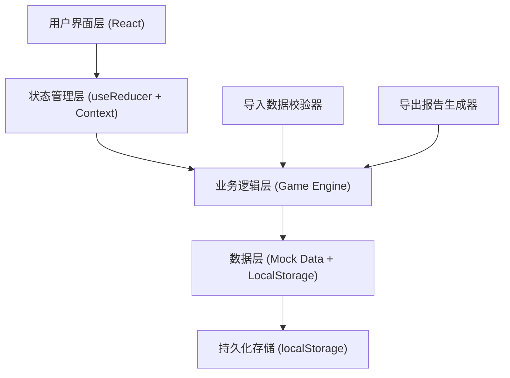

## 1. 架构设计



## 2. 技术描述

- 前端：React@18 + TypeScript + Vite
- 样式：TailwindCSS 3.x
- 状态管理：React useReducer + Context API
- 数据持久化：localStorage
- 图标：Lucide React
- 动画：CSS transitions + Framer Motion（可选）
- 后端：无（纯前端应用）
- 数据库：无（使用mock数据 + localStorage）

## 3. 路由定义

| 路由 | 页面组件 | 功能 |
|------|---------|------|
| `/` | `HomePage` | 开始页面，关卡选择和数据导入 |
| `/game/:levelId` | `GamePage` | 游戏主页面 |
| `/result/:gameId` | `ResultPage` | 结算页面 |

## 4. 数据模型

### 4.1 关卡配置 (Level)

```typescript
interface Level {
  id: string;
  title: string;
  description: string;
  difficulty: 'easy' | 'medium' | 'hard';
  totalRounds: number;
  totalScore: number;
  rounds: Round[];
  createdAt: string;
}

interface Round {
  id: number;
  title: string;
  description: string;
  scene: string;
  evidence: EvidenceItem[];
  choices: Choice[];
  correctChoiceId: string;
  deductionReasons: DeductionReason[];
}

interface EvidenceItem {
  id: string;
  source: string;
  content: string;
  value: number | string | null;
  highlight: boolean;
}

interface Choice {
  id: string;
  text: string;
  isCorrect: boolean;
  score: number;
  feedback: string;
  reasonReference: string;
}

interface DeductionReason {
  id: string;
  reason: string;
  evidence: string;
  deduction: number;
}
```

### 4.2 游戏状态 (GameState)

```typescript
interface GameState {
  gameId: string;
  levelId: string;
  status: 'idle' | 'playing' | 'paused' | 'completed';
  currentRound: number;
  totalRounds: number;
  score: number;
  maxScore: number;
  playerChoices: PlayerChoice[];
  startTime: number;
  pausedAt?: number;
  resumedAt?: number;
  totalPauseTime: number;
  importData?: ImportedData;
  conflicts?: DataConflict[];
}

interface PlayerChoice {
  roundId: number;
  choiceId: string;
  isCorrect: boolean;
  score: number;
  timestamp: number;
  reason: string;
  deductionReasonId?: string;
}
```

### 4.3 导入数据 (ImportedData)

```typescript
interface ImportedData {
  source: string;
  data: Record<string, any>;
  importedAt: number;
  teacherNote?: string;
}

interface DataConflict {
  id: string;
  field: string;
  presetValue: any;
  importedValue: any;
  presetEvidence: string;
  importedEvidence: string;
  suggestion: string;
  resolved: boolean;
  resolution?: 'use_preset' | 'use_imported';
}
```

### 4.4 导出报告 (ExportReport)

```typescript
interface ExportReport {
  gameId: string;
  levelTitle: string;
  playerName?: string;
  finalScore: number;
  maxScore: number;
  totalRounds: number;
  correctCount: number;
  startTime: string;
  endTime: string;
  keyChoices: KeyChoice[];
  deductionSummary: DeductionSummary[];
  teacherNote?: string;
  exportedAt: string;
}

interface KeyChoice {
  round: number;
  roundTitle: string;
  choice: string;
  isCorrect: boolean;
  score: number;
  reason: string;
  evidence: string;
}

interface DeductionSummary {
  reason: string;
  evidence: string;
  deduction: number;
  round: number;
}
```

## 5. 核心模块

### 5.1 游戏引擎 (GameEngine)

```typescript
class GameEngine {
  startGame(levelId: string, importData?: ImportedData): GameState;
  pauseGame(state: GameState): GameState;
  resumeGame(state: GameState): GameState;
  restartGame(state: GameState): GameState;
  makeChoice(state: GameState, choiceId: string): GameState;
  isGameComplete(state: GameState): boolean;
  calculateScore(state: GameState): number;
}
```

### 5.2 数据校验器 (DataValidator)

```typescript
class DataValidator {
  validateLevel(level: Level): ValidationResult;
  detectConflicts(level: Level, importedData: ImportedData): DataConflict[];
  checkEmptyValues(data: any): EmptyValueReport[];
  checkDuplicates(data: any[]): DuplicateReport[];
  checkBoundaryCases(data: any): BoundaryReport[];
}

interface ValidationResult {
  valid: boolean;
  errors: string[];
  warnings: string[];
}
```

### 5.3 导出器 (ReportExporter)

```typescript
class ReportExporter {
  generateReport(state: GameState, level: Level): ExportReport;
  exportAsText(report: ExportReport): string;
  exportAsJSON(report: ExportReport): string;
  downloadFile(content: string, filename: string, type: string): void;
}
```

### 5.4 持久化管理器 (PersistenceManager)

```typescript
class PersistenceManager {
  saveGameState(state: GameState): void;
  loadGameState(gameId: string): GameState | null;
  clearGameState(gameId: string): void;
  listSavedGames(): GameState[];
}
```

## 6. 错误处理策略

### 6.1 错误类型

| 错误类型 | 处理方式 | 用户提示 |
|---------|----------|---------|
| 无效关卡配置 | 降级到默认关卡 | "关卡配置有误，已加载默认关卡" |
| 导入数据格式错误 | 拒绝导入，展示具体错误 | "导入数据格式错误，请检查：{错误详情}" |
| 数据冲突 | 展示对比，等待用户选择 | "数据存在冲突，请选择使用哪一方数据" |
| 空值/缺失数据 | 标记并使用默认值 | "存在空值，已使用默认值填充：{字段名}" |
| 重复项 | 去重并记录 | "检测到重复项，已自动去重：{重复项描述}" |
| 边界情况 | 特殊处理并提示 | "这是边界情况，已按规则处理" |

### 6.2 错误边界

- 使用 React Error Boundary 捕获渲染错误
- 展示友好的错误页面，提供重试和返回按钮
- 错误信息包含：错误描述、可能原因、建议操作

## 7. 状态持久化策略

- 每次状态变更自动保存到 localStorage
- 使用游戏ID作为key，支持多局游戏同时保存
- 暂停时额外记录暂停时间戳
- 重开时保持回合数规则：从第1回合开始，但记录历史游戏ID
- 导出报告时包含所有暂停/重开记录

