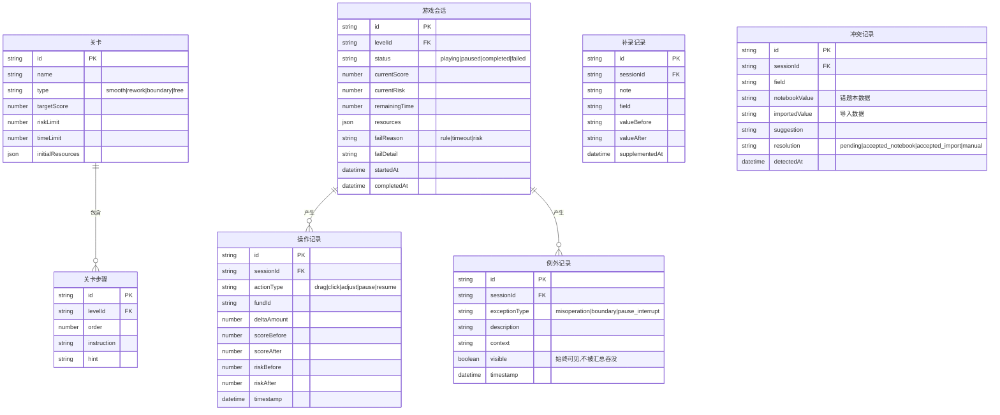

## 1. 架构设计

```mermaid
flowchart TD
    subgraph "前端层"
        "React SPA" --> "页面路由"
        "页面路由" --> "咖啡馆主界面"
        "页面路由" --> "关卡选择页"
        "页面路由" --> "汇总面板"
        "页面路由" --> "补录工作台"
        "页面路由" --> "冲突仲裁面板"
        "页面路由" --> "操作说明页"
    end
    subgraph "状态层"
        "Zustand Store" --> "游戏引擎 Store"
        "Zustand Store" --> "关卡数据 Store"
        "Zustand Store" --> "历史记录 Store"
        "Zustand Store" --> "补录数据 Store"
        "Zustand Store" --> "冲突数据 Store"
    end
    subgraph "数据层"
        "本地存储" --> "关卡配置 JSON"
        "本地存储" --> "操作历史 IndexedDB"
        "本地存储" --> "错题本数据"
    end
    "前端层" --> "状态层"
    "状态层" --> "数据层"
```

## 2. 技术说明

- **前端**：React@18 + TypeScript + Tailwind CSS@3 + Vite
- **初始化工具**：vite-init（react-ts 模板）
- **后端**：无（纯前端，数据存储于浏览器本地）
- **数据库**：无服务端数据库，使用 localStorage + 内存状态管理
- **拖拽**：使用 @dnd-kit/core + @dnd-kit/sortable 实现拖拽交互
- **状态管理**：Zustand
- **路由**：react-router-dom

## 3. 路由定义

| 路由 | 用途 |
|------|------|
| `/` | 首页/关卡选择页 |
| `/cafe/:levelId` | 咖啡馆主界面（游戏进行中） |
| `/summary/:sessionId` | 单局汇总面板 |
| `/supplement/:sessionId` | 补录工作台 |
| `/conflict/:sessionId` | 冲突仲裁面板 |
| `/guide` | 操作说明页 |
| `/history` | 历史记录列表页 |

## 4. 数据模型

### 4.1 核心数据模型定义



### 4.2 基金资产类型

| 类型 | 标识 | 风险系数 | 分数贡献 | 颜色 |
|------|------|----------|----------|------|
| 股票型 | equity | 0.8 | 高 | 红 |
| 债券型 | bond | 0.3 | 中 | 蓝 |
| 货币型 | money | 0.1 | 低 | 绿 |
| 混合型 | mixed | 0.5 | 中高 | 橙 |

### 4.3 游戏引擎核心规则

- **资源消耗**：每次拖入基金消耗对应资源点数，放回返还
- **分数计算**：组合分数 = Σ(基金配比 × 该基金分数系数) × 分散度加成
- **风险计算**：组合风险 = Σ(基金配比 × 风险系数) - 对冲减益
- **失败条件**：风险超限 / 操作超时 / 资源耗尽
- **失败诊断**：
  - 规则未理解：触发了明确禁止的操作（如风险已红还加股票型）
  - 操作超时：时间耗尽但配比未完成
  - 风险超限：组合风险超过关卡红线

## 5. 关卡预设数据

### 5.1 样例关卡A — 顺利流

- 初始资源：100 点
- 目标分数：≥ 75
- 风险红线：≤ 0.6
- 时间限制：120 秒
- 推荐操作：拖入 1 只债券型(40%) + 1 只混合型(35%) + 1 只货币型(25%)

### 5.2 样例关卡B — 返工流

- 初始资源：80 点
- 目标分数：≥ 80
- 风险红线：≤ 0.5
- 时间限制：90 秒
- 首次典型错误：全仓股票型导致风险超限
- 返工路径：减仓股票型 → 加仓债券型 → 达标

### 5.3 边界关卡C — 边界分数

- 初始资源：60 点
- 目标分数：≥ 70
- 风险红线：≤ 0.55
- 时间限制：100 秒
- 特点：分数卡在 69-71 之间，触发边界分数例外

## 6. 目录结构

```
src/
├── components/
│   ├── cafe/               # 咖啡馆场景组件
│   │   ├── OperationTable.tsx    # 操作台面
│   │   ├── ResourceShelf.tsx     # 资源架
│   │   ├── ScoreGauge.tsx        # 分数仪表盘
│   │   ├── RiskBar.tsx           # 风险条
│   │   ├── FundCard.tsx          # 基金卡片
│   │   └── PauseControl.tsx      # 暂停控制
│   ├── feedback/           # 反馈组件
│   │   ├── ActionToast.tsx       # 操作结果 toast
│   │   ├── FailureDiagnosis.tsx  # 失败诊断弹窗
│   │   └── ExceptionTag.tsx      # 例外标记
│   ├── summary/            # 汇总组件
│   │   ├── StatsOverview.tsx     # 数字总览
│   │   ├── ExceptionTable.tsx    # 例外明细表
│   │   └── HistoryTimeline.tsx   # 历史时间线
│   ├── supplement/         # 补录组件
│   │   ├── SupplementForm.tsx    # 补录表单
│   │   └── DiffViewer.tsx        # 差异对比视图
│   ├── conflict/           # 冲突组件
│   │   ├── EvidencePanel.tsx     # 证据展示面板
│   │   └── ResolutionPicker.tsx  # 处理方案选择
│   └── layout/             # 布局组件
│       ├── Header.tsx
│       └── Sidebar.tsx
├── pages/
│   ├── LevelSelect.tsx          # 关卡选择页
│   ├── CafeGame.tsx             # 咖啡馆主界面
│   ├── Summary.tsx              # 汇总面板
│   ├── Supplement.tsx           # 补录工作台
│   ├── Conflict.tsx             # 冲突仲裁面板
│   ├── Guide.tsx                # 操作说明页
│   └── History.tsx              # 历史记录页
├── stores/
│   ├── gameStore.ts             # 游戏引擎状态
│   ├── levelStore.ts            # 关卡数据
│   ├── historyStore.ts          # 历史记录
│   ├── supplementStore.ts       # 补录数据
│   └── conflictStore.ts         # 冲突数据
├── engine/
│   ├── gameEngine.ts            # 核心游戏引擎（分数/风险/资源计算）
│   ├── exceptionDetector.ts     # 例外检测器
│   ├── failureDiagnoser.ts      # 失败诊断器
│   └── conflictDetector.ts      # 冲突检测器
├── data/
│   ├── levels.ts                # 关卡预设数据
│   ├── funds.ts                 # 基金资产数据
│   └── notebookSamples.ts       # 错题本样例数据
├── types/
│   └── index.ts                 # TypeScript 类型定义
├── hooks/
│   ├── useGameTimer.ts          # 游戏计时 hook
│   ├── useDragOperation.ts      # 拖拽操作 hook
│   └── useLocalStorage.ts       # 本地存储 hook
├── utils/
│   └── format.ts                # 格式化工具
├── App.tsx
└── main.tsx
```
