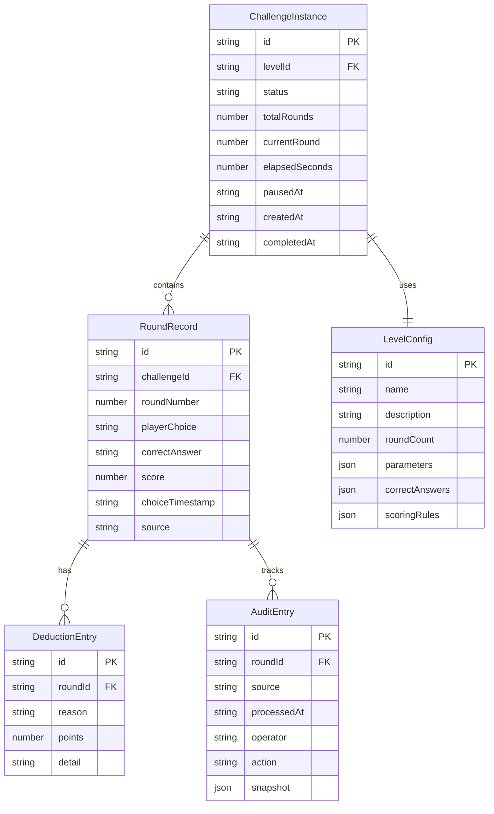

## 1. 架构设计

```mermaid
flowchart TD
    "浏览器前端" --> "Zustand 状态管理"
    "Zustand 状态管理" --> "挑战引擎（纯函数）"
    "挑战引擎（纯函数）" --> "关卡配置数据"
    "挑战引擎（纯函数）" --> "选择记录存储"
    "选择记录存储" --> "导出模块"
    "选择记录存储" --> "回放模块"
    "导出模块" --> "文本/PDF 输出"
```

纯前端架构，无后端依赖。所有状态通过 Zustand 管理，挑战判断逻辑为纯函数，确保可追溯、可测试。

## 2. 技术说明
- 前端：React@18 + TypeScript + Tailwind CSS@3 + Vite
- 初始化工具：vite-init（react-ts 模板）
- 状态管理：Zustand
- 后端：无（纯前端，数据存 localStorage）
- 字体：JetBrains Mono + Noto Sans SC（Google Fonts CDN）
- 图标：lucide-react

## 3. 路由定义
| 路由 | 用途 |
|------|------|
| / | 挑战主页：校准参数展示、选择交互、暂停/继续/重开 |
| /settlement/:challengeId | 结算页面：选择回顾、扣分明细、判断过程 |
| /review/:challengeId | 复盘与导出：回放播放器、成绩导出、审计追踪 |

## 4. 数据模型

### 4.1 数据模型定义



### 4.2 数据定义

```typescript
interface ChallengeInstance {
  id: string
  levelId: string
  status: 'active' | 'paused' | 'completed' | 'abandoned'
  totalRounds: number
  currentRound: number
  elapsedSeconds: number
  pausedAt: string | null
  createdAt: string
  completedAt: string | null
}

interface LevelConfig {
  id: string
  name: string
  description: string
  roundCount: number
  parameters: RoundParameter[]
  correctAnswers: Record<number, string>
  scoringRules: ScoringRule[]
}

interface RoundParameter {
  roundNumber: number
  frequency: number
  power: number
  angle: number
  temperature: number
  extra?: Record<string, unknown>
}

interface ScoringRule {
  id: string
  condition: string
  deduction: number
  reason: string
  detail: string
}

interface RoundRecord {
  id: string
  challengeId: string
  roundNumber: number
  playerChoice: string | null
  correctAnswer: string
  score: number
  choiceTimestamp: string | null
  source: 'player' | 'timeout' | 'system'
}

interface DeductionEntry {
  id: string
  roundId: string
  reason: string
  points: number
  detail: string
}

interface AuditEntry {
  id: string
  roundId: string
  source: 'level-config' | 'player-action' | 'system-auto' | 'teacher-remark'
  processedAt: string
  operator: string
  action: string
  snapshot: Record<string, unknown>
}
```

## 5. 核心模块设计

### 5.1 挑战引擎（纯函数）
- `evaluateChoice(choice, correctAnswer, rules)`: 评估选择，返回得分和扣分项
- `handleTimeout(round)`: 处理超时回合，标记来源为 system
- `handleNullChoice(round)`: 处理空值选择，记录"未选择"并扣分
- `detectDuplicate(records)`: 检测重复选择，每条独立保留但标注

### 5.2 状态管理（Zustand Store）
- `challengeStore`: 管理挑战实例、当前回合、暂停状态、选择记录
- 暂停：冻结 `currentRound`、`elapsedSeconds`，设置 `pausedAt`
- 继续：恢复计时，`pausedAt` 置 null
- 重开：生成新 `id`，清空记录，旧实例归档

### 5.3 导出模块
- `exportAsText(challenge)`: 生成人话文本（含选择回顾、扣分原因、总分）
- `exportAsJSON(challenge)`: 生成结构化 JSON（含审计追踪）
- 导出内容含：原始来源、处理时间、每条判断的原因

### 5.4 回放模块
- `replayChallenge(records)`: 按时间轴顺序回放每回合选择
- 支持逐步播放、跳转到指定回合
