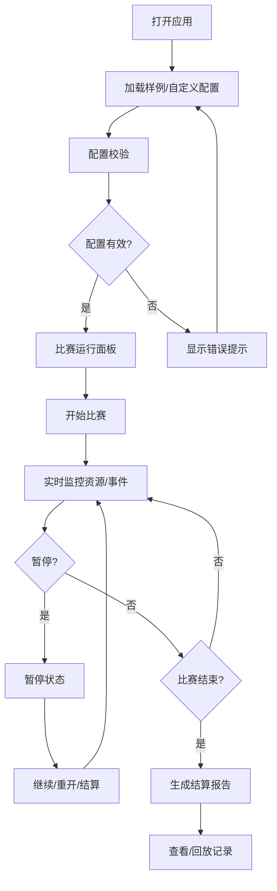

## 1. 产品概述
城市绿波信号赛模拟器是一款面向课程教学的浏览器应用，帮助助教追踪学生练习进度，实时展示比赛过程并生成可追溯的练习报告。
- 解决问题：老师课后无法查看学生练习卡住的环节，练习记录分散难以追踪
- 目标用户：课程助教、授课老师、参赛学生

## 2. 核心功能

### 2.1 用户角色
| 角色 | 注册方式 | 核心权限 |
|------|----------|----------|
| 课程助教 | 无需注册 | 配置比赛、查看所有记录、导出报告 |
| 学生用户 | 无需注册 | 运行比赛、查看个人记录 |

### 2.2 功能模块
1. **比赛运行面板**：开始、暂停、重开、实时状态显示
2. **记录回放系统**：历史记录回放、进度条控制、关键节点标记
3. **结算报告**：比赛结果统计、异常标记、来源追溯
4. **配置校验**：空关卡检测、重复事件提示、边界值警告

### 2.3 页面详情
| 页面名称 | 模块名称 | 功能描述 |
|-----------|-------------|---------------------|
| 主面板 | 比赛控制区 | 开始/暂停/重开按钮、实时计时器、资源状态 |
| 主面板 | 事件日志区 | 实时显示比赛事件、异常高亮标记、来源追踪 |
| 主面板 | 资源仪表盘 | 资源数值显示、负数警告、边界值提示 |
| 记录回放 | 回放控制 | 进度条拖动、倍速播放、关键节点跳转 |
| 结算报告 | 结果汇总 | 统计数据、异常清单、每条记录来源追溯 |
| 配置管理 | 校验提示 | 配置错误提示、空关卡提醒、重复事件列表 |

## 3. 核心流程

用户打开应用 → 加载/配置比赛数据 → 开始运行 → 实时监控资源和事件 → 暂停或继续 → 结算生成报告 → 查看/回放历史记录

## 4. 用户界面设计

### 4.1 设计风格
- 主色调：交通信号灯色系（红/黄/绿）+ 深蓝科技感背景
- 按钮风格：圆角矩形，悬停有缩放动效，状态色区分明显
- 字体：现代无衬线字体，等宽字体显示数值
- 布局：左侧控制面板 + 中央状态区 + 右侧日志区的三栏布局
- 图标风格：线性图标，交通信号相关emoji增强视觉识别

### 4.2 页面设计概述
| 页面名称 | 模块名称 | UI元素 |
|-----------|-------------|-------------|
| 主面板 | 控制区 | 大按钮组、状态标签、计时器 |
| 主面板 | 仪表盘 | 卡片式资源展示、进度条、颜色警告 |
| 主面板 | 日志区 | 时间线布局、彩色标签、可折叠详情 |
| 结算报告 | 汇总区 | 统计卡片、异常列表、来源链接 |
| 回放面板 | 控制条 | 进度滑块、倍速选择、节点标记 |

### 4.3 响应性
桌面端三栏布局，平板端两栏（日志移到下方），移动端单栏滚动布局。触摸按钮最小尺寸48px。

## 5. 数据与业务规则

### 5.1 样例数据要求
1. **顺利记录**：完整跑完所有关卡，资源充足，无异常
2. **人工确认记录**：存在边界情况，需要助教人工审核
3. **旧口径记录**：从历史练习记录导入的兼容数据

### 5.2 异常处理规则
- 资源变为负数：立即标记异常，暂停自动运行，高亮显示
- 空关卡：配置校验时提示，运行时跳过并记录
- 重复事件：配置校验时警告，运行时记录重复次数
- 超出边界资源值：配置校验时提示，运行时按边界处理并标记

### 5.3 报告要求
- 每条"城市绿波信号赛"记录均可追溯来源
- 异常情况在汇总数字中单独列出，不被掩盖
- 语言风格：同事间交流的平实语气，避免过于专业的术语堆砌
