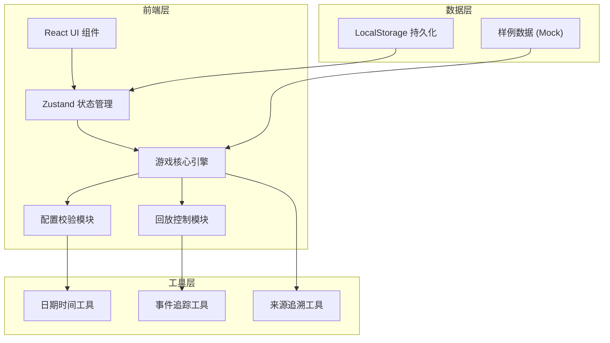

## 1. 架构设计



## 2. 技术描述
- 前端：React@18 + TypeScript + Vite
- 样式：TailwindCSS@3 + 自定义CSS变量
- 状态管理：Zustand
- 图标：lucide-react
- 数据持久化：LocalStorage
- 无后端，纯前端应用

## 3. 目录结构

```
src/
├── components/          # UI 组件
│   ├── ControlPanel.tsx    # 控制面板
│   ├── Dashboard.tsx       # 资源仪表盘
│   ├── EventLog.tsx        # 事件日志
│   ├── PlaybackBar.tsx     # 回放控制条
│   ├── ReportPanel.tsx     # 结算报告
│   └── ConfigValidator.tsx # 配置校验提示
├── store/               # 状态管理
│   └── useGameStore.ts     # 游戏状态
├── engine/              # 核心引擎
│   ├── gameEngine.ts       # 游戏引擎
│   ├── configValidator.ts  # 配置校验
│   └── playbackEngine.ts   # 回放引擎
├── types/               # 类型定义
│   └── gameTypes.ts        # 游戏相关类型
├── data/                # 样例数据
│   └── sampleData.ts       # 三条样例记录
├── utils/               # 工具函数
│   ├── traceUtils.ts       # 来源追溯
│   └── formatUtils.ts      # 格式化工具
└── App.tsx              # 主应用
```

## 4. 类型定义

```typescript
// 游戏资源
interface Resources {
  time: number;
  energy: number;
  budget: number;
  [key: string]: number;
}

// 关卡事件
interface GameEvent {
  id: string;
  name: string;
  type: 'traffic_light' | 'road_condition' | 'weather' | 'other';
  description: string;
  resourceChanges: Partial<Resources>;
  source: string;  // 来源追溯
  timestamp?: number;
}

// 关卡
interface Level {
  id: string;
  name: string;
  events: GameEvent[];
  isEmpty?: boolean;
}

// 游戏配置
interface GameConfig {
  id: string;
  name: string;
  initialResources: Resources;
  resourceBoundaries: {
    [key: string]: { min: number; max: number };
  };
  levels: Level[];
  source: string;
}

// 游戏状态
type GameStatus = 'idle' | 'running' | 'paused' | 'finished' | 'error';

// 游戏记录
interface GameRecord {
  id: string;
  configId: string;
  configName: string;
  startTime: number;
  endTime?: number;
  status: GameStatus;
  finalResources?: Resources;
  eventLog: GameEvent[];
  anomalies: string[];
  needsManualReview: boolean;
  dataFormatVersion: 'v1' | 'v2';  // 新旧口径标记
  source: string;
}

// 校验结果
interface ValidationResult {
  valid: boolean;
  errors: string[];
  warnings: string[];
  emptyLevels: string[];
  duplicateEvents: string[];
  boundaryIssues: string[];
}
```

## 5. 数据模型

### 5.1 样例数据设计

**样例1：顺利记录（v2新口径）**
- 所有关卡正常
- 资源始终在合理范围内
- 无异常事件
- 来源：城市绿波信号赛-标准流程

**样例2：需人工确认记录（v2新口径）**
- 存在边界值情况
- 资源接近临界值
- 触发警告但未出错
- 来源：城市绿波信号赛-边缘测试

**样例3：旧口径记录（v1兼容）**
- 从学生练习记录导入
- 数据格式略有不同
- 标记为历史数据
- 来源：学生练习记录-2024秋季学期

### 5.2 来源追溯规则
每条记录、每个事件都附带 `source` 字段，格式：
- 标准流程：`城市绿波信号赛-关卡X-事件Y`
- 异常情况：`城市绿波信号赛-异常-[异常类型]-时间戳`
- 历史数据：`学生练习记录-[学期]-学生ID-练习编号`
