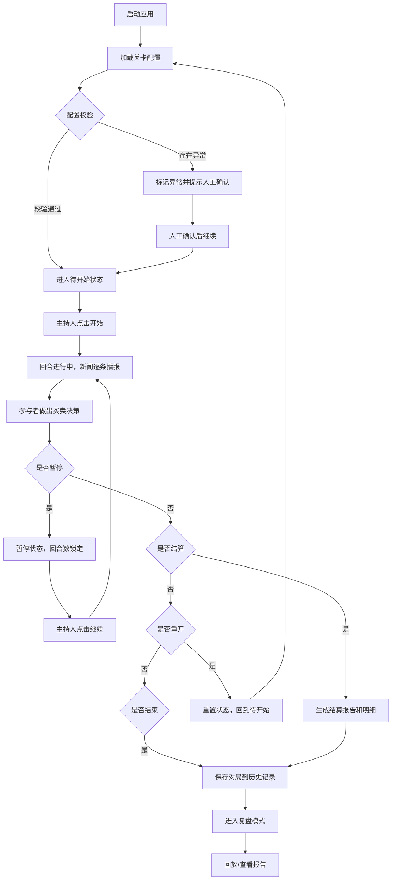

## 1. 产品概述

"股票新闻快反局"是一款面向投资社团的新闻事件快速反应模拟训练工具，帮助成员在模拟股票市场环境中锻炼对突发新闻的快速判断和决策能力。通过模拟真实的新闻事件发布和市场反应，让参与者在暂停/继续的节奏中学会冷静分析、果断决策。

- 核心目标：解决社团训练时投影大屏操作不便、暂停后局面混乱的问题
- 目标用户：高校投资社团成员、指导老师
- 产品价值：让新闻快反训练从"样例"一路走到"结果"，全程可追溯、可回放、可复盘

## 2. 核心功能

### 2.1 用户角色

| 角色 | 注册方式 | 核心权限 |
|------|----------|----------|
| 训练主持 | 本地启动，无需注册 | 开始/暂停/重开/结算、切换关卡配置、导出报告 |
| 训练参与者 | 通过浏览器访问 | 查看当前回合、做出买卖决策、查看个人记录 |
| 复盘查看者 | 通过浏览器访问 | 查看历史对局、回放决策过程、查看统计报告 |

### 2.2 功能模块

1. **对局主界面**：回合状态展示、新闻事件播报、操作控制面板
2. **决策面板**：买入/卖出/观望操作、仓位控制、决策理由记录
3. **历史回放**：按时间轴回放对局全过程、定位关键决策点
4. **报告中心**：统一展示结算报告和明细数据、导出对局记录
5. **关卡管理**：加载不同的关卡配置、验证配置合法性
6. **来源追溯**：每条处理记录关联原始来源、处理时间、处理人

### 2.3 页面详情

| 页面名称 | 模块名称 | 功能描述 |
|----------|----------|----------|
| 对局主界面 | 状态看板 | 实时显示当前回合数、剩余时间、市场指数、结算原因 |
| 对局主界面 | 新闻播报区 | 逐条展示当前回合的新闻事件，标注来源和发布时间 |
| 对局主界面 | 控制面板 | 开始、暂停、继续、重开、结算五大核心操作 |
| 决策面板 | 交易操作 | 选择标的、输入仓位、确认买卖、记录决策理由 |
| 决策面板 | 持仓概览 | 展示当前持仓、成本价、浮动盈亏 |
| 历史回放 | 时间轴控件 | 拖动定位到任意回合、倍速播放、暂停播放 |
| 历史回放 | 决策追溯 | 点击每条记录查看原始来源、处理时间、处理人 |
| 报告中心 | 结算总览 | 展示最终收益率、排名、关键决策点统计 |
| 报告中心 | 明细导出 | 按统一格式导出所有交易记录和新闻事件 |
| 关卡管理 | 配置加载 | 选择本地JSON配置文件、验证配置合法性 |
| 关卡管理 | 异常提示 | 标记空关卡、重复事件、超出边界的资源值 |
| 来源追溯 | 记录卡片 | 每条记录展示：原始来源、处理时间、处理人、处理建议 |

## 3. 核心流程

**主要用户流程说明**：
1. 主持人启动应用后，首先加载关卡配置，系统自动校验空关卡、重复事件、边界值等异常
2. 异常项标记后需人工确认才能继续，确保配置符合预期
3. 对局开始后，按回合逐条播报新闻，参与者可随时做出买卖决策
4. 主持人可随时暂停，暂停后回合数和结算原因锁定，不会乱
5. 结算后生成统一格式的报告和明细，不会出现两套说法
6. 历史对局可随时回放，每条记录都能追到原始来源和处理时间

## 4. 用户界面设计

### 4.1 设计风格

**整体定位**：专业金融终端风格，但要像"同事写给同事看的"，避免生硬的专业术语堆砌

- **主色调**：深蓝 #165DFF（专业、稳重） + 墨绿 #00B42A（上涨） + 赤红 #F53F3F（下跌）
- **辅助色**：浅灰 #F2F3F5（背景） + 深灰 #4E5969（正文） + 暖橙 #FF7D00（人工确认提示）
- **按钮风格**：圆角 4px，轻微投影，点击有按压反馈，主按钮用深蓝填充
- **字体选择**：
  - 标题：思源宋体（庄重、专业，适合新闻标题）
  - 正文：思源黑体（清晰、易读，适合交易记录）
  - 数字：JetBrains Mono（等宽，适合价格和收益率展示）
- **布局风格**：三栏式终端布局
  - 左栏：持仓概览 + 操作面板
  - 中栏：新闻播报区（时间轴样式）
  - 右栏：回合状态 + 控制面板
- **图标风格**：简洁线性图标，配合emoji增强识别度（📈📉📰💼⏸️▶️🔄）

### 4.2 页面设计概述

| 页面名称 | 模块名称 | UI 元素 |
|----------|----------|---------|
| 对局主界面 | 状态看板 | 大号数字显示回合数，彩色标签显示当前状态（进行中/暂停/已结算），底部小字显示结算原因 |
| 对局主界面 | 新闻播报区 | 时间轴布局，每条新闻带来源标签（如"Reuters"、"旧口径-投影大屏"），重要新闻标红边框 |
| 对局主界面 | 控制面板 | 横向排列五个大按钮（开始/暂停/继续/重开/结算），当前可用按钮高亮，不可用按钮置灰 |
| 决策面板 | 交易操作 | 卡片式布局，标的选择下拉框，仓位滑块 + 数字输入双控，买入/卖出按钮左右并列 |
| 决策面板 | 持仓概览 | 表格展示，盈亏列用颜色区分， hover 显示成本价和买入时间 |
| 历史回放 | 时间轴控件 | 底部横向时间轴，可拖动滑块，带倍速选择（0.5x/1x/2x/4x） |
| 报告中心 | 结算总览 | 顶部大号收益率展示，下方关键指标卡片网格，再下方明细表格 |
| 来源追溯 | 记录卡片 | 卡片顶部显示来源标签和时间，中间是处理内容，底部是"同事提醒"式的处理建议 |

### 4.3 响应式设计

- 桌面端优先（1280px 以上）：三栏完整布局
- 平板端（768px - 1280px）：左右两栏，控制面板移到底部
- 移动端（768px 以下）：单栏堆叠，核心操作按钮悬浮固定
- 触控优化：按钮最小高度 44px，滑块增大触控区域

### 4.4 动效设计

- 新闻播报：从右侧滑入，带轻微淡入效果，重要新闻有脉冲动画
- 状态切换：状态标签颜色渐变过渡，数字变化有滚动动画
- 交易确认：点击买入/卖出后，按钮有0.3秒的加载状态，成功后显示对勾
- 暂停/继续：全屏有半透明遮罩淡入淡出，配合文字提示"已暂停 / 继续进行"
- 结算报告：卡片逐个淡入出现，收益率数字从0滚动到最终值

## 5. 异常处理与数据校验

### 5.1 配置异常处理

| 异常类型 | 检测方式 | 处理策略 |
|----------|----------|----------|
| 空关卡 | 检查关卡数组长度为0或事件列表为空 | 标记为"空关卡"，高亮提示，需人工确认是否跳过 |
| 重复事件 | 检查同一回合内是否有相同ID或相同内容的新闻 | 标记为"重复事件"，保留第一条，其余标灰 |
| 超出边界的资源值 | 检查价格、仓位、收益率等数值是否在合理范围内 | 标记为"边界异常"，自动修正到边界值并记录 |

### 5.2 操作状态稳定性

- 暂停后锁定：回合数、结算原因、当前持仓全部锁定，不接受任何修改
- 继续后恢复：从暂停的回合继续，所有状态完全恢复
- 重开后重置：所有状态清空，回合数回到1，结算原因清除
- 状态持久化：对局状态实时保存到 localStorage，刷新页面不丢失

### 5.3 数据一致性

- 报告和明细共用同一数据源，不会出现两套说法
- 每条交易记录关联对应的新闻事件ID，可双向追溯
- 结算原因自动记录触发条件（如"回合结束"、"手动结算"、"触发止损"）
