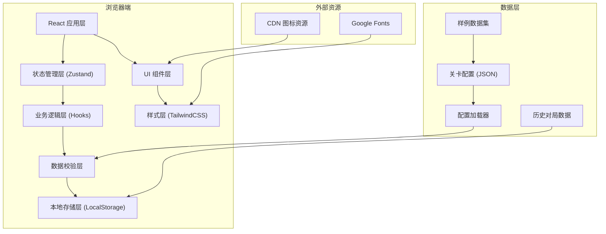
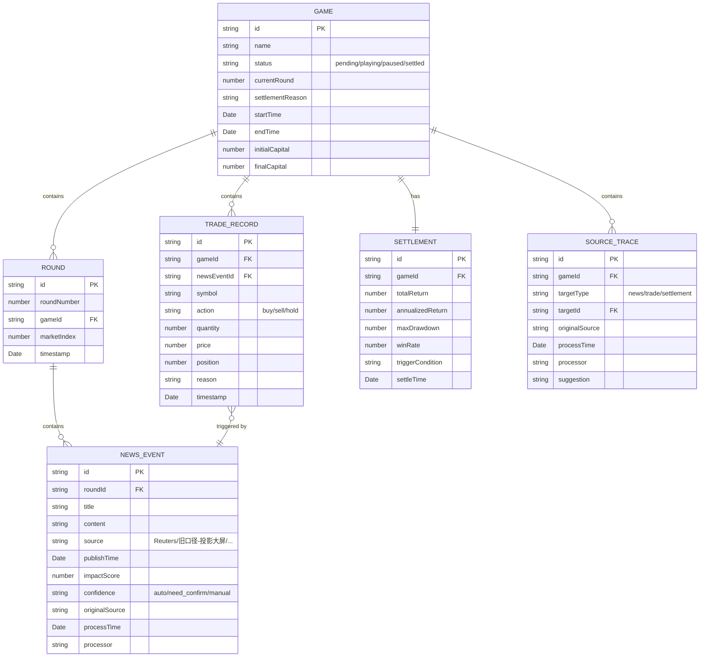

## 1. 架构设计



## 2. 技术描述

- **前端框架**：React@18 + TypeScript@5
- **构建工具**：Vite@5
- **样式方案**：TailwindCSS@3 + CSS Variables
- **状态管理**：Zustand@4（轻量级，适合本地状态持久化）
- **路由方案**：React Router@6（单页应用，多视图切换）
- **图表展示**：Recharts@2（收益率曲线、持仓分布图）
- **初始化方式**：使用 `npm create vite@latest` 初始化 React + TypeScript 模板
- **后端**：无后端，纯前端应用，数据全部存储在浏览器 LocalStorage
- **数据库**：无数据库，使用 LocalStorage 存储历史对局记录
- **Mock 数据**：内置多套关卡配置样例，包含正常配置和异常配置用于测试

## 3. 目录结构

```
src/
├── components/          # UI 组件
│   ├── game/           # 对局相关组件
│   │   ├── StatusBoard.tsx      # 状态看板
│   │   ├── NewsFeed.tsx         # 新闻播报区
│   │   ├── ControlPanel.tsx     # 控制面板
│   │   └── PauseOverlay.tsx     # 暂停遮罩
│   ├── trade/          # 交易相关组件
│   │   ├── TradePanel.tsx       # 交易操作面板
│   │   └── PositionTable.tsx    # 持仓概览表
│   ├── history/        # 历史回放组件
│   │   ├── Timeline.tsx         # 时间轴控件
│   │   └── ReplayPlayer.tsx     # 回放播放器
│   ├── report/         # 报告相关组件
│   │   ├── ReportSummary.tsx    # 结算总览
│   │   └── DetailTable.tsx      # 明细表格
│   ├── config/         # 配置管理组件
│   │   ├── ConfigLoader.tsx     # 配置加载器
│   │   └── ConfigValidator.tsx  # 配置校验展示
│   └── common/         # 通用组件
│       ├── SourceCard.tsx       # 来源追溯卡片
│       ├── StatusBadge.tsx      # 状态标签
│       └── NumberScroll.tsx     # 数字滚动动画
├── store/              # 状态管理
│   ├── useGameStore.ts         # 对局状态
│   ├── useTradeStore.ts        # 交易状态
│   └── useHistoryStore.ts      # 历史记录状态
├── hooks/              # 自定义 Hooks
│   ├── useGameLogic.ts         # 游戏核心逻辑
│   ├── useConfigValidator.ts   # 配置校验逻辑
│   ├── useSourceTracker.ts     # 来源追溯逻辑
│   └── useReplay.ts            # 回放控制逻辑
├── types/              # TypeScript 类型定义
│   ├── game.ts                 # 对局相关类型
│   ├── trade.ts                # 交易相关类型
│   ├── config.ts               # 配置相关类型
│   └── history.ts              # 历史记录类型
├── data/               # 静态数据
│   ├── sample-levels/          # 样例关卡配置
│   │   ├── level1-normal.json  # 正常配置
│   │   ├── level2-empty.json   # 含空关卡
│   │   ├── level3-duplicate.json # 含重复事件
│   │   └── level4-boundary.json # 含边界异常
│   └── sample-records.json     # 样例历史记录
├── utils/              # 工具函数
│   ├── storage.ts              # 本地存储封装
│   ├── formatters.ts           # 数据格式化
│   └── export.ts               # 导出功能
├── App.tsx             # 根组件
├── main.tsx            # 入口文件
└── index.css           # 全局样式
```

## 4. 路由定义

| 路由路径 | 页面名称 | 功能说明 |
|----------|----------|----------|
| `/` | 对局主界面 | 核心对局操作，包含状态看板、新闻播报、控制面板、交易面板 |
| `/history` | 历史记录列表 | 展示所有历史对局，支持搜索、筛选、删除 |
| `/history/:id` | 历史回放 | 回放指定对局，支持时间轴拖动、倍速播放 |
| `/report/:id` | 报告详情 | 展示指定对局的结算报告和明细数据 |
| `/config` | 关卡管理 | 加载、校验、管理关卡配置文件 |
| `/help` | 帮助说明 | 启动说明、操作指南、常见问题 |

## 5. 核心数据模型

### 5.1 数据模型定义



### 5.2 核心类型定义

```typescript
// 对局状态
type GameStatus = 'pending' | 'playing' | 'paused' | 'settled';

// 新闻事件置信度
type NewsConfidence = 'auto' | 'need_confirm' | 'manual';

// 来源类型
type SourceType = 'reuters' | 'bloomberg' | 'projection_old' | 'manual' | 'other';

// 交易动作
type TradeAction = 'buy' | 'sell' | 'hold';

// 结算触发条件
type SettleTrigger = 'round_end' | 'manual' | 'stop_loss' | 'take_profit';

interface GameConfig {
  id: string;
  name: string;
  totalRounds: number;
  initialCapital: number;
  stocks: StockConfig[];
  rounds: RoundConfig[];
}

interface RoundConfig {
  roundNumber: number;
  marketIndex: number;
  news: NewsConfig[];
}

interface NewsConfig {
  id: string;
  title: string;
  content: string;
  source: SourceType;
  sourceName: string;
  publishTime: string;
  impactScore: number;
  confidence: NewsConfidence;
  originalSource: string;
  processTime: string;
  processor: string;
  suggestion: string;
}

interface StockConfig {
  symbol: string;
  name: string;
  basePrice: number;
  volatility: number;
}

interface ValidationResult {
  isValid: boolean;
  errors: ValidationError[];
}

interface ValidationError {
  type: 'empty_level' | 'duplicate_event' | 'boundary_violation';
  path: string;
  message: string;
  value?: any;
  boundary?: { min: number; max: number };
}
```

## 6. 核心技术方案

### 6.1 状态持久化方案

使用 Zustand 的 persist 中间件，将对局状态实时保存到 LocalStorage：

```typescript
// store/useGameStore.ts
import { create } from 'zustand';
import { persist } from 'zustand/middleware';

export const useGameStore = create(
  persist(
    (set, get) => ({
      // 状态定义
      gameId: null,
      status: 'pending',
      currentRound: 1,
      settlementReason: '',
      // ... 其他状态
      
      // 核心操作
      startGame: () => { ... },
      pauseGame: () => { 
        // 暂停时锁定状态
        set({ status: 'paused', isLocked: true });
      },
      resumeGame: () => {
        // 继续时恢复状态
        set({ status: 'playing', isLocked: false });
      },
      restartGame: () => {
        // 重开时重置所有状态
        set({ 
          status: 'pending', 
          currentRound: 1, 
          settlementReason: '',
          // ... 其他重置
        });
      },
      settleGame: (trigger: SettleTrigger) => {
        // 结算时计算最终结果
        set({ 
          status: 'settled', 
          settlementReason: trigger,
          // ... 计算结果
        });
      },
    }),
    {
      name: 'stock-news-game-storage',
      // 只持久化必要的状态，避免数据过大
      partialize: (state) => ({
        gameId: state.gameId,
        status: state.status,
        currentRound: state.currentRound,
        settlementReason: state.settlementReason,
        // ... 其他需要持久化的状态
      }),
    }
  )
);
```

### 6.2 配置校验方案

```typescript
// hooks/useConfigValidator.ts
export function useConfigValidator() {
  const validate = (config: GameConfig): ValidationResult => {
    const errors: ValidationError[] = [];
    
    // 1. 检查空关卡
    if (config.rounds.length === 0) {
      errors.push({
        type: 'empty_level',
        path: 'rounds',
        message: '关卡配置为空，没有任何回合',
      });
    }
    
    config.rounds.forEach((round, roundIdx) => {
      if (round.news.length === 0) {
        errors.push({
          type: 'empty_level',
          path: `rounds[${roundIdx}].news`,
          message: `第 ${round.roundNumber} 回合没有新闻事件`,
        });
      }
      
      // 2. 检查重复事件
      const seenIds = new Set();
      round.news.forEach((news, newsIdx) => {
        if (seenIds.has(news.id)) {
          errors.push({
            type: 'duplicate_event',
            path: `rounds[${roundIdx}].news[${newsIdx}]`,
            message: `第 ${round.roundNumber} 回合存在重复的新闻 ID: ${news.id}`,
            value: news.id,
          });
        }
        seenIds.add(news.id);
      });
      
      // 3. 检查边界值
      round.news.forEach((news, newsIdx) => {
        if (news.impactScore < -100 || news.impactScore > 100) {
          errors.push({
            type: 'boundary_violation',
            path: `rounds[${roundIdx}].news[${newsIdx}].impactScore`,
            message: `新闻影响分数超出边界 [-100, 100]`,
            value: news.impactScore,
            boundary: { min: -100, max: 100 },
          });
        }
      });
    });
    
    return {
      isValid: errors.length === 0,
      errors,
    };
  };
  
  return { validate };
}
```

### 6.3 来源追溯方案

每条记录都包含完整的来源信息，使用 `SourceCard` 组件统一展示：

```typescript
// types/game.ts
interface SourceInfo {
  originalSource: string;      // 原始来源，如"路透社 2024-01-15"
  processTime: string;         // 处理时间
  processor: string;           // 处理人，如"社团老师小林"
  suggestion: string;          // 处理建议，同事间的提醒
  sourceType: SourceType;      // 来源类型
}
```

### 6.4 回放控制方案

```typescript
// hooks/useReplay.ts
export function useReplay(gameId: string) {
  const [currentRound, setCurrentRound] = useState(1);
  const [isPlaying, setIsPlaying] = useState(false);
  const [speed, setSpeed] = useState(1);
  
  // 按倍速播放
  useEffect(() => {
    if (!isPlaying) return;
    
    const interval = setInterval(() => {
      setCurrentRound((prev) => {
        if (prev >= totalRounds) {
          setIsPlaying(false);
          return prev;
        }
        return prev + 1;
      });
    }, 2000 / speed);
    
    return () => clearInterval(interval);
  }, [isPlaying, speed, totalRounds]);
  
  return {
    currentRound,
    setCurrentRound,
    isPlaying,
    setIsPlaying,
    speed,
    setSpeed,
  };
}
```

### 6.5 数据一致性方案

报告和明细共用同一数据源，通过统一的 selectors 获取数据：

```typescript
// store/selectors.ts
export const getSettlementData = (state: GameState) => {
  const trades = state.trades;
  const events = state.events;
  
  // 统一计算逻辑，确保报告和明细数据一致
  const totalReturn = calculateTotalReturn(trades);
  const details = trades.map((trade) => {
    const event = events.find((e) => e.id === trade.newsEventId);
    return {
      ...trade,
      newsTitle: event?.title,
      newsSource: event?.sourceName,
    };
  });
  
  return {
    summary: {
      totalReturn,
      tradeCount: trades.length,
      // ... 其他汇总指标
    },
    details,
  };
};
```

## 7. 性能优化

- 使用 React.memo 优化列表渲染，避免不必要的重渲染
- 使用 useMemo 缓存计算结果（如收益率、明细数据）
- 使用虚拟列表优化长列表（历史记录、明细表格）
- 图片资源使用 CDN 懒加载
- LocalStorage 写入做节流处理，避免频繁写入
