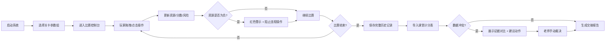

## 1. 产品概述

"黑胶节拍修复赛"计分系统是为社团老师小林设计的比赛计分与数据核对工具，解决人工对照课堂计分表和比赛数据时的混乱问题，特别是暂停后恢复计分的场景。系统确保每一次操作都真实影响资源、分数或风险，完整保留原始备注和处理痕迹，在数据冲突时提供证据对比而非自动裁决。

- 核心目标：消除人工核对误差，保留完整审计线索，让交接工作清晰可追溯
- 目标用户：社团老师小林及后续接手的工作人员
- 核心价值：让"黑胶节拍修复赛"的每一条计分都有来源、有时间、有依据，不再需要反复询问原始判罚原因

## 2. 核心功能

### 2.1 用户角色
| 角色 | 注册方式 | 核心权限 |
|------|----------|----------|
| 社团老师 | 本地登录（无需注册） | 导入关卡参数、记录玩家操作、查看历史、导出报告、处理数据冲突 |

### 2.2 功能模块
1. **比赛控制台**：实时显示当前关卡、资源状态、分数、风险值，支持拖拽/点击操作
2. **关卡管理**：导入/切换不同关卡参数组，查看关卡配置详情
3. **历史记录**：按局查看完整操作历史，包括原始来源和处理时间
4. **数据冲突处理**：对比课堂计分表与导入数据，展示证据和建议动作
5. **报告生成**：生成同事风格的交接报告，保留所有原始备注

### 2.3 页面详情
| 页面名称 | 模块名称 | 功能描述 |
|----------|----------|------------|
| 比赛控制台 | 实时状态面板 | 显示当前资源、分数、风险值，负数资源红色高亮警示 |
| 比赛控制台 | 操作区域 | 拖拽/点击操作立即影响资源/分数/风险，每步操作即时反馈 |
| 比赛控制台 | 样例验证区 | 运行"黑胶节拍修复赛"样例，可视化展示判断逻辑参与过程 |
| 关卡管理 | 关卡列表 | 展示可用关卡参数组，支持切换和导入新关卡 |
| 关卡管理 | 关卡详情 | 显示关卡配置：初始资源、目标分数、风险规则等 |
| 历史记录 | 局列表 | 按时间倒序展示所有比赛局，支持筛选和搜索 |
| 历史记录 | 单局详情 | 时间线展示每一步操作：操作人、时间、来源、数值变化、备注 |
| 冲突处理 | 冲突列表 | 标记课堂计分表与导入数据不一致的条目 |
| 冲突处理 | 证据对比 | 并排展示两边数据、原始备注、建议动作，不自动裁决 |
| 报告生成 | 报告预览 | 同事风格的交接报告，包含完整审计线索 |

## 3. 核心流程

### 3.1 比赛进行流程
老师启动系统 → 选择关卡参数 → 进入比赛控制台 → 玩家每次拖拽/点击操作 → 系统即时更新资源/分数/风险 → 资源负数时红色警示并阻止违规操作 → 比赛结束 → 自动保存完整历史

### 3.2 数据冲突处理流程
导入课堂计分表 → 系统自动比对"黑胶节拍修复赛"导入数据 → 标记冲突条目 → 并排展示两边证据（原始备注、来源、时间）→ 提供建议动作（采信A/采信B/保留待查）→ 老师手动选择处理方式 → 记录处理人和时间

## 4. 用户界面设计

### 4.1 设计风格
- **主色调**：深褐色(#2C1810)搭配黑胶唱片质感，辅以金色(#D4AF37)点缀，呼应"黑胶"主题
- **辅助色**：警示红(#E74C3C)用于负数资源，确认绿(#27AE60)用于正常状态，待定黄(#F39C12)用于冲突标记
- **按钮风格**：圆角矩形，带轻微阴影，hover时有微缩放效果
- **字体**：标题用"Noto Serif SC"（复古印刷感），正文用"Noto Sans SC"（清晰易读）
- **布局风格**：三栏布局（左侧导航/中间主操作区/右侧状态面板），卡片式模块分隔
- **图标风格**：线条图标，黑胶唱片、节拍器等音乐相关元素

### 4.2 页面设计概述
| 页面名称 | 模块名称 | UI元素 |
|----------|----------|--------|
| 比赛控制台 | 实时状态面板 | 大号数字卡片，资源负数时红色背景闪烁动画 |
| 比赛控制台 | 操作区域 | 可拖拽的黑胶唱片元素，点击时有旋转动画 |
| 比赛控制台 | 样例验证区 | 代码风格的判断逻辑展示，高亮"黑胶节拍修复赛"参与行 |
| 历史记录 | 单局详情 | 垂直时间线，每个节点显示操作图标、时间、来源、备注 |
| 冲突处理 | 证据对比 | 左右分栏对比，中间箭头指示差异，底部列出建议动作按钮 |
| 报告生成 | 报告预览 | 仿打印纸质感，灰色边框，等宽字体展示数据表格 |

### 4.3 响应式
- 桌面端优先设计，主操作区最小宽度1200px
- 平板端自动调整为两栏布局，状态面板移至底部
- 移动端简化为单栏滚动，保留核心操作功能
- 拖拽操作在触屏设备上支持触摸事件

### 4.4 动画与交互细节
- 黑胶唱片拖拽时带旋转跟随效果
- 数值变化时数字滚动动画（0.5秒过渡）
- 资源变负时红色边框脉冲动画（每2秒一次）
- 页面加载时模块交错淡入（staggered fade-in）
- 冲突标记悬停时显示详情tooltip
