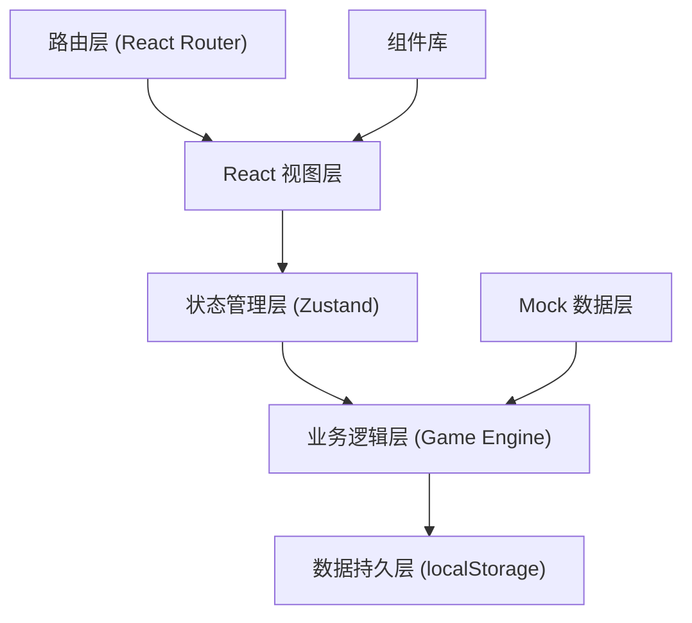
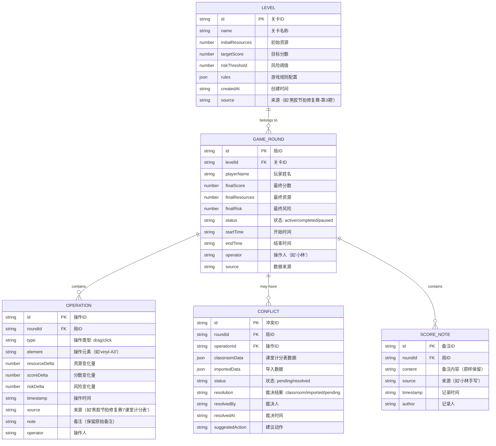

## 1. 架构设计

本系统为纯前端单页应用，数据存储在浏览器 localStorage 中，无需后端服务。架构分层清晰，状态管理集中，确保"黑胶节拍修复赛"的每一步操作都可追溯。



## 2. 技术描述

- **前端框架**：React@18 + TypeScript
- **构建工具**：Vite@5
- **样式方案**：TailwindCSS@3 + CSS Variables（主题系统）
- **状态管理**：Zustand（轻量级，支持时间旅行调试）
- **路由**：React Router@6
- **拖拽交互**：@dnd-kit/core + @dnd-kit/sortable（支持键盘和触摸）
- **动画**：Framer Motion（流畅的数值变化和过渡动画）
- **图标**：Lucide React（线性图标，与设计风格匹配）
- **数据持久化**：localStorage + 自动备份机制
- **后端**：无（纯前端应用，数据本地存储）
- **数据库**：localStorage 作为文档数据库，JSON 格式存储

## 3. 技术选型说明

### 3.1 为什么选 Zustand 而非 Redux
- "黑胶节拍修复赛"需要频繁的状态更新（每次拖拽/点击都触发）
- Zustand 更轻量，API 更简洁，减少样板代码
- 支持时间旅行，便于调试比赛历史
- 无需 Provider 包裹，组件层级更清晰

### 3.2 为什么选 @dnd-kit 而非 react-dnd
- 更现代的 API，TypeScript 支持更好
- 内置键盘可访问性支持
- 性能更优，特别适合频繁拖拽场景
- 支持自定义碰撞检测，便于实现"黑胶节拍修复赛"特殊规则

### 3.3 为什么选纯前端架构
- 社团老师小林单机使用，不需要多用户协作
- 数据不敏感，本地存储足够安全
- 部署简单，无需服务器维护
- 离线可用，课堂场景网络不稳定时也能正常工作

## 4. 路由定义

| 路由 | 页面名称 | 核心功能 |
|------|----------|----------|
| `/` | 比赛控制台 | 实时状态显示、拖拽/点击操作、样例验证 |
| `/levels` | 关卡管理 | 关卡列表、切换关卡、导入新关卡参数 |
| `/history` | 历史记录 | 局列表、单局详情时间线、筛选搜索 |
| `/conflicts` | 冲突处理 | 冲突列表、证据对比、手动裁决 |
| `/report` | 报告生成 | 报告预览、导出、打印 |

## 5. 数据模型

### 5.1 数据模型定义



### 5.2 核心数据结构示例

```typescript
// 游戏状态
interface GameState {
  currentRound: GameRound | null;
  resources: number;
  score: number;
  risk: number;
  operations: Operation[];
  isPaused: boolean;
}

// 关卡配置
interface LevelConfig {
  id: string;
  name: string;
  initialResources: number;
  targetScore: number;
  riskThreshold: number;
  rules: {
    dragEffects: Record<string, { resource: number; score: number; risk: number }>;
    clickEffects: Record<string, { resource: number; score: number; risk: number }>;
    negativeResourceBlocked: boolean;
  };
  source: string;
  createdAt: string;
}

// 操作记录（完整审计线索）
interface Operation {
  id: string;
  roundId: string;
  type: 'drag' | 'click';
  element: string;
  elementLabel: string;
  resourceDelta: number;
  scoreDelta: number;
  riskDelta: number;
  resourcesAfter: number;
  scoreAfter: number;
  riskAfter: number;
  timestamp: string;
  source: '黑胶节拍修复赛' | '课堂计分表' | '手动修正';
  note: string;
  operator: string;
  isJudgementCall?: boolean;
  judgementReason?: string;
}
```

### 5.3 localStorage 存储键定义

```typescript
const STORAGE_KEYS = {
  LEVELS: 'vinyl_be_levels',
  ROUNDS: 'vinyl_be_rounds',
  OPERATIONS: 'vinyl_be_operations',
  NOTES: 'vinyl_be_notes',
  CONFLICTS: 'vinyl_be_conflicts',
  CURRENT_STATE: 'vinyl_be_current_state',
  BACKUP: 'vinyl_be_backup_' // + timestamp
} as const;
```

## 6. 核心模块设计

### 6.1 Game Engine（游戏引擎）
- 位置：`src/engine/GameEngine.ts`
- 职责：处理所有操作的业务逻辑，计算资源/分数/风险变化
- 关键方法：
  - `processDrag(element, position)` - 处理拖拽操作
  - `processClick(element)` - 处理点击操作
  - `validateOperation(operation)` - 验证操作合法性（如资源负数检查）
  - `applyJudgementCall(operationId, decision, reason)` - 应用人工裁决

### 6.2 Conflict Detector（冲突检测器）
- 位置：`src/engine/ConflictDetector.ts`
- 职责：对比课堂计分表与导入数据，识别冲突
- 关键方法：
  - `detectConflicts(classroomData, importedData)` - 检测冲突
  - `generateEvidence(conflict)` - 生成证据对比
  - `suggestAction(conflict)` - 生成建议动作

### 6.3 History Replayer（历史回放器）
- 位置：`src/engine/HistoryReplayer.ts`
- 职责：按时间线回放操作历史，支持暂停/单步执行
- 关键方法：
  - `buildTimeline(roundId)` - 构建时间线
  - `replayStep(stepIndex)` - 单步回放
  - `exportAuditLog(roundId)` - 导出审计日志

### 6.4 Report Generator（报告生成器）
- 位置：`src/engine/ReportGenerator.ts`
- 职责：生成同事风格的交接报告
- 关键方法：
  - `generateHandoverReport(roundId)` - 生成交接报告
  - `exportAsMarkdown(report)` - 导出为 Markdown
  - `formatForPrint(report)` - 格式化用于打印

## 7. 关键业务规则实现

### 7.1 资源负数检查
```typescript
// 规则：资源变负时，阻止后续消耗资源的操作
// 但允许增加资源的操作继续
const canPerformOperation = (
  currentResources: number,
  resourceDelta: number
): { allowed: boolean; reason?: string } => {
  const newResources = currentResources + resourceDelta;
  if (newResources < 0 && resourceDelta < 0) {
    return {
      allowed: false,
      reason: '资源不足，此操作会导致资源为负。请先执行增加资源的操作。'
    };
  }
  return { allowed: true };
};
```

### 7.2 "黑胶节拍修复赛"判断逻辑可视化
```typescript
// 每一步操作都记录判断逻辑的参与
const logJudgementTrace = (
  operation: Operation,
  rules: string[],
  decision: string
) => {
  operation.judgementTrace = {
    rulesApplied: rules,
    decision,
    timestamp: new Date().toISOString(),
    module: '黑胶节拍修复赛-判断引擎'
  };
};
```

## 8. 开发目录结构

```
src/
├── components/          # React 组件
│   ├── console/         # 比赛控制台组件
│   ├── levels/          # 关卡管理组件
│   ├── history/         # 历史记录组件
│   ├── conflicts/       # 冲突处理组件
│   ├── report/          # 报告生成组件
│   └── shared/          # 共享组件
├── engine/              # 业务逻辑引擎
│   ├── GameEngine.ts
│   ├── ConflictDetector.ts
│   ├── HistoryReplayer.ts
│   └── ReportGenerator.ts
├── store/               # Zustand 状态管理
│   ├── useGameStore.ts
│   ├── useLevelStore.ts
│   └── useHistoryStore.ts
├── types/               # TypeScript 类型定义
│   ├── game.ts
│   ├── level.ts
│   └── operation.ts
├── data/                # Mock 数据
│   ├── levels.ts
│   ├── sampleRounds.ts
│   └── classroomScores.ts
├── hooks/               # 自定义 Hooks
│   ├── useDragOperation.ts
│   ├── useClickOperation.ts
│   └── useNumberAnimation.ts
├── utils/               # 工具函数
│   ├── storage.ts
│   ├── time.ts
│   └── audit.ts
├── App.tsx
├── main.tsx
└── index.css
```
