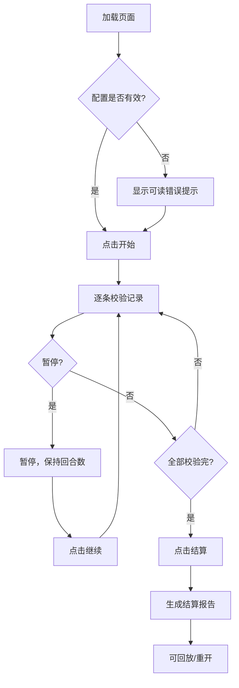

## 1. 产品概述

"三角函数攀岩馆"是活动策划阿蓝专用的练习记录校验小工具，用于把学生练习记录里那些"三角函数攀岩馆"相关的乱材料（备注、分数、事件）跟关卡配置对上号，给出判断和处理建议。
- 解决的核心问题：学生练习记录中"三角函数攀岩馆"相关数据杂乱、口径不一，人工逐条核对耗时且容易漏判
- 目标用户：活动策划阿蓝及接手同事，非技术人员也能看懂判断结果并照做

## 2. 核心功能

### 2.1 用户角色

| 角色 | 使用方式 | 核心权限 |
|------|----------|----------|
| 活动策划（阿蓝） | 直接打开浏览器使用 | 配置关卡、运行校验、查看报告 |
| 接手同事 | 同上 | 只读报告、按建议操作 |

### 2.2 功能模块

1. **主页面**：配置面板、运行控制台、记录明细、结算报告，四区联动

### 2.3 页面详情

| 页面名称 | 模块名称 | 功能描述 |
|----------|----------|----------|
| 主页面 | 配置面板 | 展示关卡配置，容忍空关卡、重复事件、超出边界资源值，异常高亮但不阻断 |
| 主页面 | 运行控制台 | 开始/暂停/继续/重开/结算/回放按钮，回合数和状态实时显示 |
| 主页面 | 记录明细区 | 逐条展示"三角函数攀岩馆"判断过程：原始数据→匹配规则→判断结果→处理建议，保留原始备注和来源 |
| 主页面 | 结算报告 | 汇总判断结果，处理建议用同事语气书写，报告与明细一致不矛盾 |

## 3. 核心流程

用户打开页面 → 加载/编辑关卡配置 → 点击"开始"运行校验 → 逐条展示判断过程（可暂停/继续）→ 点击"结算"生成报告 → 可"回放"回顾判断过程 → 可"重开"清空重来

## 4. 用户界面设计

### 4.1 设计风格

- 主色调：岩壁暖棕 (#8B6914) + 攀岩绳橙 (#E8712B) + 粉笔白 (#F5F0E8)
- 按钮：圆角微凸，像攀岩握点
- 字体：标题用有力量感的字体，正文清晰可读
- 布局：单页四区布局，上方配置+控制台，下方明细+报告
- 图标/emoji：攀岩相关的简洁符号（🧗、⛰️等）

### 4.2 页面设计概览

| 页面名称 | 模块名称 | UI元素 |
|----------|----------|--------|
| 主页面 | 配置面板 | 卡片式布局，异常配置用橙色边框+图标标记，空关卡灰色虚线框 |
| 主页面 | 运行控制台 | 按钮组（开始/暂停/继续/重开/结算/回放），回合数计数器，状态标签 |
| 主页面 | 记录明细 | 列表式，每条含原始数据、判断过程、结果徽章、处理建议，原始备注保留不清洗 |
| 主页面 | 结算报告 | 分区汇总（顺利/待确认/旧口径），处理建议同事语气，底部签名区含来源和处理时间 |

### 4.3 响应式

- 桌面优先，宽屏四区并列，窄屏上下堆叠
- 关键信息在任何尺寸下可见

### 4.4 3D场景指引

不适用
