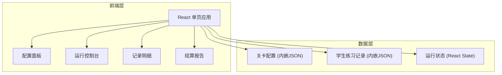
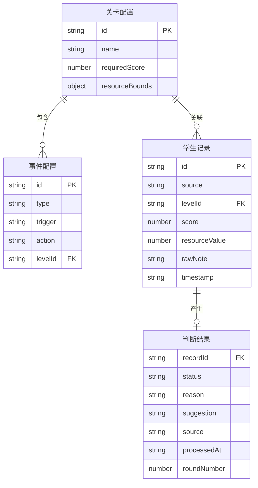

## 1. 架构设计



纯前端架构，无后端服务，数据内嵌在应用中，浏览器直接打开即可运行。

## 2. 技术说明

- 前端：React@18 + Tailwind CSS@3 + Vite
- 初始化工具：Vite
- 后端：无
- 数据库：无，使用内嵌 Mock 数据

## 3. 路由定义

| 路由 | 用途 |
|------|------|
| / | 主页面，包含配置、控制台、明细、报告四区 |

## 4. API 定义

无后端 API，所有数据操作在前端完成。

### 4.1 核心 TypeScript 类型

```typescript
interface LevelConfig {
  id: string;
  name: string;
  requiredScore: number;
  resourceBounds: { min: number; max: number };
  events: EventConfig[];
}

interface EventConfig {
  id: string;
  type: string;
  trigger: string;
  action: string;
}

interface StudentRecord {
  id: string;
  source: "三角函数攀岩馆" | "学生练习记录" | "旧口径";
  levelId: string;
  score: number | null;
  resourceValue: number | null;
  rawNote: string;
  timestamp: string;
}

interface JudgementResult {
  recordId: string;
  originalRecord: StudentRecord;
  status: "顺利" | "待人工确认" | "旧口径补录";
  reason: string;
  suggestion: string;
  source: string;
  processedAt: string;
  roundNumber: number;
}

interface RunState {
  status: "idle" | "running" | "paused" | "settled";
  currentRound: number;
  results: JudgementResult[];
}
```

## 5. 服务器架构图

不适用

## 6. 数据模型

### 6.1 数据模型定义



### 6.2 示例数据设计

**关卡配置（含异常）：**
- 关卡1：正常配置
- 关卡2：空关卡（无事件）
- 关卡3：重复事件 + 资源值超出边界

**学生记录（三条样例）：**
1. 顺利记录：分数、资源值均在范围内，备注清晰
2. 待人工确认记录：分数或资源值越界/异常，备注杂乱
3. 旧口径补录：来源标记为"学生练习记录"，备注含旧格式

## 7. 关键实现约束

1. **状态稳定性**：暂停/继续/重开后，currentRound 和判断结果不可变
2. **原始数据保留**：rawNote 原样展示，不做清洗/格式化
3. **来源可追溯**：每条判断结果保留 source 和 processedAt
4. **配置容错**：空关卡、重复事件、越界值不崩溃，给出提示
5. **报告一致性**：结算报告的汇总数字必须与明细条目一一对应
6. **同事语气**：suggestion 字段用"建议你……""这条需要……"等同事口吻
