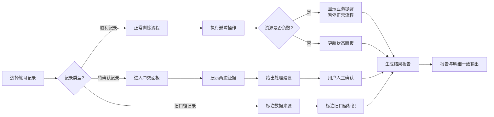

## 1. 产品概述

无人车避障训练场是面向学生的交互式训练平台，通过真实的练习记录模拟无人车避障决策过程，让学生在操作中直观理解资源消耗、风险评估和分数计算的业务逻辑。

- 核心目标：解决学生练习只知结果不知过程的问题，将"输赢"转化为可追溯的决策链条
- 目标用户：课堂教学中的学生和教师

---

## 2. 核心功能

### 2.1 用户角色
| 角色 | 登录方式 | 核心权限 |
|------|----------|----------|
| 学生 | 无需登录 | 进行避障训练、查看练习记录、理解决策过程 |
| 教师 | 无需登录 | 导入练习数据、查看冲突报告、进行人工确认 |

### 2.2 功能模块
1. **训练主界面**：避障决策面板、资源状态、实时分数、风险指示器
2. **练习记录列表**：三条样例记录（顺利、待确认、旧口径）、记录筛选
3. **冲突处理面板**：数据对比展示、证据呈现、操作建议
4. **结果报告页**：决策过程追溯、分数明细、资源变动历史

### 2.3 页面详情
| 页面名称 | 模块名称 | 功能描述 |
|----------|----------|----------|
| 训练主界面 | 避障决策区 | 拖拽/点击障碍物影响资源、分数、风险，每次操作立即生效 |
| 训练主界面 | 状态面板 | 实时显示能源、算力、时间资源，当前分数，风险等级 |
| 练习记录列表 | 记录卡片 | 展示三条样例记录，标注状态（顺利/待确认/旧口径） |
| 冲突处理面板 | 数据对比 | 并排展示学生记录与导入数据的差异，列出两边证据 |
| 冲突处理面板 | 建议动作 | 给出业务同事可执行的处理建议，不替用户拍板 |
| 结果报告页 | 决策追溯 | 时间线展示完整判断过程，报告与明细说法一致 |
| 全局 | 异常处理 | 资源负数时给出业务提醒，坏配置显示友好提示而非白屏 |

---

## 3. 核心流程

用户选择练习记录 → 进入训练界面 → 执行避障操作（拖拽/点击）→ 实时计算资源/分数/风险 → 操作完成生成报告 → 遇到数据冲突进入人工确认 → 输出最终结果

---

## 4. 用户界面设计

### 4.1 设计风格
- **主色调**：科技蓝 (#165DFF) 搭配警示橙 (#FF7D00)、安全绿 (#00B42A)、危险红 (#F53F3F)
- **辅助色**：深灰背景 (#1D2129)、浅灰卡片 (#272E3B)
- **按钮风格**：直角矩形，4px圆角，悬停有微妙阴影提升
- **字体**：JetBrains Mono（等宽字体体现科技感）搭配思源黑体
- **布局风格**：模块化卡片布局，左侧状态面板 + 中央操作区 + 右侧日志区
- **图标风格**：线性图标，统一2px线宽，使用emoji辅助表达状态

### 4.2 页面设计概览
| 页面名称 | 模块名称 | UI元素 |
|----------|----------|--------|
| 训练主界面 | 状态面板 | 资源进度条（颜色随状态变化）、分数数字动画、风险指示灯 |
| 训练主界面 | 避障操作区 | 网格画布、可拖拽障碍物、点击触发的决策节点 |
| 练习记录列表 | 记录卡片 | 三色标签（绿/橙/灰）、摘要信息、进入按钮 |
| 冲突处理面板 | 数据对比 | 左右分栏布局、差异高亮、证据列表带序号 |
| 结果报告页 | 时间线 | 垂直时间线、节点状态图标、可展开详情 |

### 4.3 响应式
- 桌面端优先（课堂教学场景）
- 平板适配：堆叠布局
- 触控优化：拖拽区域扩大40px热区

### 4.4 动效设计
- 资源变动：数字滚动动画 + 进度条平滑过渡
- 风险升级：指示灯呼吸效果
- 操作反馈：障碍物拖拽时的吸附效果
- 页面切换：淡入淡出 + 轻微位移
