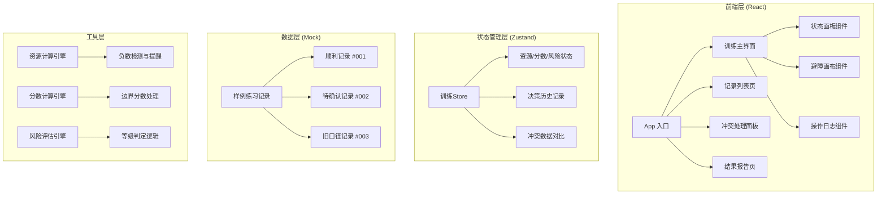
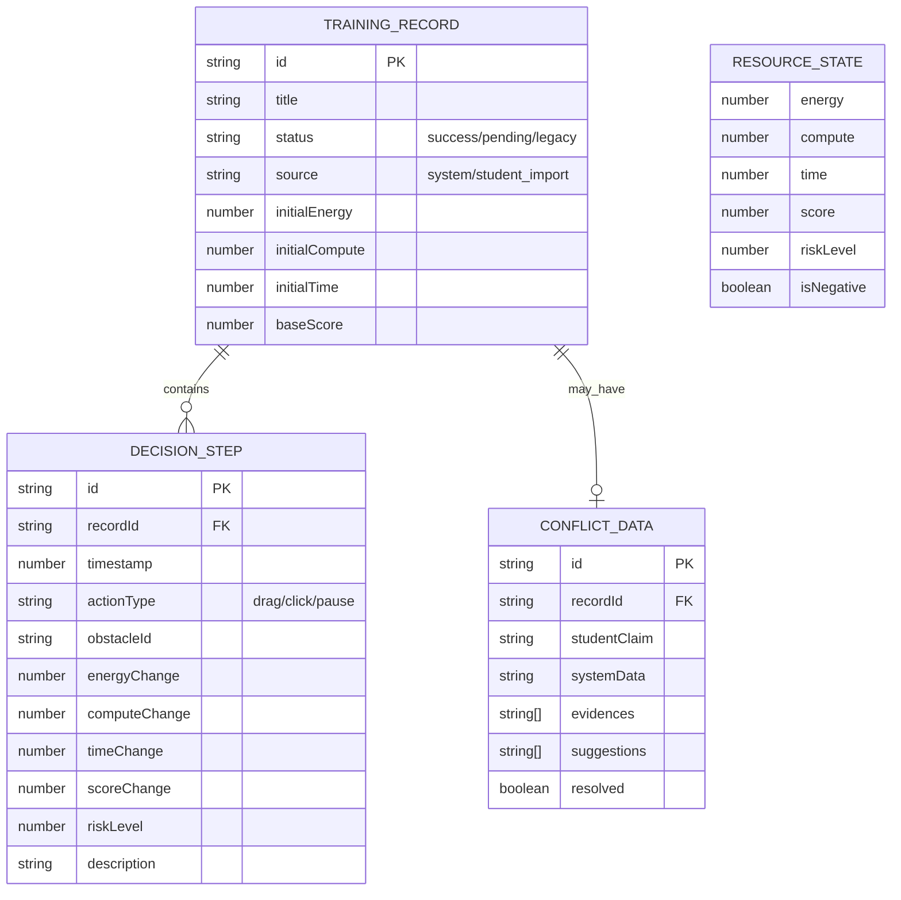

## 1. 架构设计



---

## 2. 技术描述

- **前端框架**：React@18 + TypeScript
- **构建工具**：Vite@5
- **样式方案**：TailwindCSS@3
- **状态管理**：Zustand@4
- **拖拽交互**：@dnd-kit/core
- **路由**：react-router-dom@6
- **后端**：无（纯前端应用，数据使用Mock）
- **数据库**：无（使用localStorage持久化训练进度）

---

## 3. 路由定义

| 路由 | 页面用途 |
|------|----------|
| / | 首页 - 练习记录列表 |
| /train/:recordId | 训练主界面 |
| /conflict/:recordId | 冲突处理面板 |
| /report/:recordId | 结果报告页 |

---

## 4. 数据模型

### 4.1 数据模型定义



### 4.2 TypeScript 类型定义

```typescript
// 训练记录
interface TrainingRecord {
  id: string;
  title: string;
  status: 'success' | 'pending' | 'legacy';
  source: 'system' | 'student_import';
  initialResources: {
    energy: number;
    compute: number;
    time: number;
  };
  baseScore: number;
  obstacles: Obstacle[];
  conflictData?: ConflictData;
  createdAt: string;
}

// 障碍物
interface Obstacle {
  id: string;
  type: 'static' | 'moving' | 'unknown';
  x: number;
  y: number;
  riskWeight: number;
  energyCost: number;
  computeCost: number;
  timeCost: number;
  scoreBonus: number;
}

// 冲突数据
interface ConflictData {
  studentClaim: {
    description: string;
    reportedScore: number;
    reportedResources: { energy: number; compute: number; time: number };
  };
  systemData: {
    description: string;
    calculatedScore: number;
    calculatedResources: { energy: number; compute: number; time: number };
  };
  evidences: {
    source: 'student' | 'system';
    content: string;
    timestamp: string;
  }[];
  suggestions: string[];
  resolved: boolean;
}

// 决策步骤
interface DecisionStep {
  id: string;
  timestamp: number;
  actionType: 'drag' | 'click' | 'pause' | 'resume';
  obstacleId?: string;
  resourceDelta: { energy: number; compute: number; time: number };
  scoreDelta: number;
  riskLevel: number;
  description: string;
}

// 资源状态
interface ResourceState {
  energy: number;
  compute: number;
  time: number;
  score: number;
  riskLevel: number;
  isNegative: boolean;
  negativeWarning?: string;
}
```

---

## 5. 核心业务规则

### 5.1 资源计算规则
- 拖拽障碍物：消耗能源 (-15)、算力 (-10)、时间 (-5)
- 点击避开障碍物：消耗能源 (-5)、算力 (-20)、时间 (-2)
- 资源负数触发：显示业务提醒，暂停自动计分
- 负数处理建议格式："[业务提醒] {资源类型}不足，请检查操作策略或补充{资源类型}"

### 5.2 分数计算规则
- 成功避开障碍物：+50分
- 碰撞障碍物：-30分
- 边界情况（资源刚好为0）：正常计分但标注"临界状态"
- 暂停记录：分数冻结，标注"人为中断"

### 5.3 风险评估规则
- 风险等级 0-3：低/中/高/极高
- 每步操作后重新计算
- 资源 < 30% 自动提升风险等级

### 5.4 冲突处理规则
- 学生记录与系统数据冲突时：并排展示，不自动裁决
- 建议动作格式："建议{动作}，依据是{证据来源}显示{具体内容}"
- 人工确认后：将决策记入历史，保持可追溯
