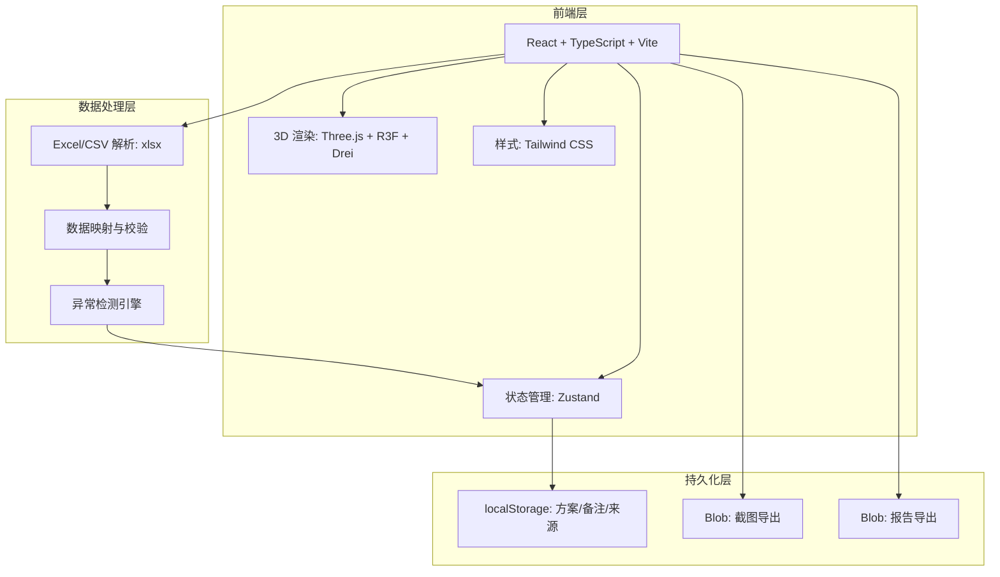
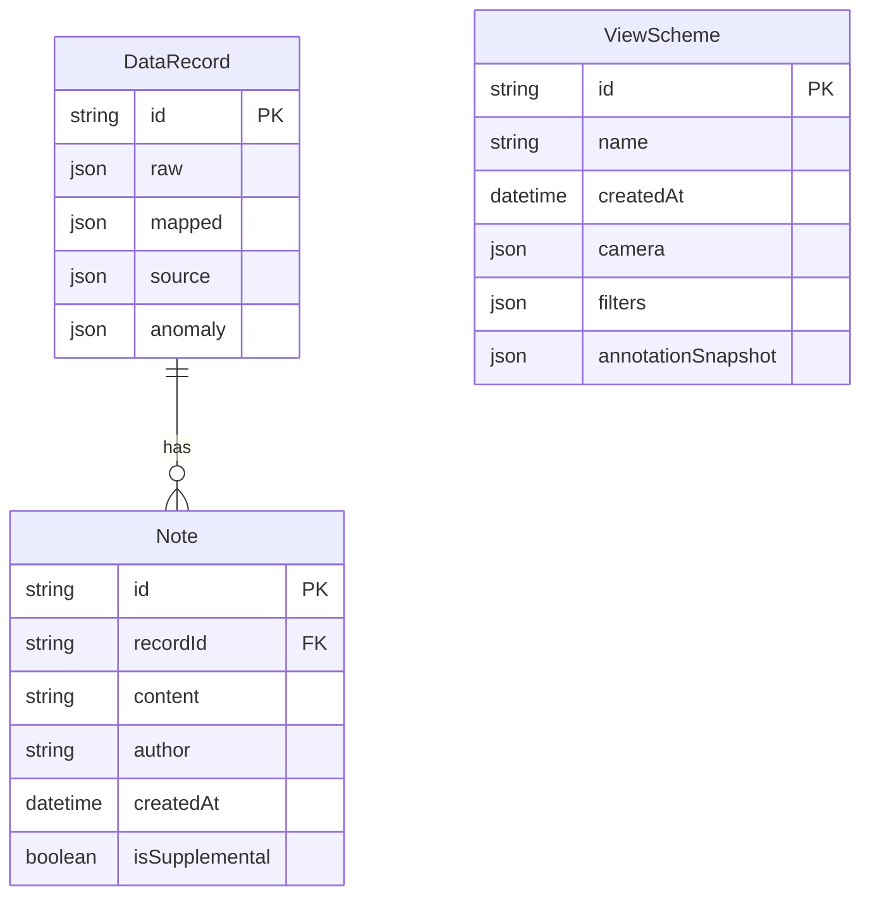

## 1. 架构设计



纯前端架构，无需后端服务。所有数据在浏览器本地处理和持久化。

## 2. 技术说明

- **前端框架**: React 18 + TypeScript + Vite
- **3D 渲染**: three + @react-three/fiber + @react-three/drei + @react-three/postprocessing
- **状态管理**: zustand
- **样式方案**: Tailwind CSS 3
- **数据解析**: xlsx（SheetJS）解析 Excel/CSV
- **截图导出**: html2canvas 或 Three.js renderer.domElement.toDataURL()
- **初始化工具**: vite-init（react-ts 模板）
- **后端**: 无（纯前端，localStorage 持久化）
- **数据库**: 无（localStorage + 内存状态）

## 3. 路由定义

| 路由 | 用途 |
|------|------|
| `/` | 重定向到 `/import` |
| `/import` | 数据导入页：上传文件、预览数据、字段映射 |
| `/cloud` | 3D 云台页：3D 可视化、异常高亮、溯源面板、备注补录 |
| `/schemes` | 方案管理页：保存/加载/删除查看方案 |
| `/export` | 报告导出页：截图导出、报告生成与下载 |

## 4. API 定义

无后端 API，所有数据通过本地状态管理和 localStorage 处理。

### 4.1 核心 Store 定义（Zustand）

```typescript
interface DataRecord {
  id: string
  raw: Record<string, unknown>
  mapped: {
    delta?: number
    gamma?: number
    theta?: number
    vega?: number
    rho?: number
    label?: string
    strike?: number
    maturity?: string
  }
  source: {
    type: 'gis' | 'inspection' | 'excel' | 'manual'
    fileName: string
    originalNotes: string
    importTime: string
  }
  anomaly: {
    isAnomaly: boolean
    anomalyType?: string
    detectedAt?: string
  }
  notes: Array<{
    id: string
    content: string
    author: string
    createdAt: string
    isSupplemental: boolean
  }>
}

interface ViewScheme {
  id: string
  name: string
  createdAt: string
  camera: { position: [number, number, number]; target: [number, number, number] }
  filters: FilterState
  annotationSnapshot: Record<string, string>
}

interface FilterState {
  deltaRange: [number, number]
  gammaRange: [number, number]
  thetaRange: [number, number]
  vegaRange: [number, number]
  sourceTypes: string[]
  anomalyOnly: boolean
}

interface AppStore {
  data: DataRecord[]
  selectedId: string | null
  filters: FilterState
  schemes: ViewScheme[]
  importData: (raw: Record<string, unknown>[], mapping: FieldMapping, sourceInfo: SourceInfo) => void
  addNote: (recordId: string, content: string) => void
  setSelected: (id: string | null) => void
  setFilters: (filters: Partial<FilterState>) => void
  saveScheme: (scheme: Omit<ViewScheme, 'id' | 'createdAt'>) => void
  deleteScheme: (id: string) => void
  loadScheme: (id: string) => void
}
```

## 5. 服务器架构图

无后端服务。

## 6. 数据模型

### 6.1 数据模型定义



### 6.2 数据定义语言

使用 localStorage 存储，键值设计如下：

- `greek-cloud-data`: DataRecord[] — 全部导入数据
- `greek-cloud-schemes`: ViewScheme[] — 保存的查看方案
- `greek-cloud-notes-supplement`: 补录备注的差异数据（记录哪些是补录后新增/修改的）
