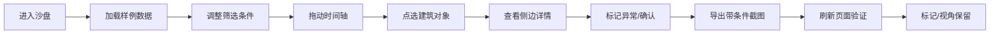
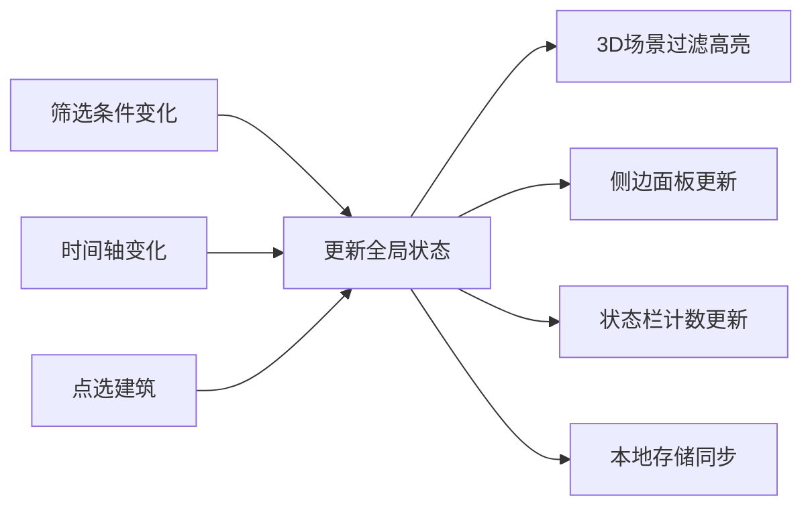
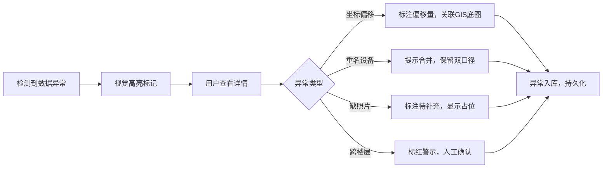

## 1. 产品概述

城市天际线日照沙盘是一款面向设计院的日照分析可视化工具，解决GIS底图筛选与截图条件不一致、异常数据易丢失的问题。通过3D可视化与多维度交互同步，让日照分析从样例到结果全程可追溯。

- 目标用户：设计院规划师、项目评审人员
- 核心价值：条件可追溯、异常不丢失、交接零歧义
- 解决痛点：截图无筛选条件标注、异常在汇总中消失、刷新后标记丢失

## 2. 核心 Features

### 2.1 用户角色

| 角色 | 使用场景 | 核心需求 |
|------|----------|----------|
| 设计院规划师 | 日常日照分析、数据标注 | 快速筛选、异常标记、截图导出 |
| 项目评审人员 | 方案评审、条件追溯 | 条件可见、数据可查、结果可信 |
| 交接人员 | 工作交接、历史回溯 | 标记保留、视角还原、口径一致 |

### 2.2 功能模块

1. **3D沙盘主视图**：城市天际线三维渲染、日照光影模拟、视角交互
2. **筛选控制面板**：多条件筛选、实时同步、状态留存
3. **时间轴控制**：日照时间滑动、光影实时变化、同步联动
4. **侧边信息面板**：建筑详情、异常说明、人工确认入口
5. **导出功能**：带条件水印截图、筛选条件元数据
6. **数据管理**：样例数据、异常标记、本地持久化

### 2.3 页面详情

| 页面名称 | 模块名称 | 功能描述 |
|-----------|-------------|---------------------|
| 主沙盘页 | 3D视口 | Three.js渲染城市建筑，支持拖拽旋转、缩放平移、点选建筑 |
| 主沙盘页 | 顶部筛选栏 | 按区域、楼层、日照时长、异常类型多条件筛选，条件实时显示 |
| 主沙盘页 | 底部时间轴 | 24小时日照时间滑动条，显示当前时间，光影同步变化 |
| 主沙盘页 | 右侧信息面板 | 显示选中建筑详情、异常标记、照片状态、GIS口径说明 |
| 主沙盘页 | 导出工具栏 | 一键导出带筛选条件水印的截图，包含时间戳和条件说明 |
| 主沙盘页 | 状态提示栏 | 显示当前筛选结果计数、异常数量、待确认数量 |

## 3. 核心流程

### 3.1 主操作流程

### 3.2 数据同步机制

### 3.3 异常处理流程

## 4. 样例数据设计

### 4.1 数据异常场景

| 记录ID | 异常类型 | 描述 | 处理方式 |
|--------|----------|------|----------|
| B001 | 顺利记录 | 数据完整，无异常 | 正常显示 |
| B002 | 坐标偏移 | GIS坐标与实际偏移5米 | 标注偏移量，GIS底图补正 |
| B003 | 重名设备 | "冷却塔A"和"冷却塔_A"实为同一设备 | 提示合并，保留双名 |
| B004 | 缺照片 | 建筑立面照片缺失 | 灰色占位，标注待补充 |
| B005 | 跨楼层异常 | 设备登记在3层但实际跨3-5层 | 标红警示，人工确认 |
| B006 | 人工确认 | 日照临界值，需人工复核 | 黄色标记，待确认状态 |
| B007 | 旧口径 | 从2020版GIS底图导入，口径已更新 | 标注旧口径，关联新数据 |

### 4.2 测试用例

| 测试场景 | 输入条件 | 预期结果 |
|----------|----------|----------|
| 空值处理 | 某建筑日照时长为空 | 显示"待测算"，不参与统计，单独计数 |
| 重复项处理 | 同一建筑两条记录 | 自动去重，标注重复来源，保留两条备查 |
| 边界记录 | 日照时长刚好等于标准值 | 特殊标记，边界值提示 |

## 5. 用户界面设计

### 5.1 设计风格

- **主色调**：深空蓝 #0a1628 为背景，日照金 #ffb347 为高亮，警示红 #ff6b6b 为异常，确认黄 #ffd93d 为待确认
- **按钮风格**：扁平化细边框，hover状态轻微发光，active状态凹陷
- **字体**：标题用 Noto Serif SC（专业制图感），正文用 JetBrains Mono（数据清晰）
- **布局风格**：信息密度高，边框分明，科技感仪表盘风格
- **图标风格**：线性细描边图标，2px线宽

### 5.2 页面设计

| 区域 | 布局 | 关键元素 | 动画效果 |
|------|------|----------|----------|
| 3D视口 | 居中占60%宽度 | 建筑模型、日照光影、选中高亮 | 建筑点选脉冲动画、光影平滑过渡 |
| 顶部筛选栏 | 全宽，高度64px | 筛选下拉、条件标签、清除按钮 | 条件添加时标签滑入 |
| 底部时间轴 | 全宽，高度80px | 时间刻度、滑块、当前时间显示 | 滑块拖动时光影实时变化 |
| 右侧面板 | 宽度320px，高度calc(100% - 144px) | 建筑信息、异常列表、操作按钮 | 面板展开/收起动画 |
| 状态栏 | 底部时间轴上方 | 结果计数、异常计数、待确认计数 | 数字变化时滚动动画 |

### 5.3 3D场景设计

- **环境**：程序生成的渐变天空，日出到日落的色调变化，无HDRI
- **光照**：方向光模拟太阳光，随时间轴变化角度和色温；环境光补光
- **相机**：透视相机，初始视角45度俯角，支持OrbitControls
- **建筑**：参数化生成的楼体，不同高度和宽度，玻璃材质带透明度
- **交互**：Raycaster点选，选中建筑外发光，非选中建筑半透明
- **后处理**：Bloom效果用于选中建筑和日照高光

### 5.4 响应式

- 桌面端优先，最小支持1280px宽度
- 右侧面板在小屏可折叠
- 触摸设备支持双指缩放、单指旋转

### 5.5 截图导出样式

- 截图包含：3D场景 + 顶部筛选条件条 + 右下角水印（时间戳 + 条件摘要）
- 导出格式：PNG，分辨率1920x1080
- 水印文字："城市天际线日照沙盘 | 筛选：[条件] | 时间：[YYYY-MM-DD HH:mm]"
