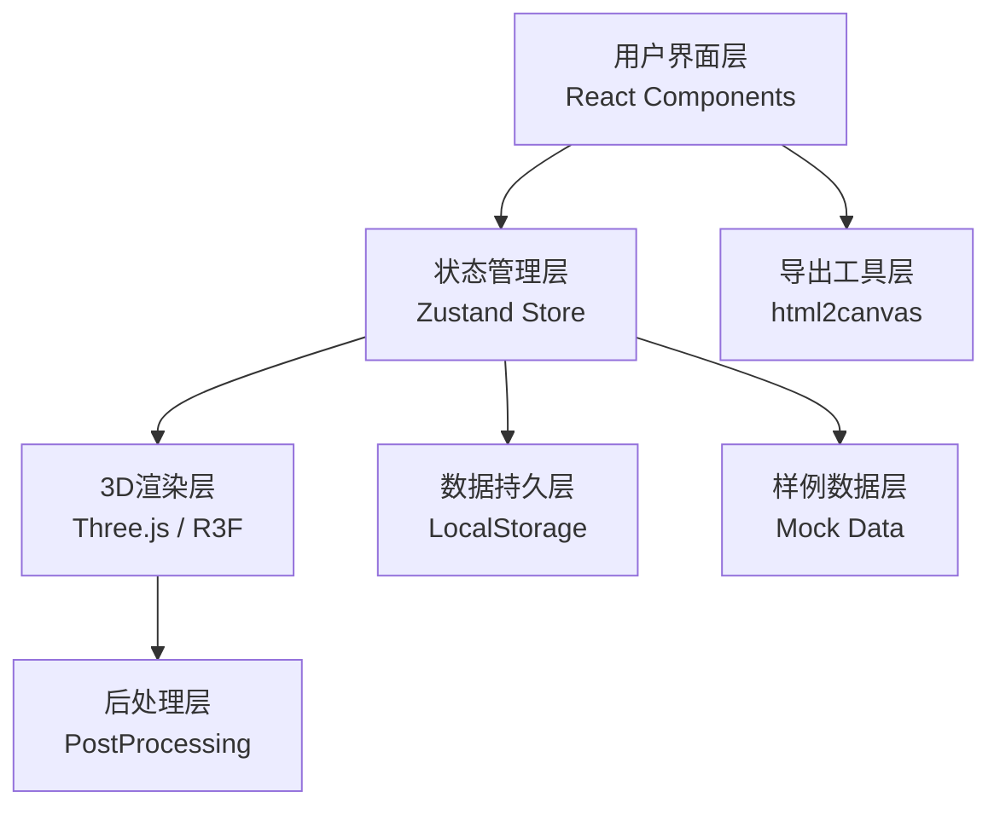

## 1. 架构设计



## 2. 技术选型

### 2.1 核心技术栈

| 层级 | 技术选型 | 版本 | 用途 |
|------|----------|------|------|
| 构建工具 | Vite | ^5.0.0 | 项目构建、开发服务器 |
| 前端框架 | React | ^18.2.0 | UI组件化开发 |
| 语言 | TypeScript | ^5.3.0 | 类型安全 |
| 3D引擎 | three | ^0.160.0 | WebGL 3D渲染 |
| React绑定 | @react-three/fiber | ^8.15.0 | Three.js React封装 |
| 辅助组件 | @react-three/drei | ^9.92.0 | 常用3D组件 |
| 后处理 | @react-three/postprocessing | ^2.15.0 | Bloom等特效 |
| 状态管理 | zustand | ^4.4.0 | 全局状态管理 |
| 样式 | tailwindcss | ^3.4.0 | CSS原子化 |
| 截图导出 | html2canvas | ^1.4.1 | DOM转图片 |

### 2.2 技术决策理由

1. **React + TypeScript**：组件化开发，类型安全，适合复杂交互
2. **@react-three/fiber**：声明式Three.js开发，与React生态无缝集成
3. **zustand**：轻量状态管理，支持选择器和中间件，适合跨组件同步
4. **tailwindcss**：快速构建高密度仪表盘界面，响应式便捷
5. **LocalStorage**：无后端依赖，本地持久化用户标记和视角

## 3. 目录结构

```
src/
├── components/           # React 组件
│   ├── ui/              # 基础UI组件
│   │   ├── FilterBar.tsx       # 顶部筛选栏
│   │   ├── Timeline.tsx        # 底部时间轴
│   │   ├── SidePanel.tsx       # 右侧信息面板
│   │   ├── StatusBar.tsx       # 状态栏
│   │   └── ExportButton.tsx    # 导出按钮
│   └── three/           # 3D相关组件
│       ├── Scene.tsx           # 3D场景容器
│       ├── Buildings.tsx       # 建筑群组
│       ├── Building.tsx        # 单栋建筑
│       ├── SunLight.tsx        # 太阳光
│       └── Ground.tsx          # 地面
├── store/               # 状态管理
│   └── useSandboxStore.ts      # 沙盘全局状态
├── data/                # 数据
│   ├── mockBuildings.ts        # 样例建筑数据
│   └── types.ts                # TypeScript类型定义
├── utils/               # 工具函数
│   ├── export.ts              # 截图导出工具
│   ├── sunPosition.ts         # 太阳位置计算
│   └── storage.ts             # 本地存储封装
├── hooks/               # 自定义Hooks
│   ├── useBuildingSelect.ts    # 建筑点选逻辑
│   └── useSunAnimation.ts      # 日照动画
├── App.tsx              # 根组件
├── main.tsx             # 入口
└── index.css            # 全局样式
```

## 4. 状态管理设计

### 4.1 Store 结构

```typescript
interface SandboxState {
  // 筛选条件
  filters: {
    district: string[];
    floors: [number, number];
    sunlightHours: [number, number];
    anomalyType: string[];
  };
  
  // 时间轴
  currentHour: number; // 0-24
  
  // 选中建筑
  selectedBuildingId: string | null;
  
  // 建筑数据
  buildings: Building[];
  
  // 用户标记
  userMarkers: Record<string, {
    isAnomaly: boolean;
    anomalyNote: string;
    confirmed: boolean;
  }>;
  
  // 相机视角
  cameraState: {
    position: [number, number, number];
    target: [number, number, number];
  };
  
  // Actions
  setFilters: (filters: Partial<SandboxState['filters']>) => void;
  setCurrentHour: (hour: number) => void;
  setSelectedBuilding: (id: string | null) => void;
  toggleBuildingAnomaly: (id: string, note?: string) => void;
  confirmBuilding: (id: string) => void;
  saveCameraState: (pos: [number, number, number], target: [number, number, number]) => void;
  resetAll: () => void;
}
```

### 4.2 数据同步机制

- **筛选条件变化** → 触发 `filteredBuildings` 计算属性 → 3D场景更新可见性
- **时间轴变化** → 计算太阳位置 → 更新光照方向和颜色
- **点选建筑** → 更新 `selectedBuildingId` → 侧边面板更新 + 3D高亮
- **任意状态变化** → 通过 zustand 中间件自动持久化到 LocalStorage

## 5. 数据模型

### 5.1 Building 数据结构

```typescript
interface Building {
  id: string;
  name: string;
  position: [number, number, number]; // x, y, z
  dimensions: [number, number, number]; // width, height, depth
  district: string;
  floors: number;
  sunlightHours: number | null; // null表示空值
  hasPhoto: boolean;
  gisSource: '2020' | '2024'; // 数据口径
  deviceNames: string[]; // 可能重复的设备名
  crossFloors: boolean; // 是否跨楼层
  coordinateOffset: [number, number] | null; // 坐标偏移量
  boundaryCase: boolean; // 是否边界记录
  anomalies: AnomalyType[];
}

type AnomalyType = 
  | 'coordinate_offset'    // 坐标偏移
  | 'duplicate_name'       // 重名设备
  | 'missing_photo'        // 缺照片
  | 'cross_floor'          // 跨楼层
  | 'needs_confirmation'   // 需人工确认
  | 'old_gis_version';     // 旧GIS口径
```

### 5.2 本地存储结构

```typescript
interface PersistedState {
  userMarkers: SandboxState['userMarkers'];
  cameraState: SandboxState['cameraState'];
  filters: SandboxState['filters'];
  currentHour: number;
  lastSaved: string; // ISO timestamp
}
```

## 6. 核心算法

### 6.1 太阳位置计算

```typescript
function calculateSunPosition(hour: number, dayOfYear: number = 172): {
  elevation: number;
  azimuth: number;
  color: THREE.Color;
} {
  // 简化的太阳位置算法
  // hour: 0-24 小时
  // 返回太阳高度角、方位角、光照颜色
}
```

### 6.2 建筑筛选逻辑

```typescript
function filterBuildings(
  buildings: Building[],
  filters: SandboxState['filters']
): Building[] {
  return buildings.filter(b => {
    // 区域筛选
    if (filters.district.length > 0 && !filters.district.includes(b.district)) return false;
    // 楼层范围
    if (b.floors < filters.floors[0] || b.floors > filters.floors[1]) return false;
    // 日照时长（处理空值）
    if (b.sunlightHours !== null) {
      if (b.sunlightHours < filters.sunlightHours[0] || b.sunlightHours > filters.sunlightHours[1]) return false;
    }
    // 异常类型
    if (filters.anomalyType.length > 0) {
      const hasAnomaly = filters.anomalyType.some(t => b.anomalies.includes(t as AnomalyType));
      if (!hasAnomaly) return false;
    }
    return true;
  });
}
```

### 6.3 重复项检测

```typescript
function detectDuplicates(buildings: Building[]): Map<string, Building[]> {
  const nameMap = new Map<string, Building[]>();
  buildings.forEach(b => {
    b.deviceNames.forEach(name => {
      const normalized = name.toLowerCase().replace(/[^a-z0-9]/g, '');
      if (!nameMap.has(normalized)) nameMap.set(normalized, []);
      nameMap.get(normalized)!.push(b);
    });
  });
  // 只保留出现多次的
  for (const [key, list] of nameMap) {
    if (list.length <= 1) nameMap.delete(key);
  }
  return nameMap;
}
```

## 7. 路由定义

| 路由 | 页面 | 说明 |
|------|------|------|
| `/` | 主沙盘页 | 唯一页面，单页应用 |

## 8. 性能优化

1. **建筑实例化**：使用 `InstancedMesh` 渲染大量建筑，减少Draw Call
2. **LOD**：远处建筑使用简化模型
3. **状态选择器**：zustand 使用 shallow 比较，避免不必要重渲染
4. **requestAnimationFrame**：时间轴动画使用 RAF 节流
5. **截图导出**：使用 WebGLRenderer 的 readRenderTargetPixels 直接获取3D画布像素，避免 html2canvas 性能问题

## 9. 测试策略

### 9.1 单元测试

- 太阳位置计算算法
- 建筑筛选逻辑
- 重复项检测算法
- 本地存储工具

### 9.2 集成测试

- 筛选条件 → 3D场景 同步
- 时间轴 → 光照 同步
- 点选 → 侧边面板 同步
- 刷新页面后状态恢复

### 9.3 E2E测试场景

1. 空值测试：B008 日照时长为空，验证显示"待测算"且不参与统计
2. 重复项测试：B003 重名设备，验证去重提示
3. 边界记录测试：B009 日照时长刚好等于标准值，验证边界标记
4. 异常标记持久化：标记异常后刷新，验证标记保留
5. 视角持久化：调整视角后刷新，验证视角恢复
