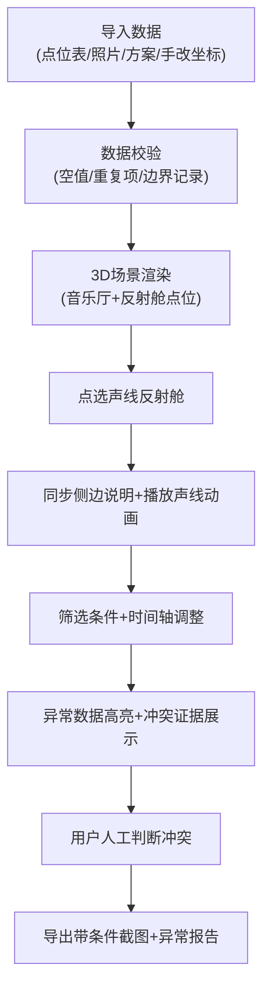

## 1. 产品概述

音乐厅声线反射舱可视化巡检系统，解决声学工程巡检中"照片凑数、条件对不上、例外消失"的痛点。目标用户是声学工程师、巡检人员和评审老师，核心价值是让声线反射舱的每一条判断都可追溯、可验证、可导出。

## 2. 核心 Features

### 2.1 用户角色
| 角色 | 注册方式 | 核心权限 |
|------|----------|----------|
| 巡检人员 | 本地登录 | 导入数据、点选查看、筛选导出 |
| 工程评审 | 本地登录 | 多方案对比、冲突核验、导出报告 |
| 教学老师（林老师） | 本地登录 | 查看错误详情、追溯原始数据 |

### 2.2 Feature Module
1. **3D场景页**：音乐厅模型、声线反射舱点位、现场照片热区、声线路径动画
2. **筛选面板**：多条件筛选、时间轴、方案切换、空值/重复项高亮
3. **侧边说明**：点位详情、照片对照、方案备注、冲突证据展示
4. **导出模块**：带筛选条件的截图、异常报告、数据汇总表

### 2.3 页面详情
| 页面名称 | 模块名称 | Feature description |
|----------|----------|---------------------|
| 3D场景页 | 音乐厅模型 | Three.js渲染，可旋转缩放，声线反射舱用醒目标识 |
| 3D场景页 | 点位交互 | 点击点位高亮，同步显示侧边说明和时间轴位置 |
| 3D场景页 | 声线动画 | 选中反射舱后播放声线路径，验证是否参与判断 |
| 筛选面板 | 条件筛选 | 按点位类型、方案版本、巡检日期、异常状态筛选 |
| 筛选面板 | 时间轴 | 拖拽定位到特定巡检时间，同步场景和侧边栏 |
| 筛选面板 | 方案切换 | V1/V2方案对比，手改坐标高亮显示差异 |
| 侧边说明 | 点位详情 | 坐标、类型、巡检状态、关联照片 |
| 侧边说明 | 冲突提示 | 数据冲突时并排展示两边证据，给出建议动作 |
| 侧边说明 | 错误定位 | 空值/重复项/边界记录标红，说明是哪类点位哪张照片 |
| 导出模块 | 截图导出 | 自动叠加当前筛选条件水印，文件名包含筛选条件 |
| 导出模块 | 报告导出 | 异常清单、冲突汇总、方案对比表 |

## 3. 核心流程

用户导入点位表、现场照片、方案备注和手改坐标 → 系统自动校验空值/重复项/边界记录并标红 → 点选声线反射舱查看详情和声线动画 → 通过筛选条件和时间轴定位特定场景 → 发现数据冲突时并排展示证据不自动决策 → 导出带筛选条件的截图和异常报告

## 4. 用户界面设计

### 4.1 设计风格
- **主色调**：深邃蓝（#1a2942）代表声学空间的沉静，赭石橙（#d4762a）作为声线反射舱的醒目标识
- **辅助色**：警示红（#c0392b）用于异常数据，对比绿（#27ae60）用于正常状态
- **按钮风格**：微立体、圆角8px，hover有微妙阴影变化
- **字体**：标题用"思源黑体 Heavy"，正文用"思源宋体 Regular"，数字用"JetBrains Mono"
- **布局风格**：左侧3D场景占70%，右侧筛选+侧边说明占30%，底部时间轴贯穿
- **交互提示**：像同事间对话，不说"发生错误"，说"哎，这个点位坐标跟照片里对不上，你瞅瞅"

### 4.2 页面设计概述
| 页面名称 | 模块名称 | UI Elements |
|----------|----------|-------------|
| 3D场景页 | 音乐厅模型 | 深色空间感、柔和面光、声学材质感、网格参考线 |
| 3D场景页 | 反射舱点位 | 橙色发光立方体，选中后脉冲动画，显示编号标签 |
| 3D场景页 | 声线动画 | 橙色光束，带粒子拖尾，遇反射舱后改变方向 |
| 筛选面板 | 条件区域 | 卡片式分组，下拉选择+复选框，已选条件高亮 |
| 筛选面板 | 时间轴 | 渐变背景，刻度标记巡检点，异常位置红点标注 |
| 侧边说明 | 点位卡片 | 标题+坐标+状态标签，照片缩略图可点击放大 |
| 侧边说明 | 冲突区域 | 左右分栏对比，中间"VS"标识，底部建议动作按钮 |
| 导出模块 | 导出按钮 | 固定右下角，下拉菜单含截图/报告选项 |

### 4.3 响应式
- Desktop-first，主场景最小支持1280px宽度
- 侧边栏可折叠，折叠后显示图标提示
- 移动端降级为上下布局，3D场景在上，控制区在下

### 4.4 3D Scene Guidance
- **环境**：深色音乐厅内部，弱光环境，墙面有吸音板纹理
- **灯光**：顶光模拟舞台灯光，反射舱自发光，声线用点光源跟随
- **相机**：初始视角为观众席后上方，可轨道控制，点击点位自动对焦
- **构图**：反射舱点位作为视觉焦点，音乐厅模型半透明显示避免干扰
- **交互**：悬停显示点位编号，点击播放声线路径动画
- **后处理**：轻微Bloom效果让声线和反射舱更醒目，SSR提升质感
- **性能**：模型面数控制在5万以内，实例化渲染多个反射舱，目标60fps
