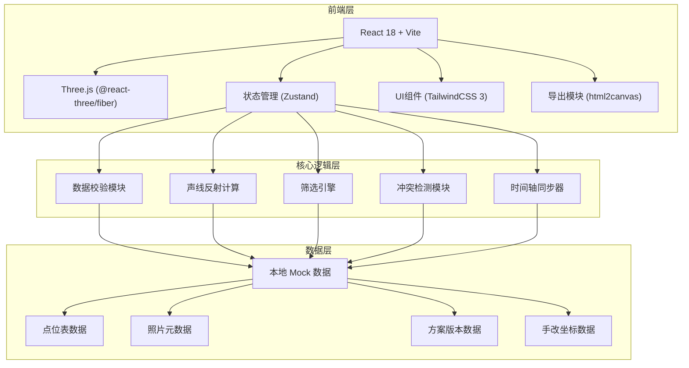
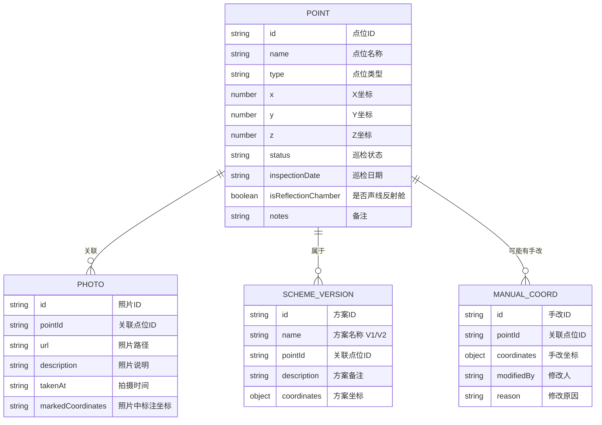

## 1. 架构设计



## 2. 技术描述

- **前端**：React@18.2.0 + TailwindCSS@3.4.1 + Vite@5.0.0
- **3D引擎**：three@0.160.0 + @react-three/fiber@8.15.12 + @react-three/drei@9.92.7 + @react-three/postprocessing@2.15.11
- **状态管理**：zustand@4.4.7
- **导出工具**：html2canvas@1.4.1
- **后端**：无，纯前端本地应用
- **数据库**：无，使用本地JSON Mock数据模拟点位表、照片、方案备注
- **初始化工具**：vite-init

## 3. 路由定义

| Route | Purpose |
|-------|---------|
| / | 主应用页面，包含3D场景、筛选面板、侧边说明、时间轴 |

## 4. 数据模型

### 4.1 数据模型定义



### 4.2 Mock 数据结构

```typescript
// 点位数据 - 包含空值、重复项、边界记录测试用例
interface Point {
  id: string;
  name: string;
  type: 'reflection-chamber' | 'microphone' | 'speaker' | 'boundary';
  x: number | null;
  y: number | null;
  z: number | null;
  status: 'normal' | 'warning' | 'error' | 'empty' | 'duplicate' | 'boundary';
  inspectionDate: string;
  isReflectionChamber: boolean;
  notes: string;
  schemeVersion: 'v1' | 'v2';
  manualCoord?: { x: number; y: number; z: number; modifiedBy: string; reason: string };
  conflictWithPhoto?: boolean;
  photoEvidence?: { photoDesc: string; photoCoord: string };
}

// 筛选条件
interface FilterCriteria {
  types: string[];
  statuses: string[];
  schemeVersions: string[];
  dateRange: [string, string] | null;
  onlyReflectionChambers: boolean;
  onlyAnomalies: boolean;
}

// 时间轴状态
interface TimelineState {
  currentDate: string;
  minDate: string;
  maxDate: string;
  playbackSpeed: number;
  isPlaying: boolean;
}
```

## 5. 核心模块说明

### 5.1 数据校验模块 (src/core/dataValidator.ts)
- 检测空值：x/y/z任一为null标记为empty状态
- 检测重复项：相同坐标+名称标记为duplicate状态
- 检测边界记录：坐标接近音乐厅边界±0.5m标记为boundary状态
- 检测冲突：手改坐标 vs 方案坐标 vs 照片标注不一致时标记conflict

### 5.2 声线反射计算 (src/core/acousticCalculator.ts)
- 从声源发射射线，检测是否与声线反射舱相交
- 计算反射角度和路径，生成动画关键帧
- 验证声线反射舱确实参与了声线路径判断

### 5.3 筛选引擎 (src/core/filterEngine.ts)
- 支持多条件组合筛选
- 筛选结果同步到3D场景、侧边栏、时间轴
- 筛选条件持久化到导出文件名和截图水印

### 5.4 冲突检测模块 (src/core/conflictDetector.ts)
- 对比点位表坐标 vs 现场照片标注 vs 手改坐标 vs 方案坐标
- 不一致时收集所有证据，不自动决策，仅呈现建议动作
- 友好提示："哎，RC-007这个点位，照片里标在(3.2, 1.8)，但点位表写的是(2.8, 1.5)，差了0.4米，建议你再核对下"

### 5.5 时间轴同步器 (src/core/timelineSync.ts)
- 拖拽时间轴时，3D场景切换对应日期的点位状态
- 侧边说明同步显示该日期的巡检记录
- 筛选条件与时间轴联动

## 6. 文件结构

```
src/
├── components/
│   ├── Scene3D/              # 3D场景组件
│   │   ├── ConcertHall.tsx   # 音乐厅模型
│   │   ├── ReflectionChamber.tsx  # 声线反射舱
│   │   ├── SoundRay.tsx      # 声线动画
│   │   └── index.tsx
│   ├── FilterPanel/          # 筛选面板
│   ├── Sidebar/              # 侧边说明
│   │   ├── PointDetail.tsx   # 点位详情
│   │   ├── ConflictView.tsx  # 冲突对比
│   │   └── PhotoViewer.tsx   # 照片查看
│   ├── Timeline/             # 时间轴组件
│   └── ExportButton/         # 导出模块
├── core/                     # 核心逻辑
│   ├── dataValidator.ts
│   ├── acousticCalculator.ts
│   ├── filterEngine.ts
│   ├── conflictDetector.ts
│   └── timelineSync.ts
├── store/                    # Zustand状态
│   └── useAppStore.ts
├── data/                     # Mock数据
│   ├── points.json           # 点位表(含测试用例)
│   ├── photos.json           # 照片元数据
│   ├── schemes.json          # 方案备注
│   └── manualCoords.json     # 手改坐标
├── types/                    # TypeScript类型
├── App.tsx
└── main.tsx
```

## 7. 测试用例内置

Mock数据中特意包含以下测试场景：
1. **空值测试**：RC-003点位z坐标为null
2. **重复项测试**：RC-005和RC-005-dup坐标完全相同
3. **边界记录测试**：RC-009坐标(9.8, 0.1, 4.9)接近音乐厅边界(10, 5, 5)
4. **冲突测试**：RC-007点位表坐标与照片标注不一致，同时存在手改坐标
5. **声线反射舱参与判断**：RC-001, RC-002, RC-004配置为参与声线路径计算
