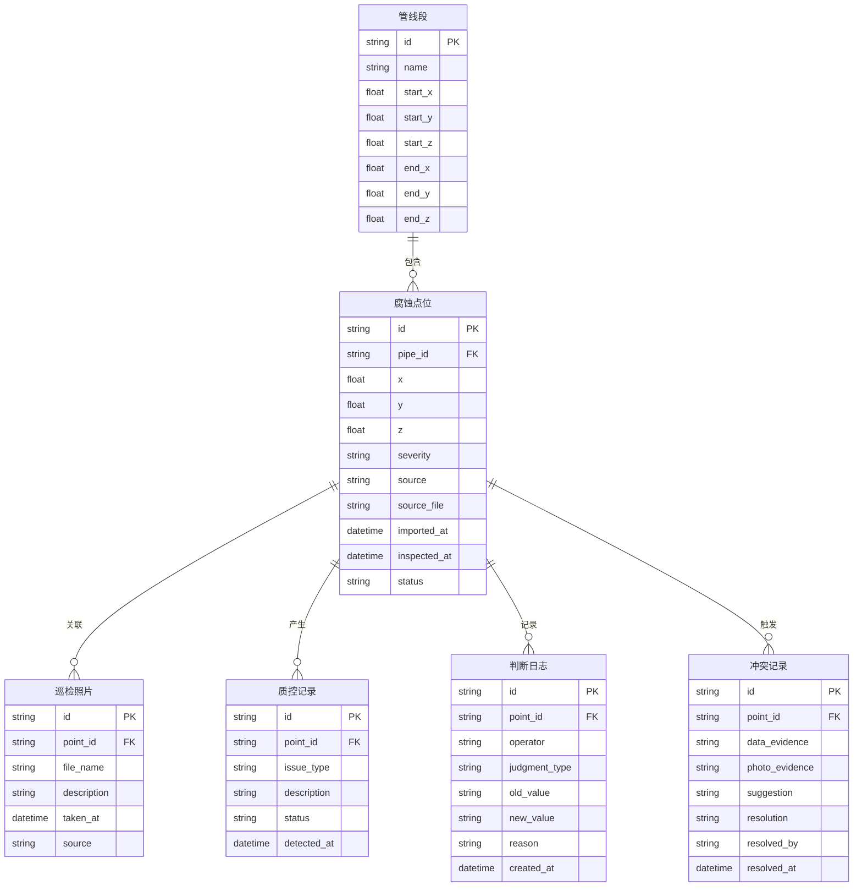

## 1. 架构设计

```mermaid
flowchart TD
    "前端 React + Three.js" --> "Zustand 状态管理"
    "Zustand 状态管理" --> "本地存储 localStorage"
    "前端 React + Three.js" --> "3D 渲染引擎 @react-three/fiber"
    "前端 React + Three.js" --> "数据导入模块"
    "数据导入模块" --> "Excel 解析 (xlsx)"
    "数据导入模块" --> "GIS 数据模拟"
    "数据导入模块" --> "照片批量上传"
    "数据导入模块" --> "质控引擎"
    "质控引擎" --> "空值检测"
    "质控引擎" --> "重复检测"
    "质控引擎" --> "边界检测"
    "质控引擎" --> "冲突检测"
    "截图导出模块" --> "Canvas 合成（3D + 水印叠加）"
```

## 2. 技术说明

- **前端**：React@18 + TypeScript + Tailwind CSS@3 + Vite
- **初始化工具**：vite-init，模板 react-ts
- **后端**：无（纯前端，数据持久化使用 localStorage）
- **数据库**：无（使用 Zustand + localStorage 存储管线数据、质控结果、判断日志）
- **3D 渲染**：three + @react-three/fiber + @react-three/drei + @react-three/postprocessing
- **数据解析**：xlsx（Excel 解析）、FileReader API（照片读取）
- **截图导出**：html2canvas 或 Canvas API 合成
- **图标**：lucide-react
- **状态管理**：zustand

## 3. 路由定义

| 路由 | 用途 |
|------|------|
| `/` | 腐蚀地图总览页，3D 管线场景 + 筛选 + 统计 + 截图导出 |
| `/data` | 数据管理与质控页，导入、质控、冲突仲裁、判断日志 |
| `/record/:id` | 记录详情页，单条记录全链路信息、照片对照、判断历史 |

## 4. 数据模型

### 4.1 数据模型定义



### 4.2 数据定义

```typescript
type Severity = 'none' | 'minor' | 'moderate' | 'severe' | 'critical'
type Source = 'gis' | 'inspection' | 'excel'
type QCStatus = 'pass' | 'null_value' | 'duplicate' | 'boundary' | 'conflict'
type JudgmentType = 'conflict_resolution' | 'anomaly_confirm' | 'data_correction'

interface PipeSegment {
  id: string
  name: string
  startX: number; startY: number; startZ: number
  endX: number; endY: number; endZ: number
}

interface CorrosionPoint {
  id: string
  pipeId: string
  x: number; y: number; z: number
  severity: Severity
  source: Source
  sourceFile: string
  importedAt: string
  inspectedAt: string
  status: 'normal' | 'anomaly' | 'exception'
  depth?: number
  thickness?: number
  description?: string
}

interface InspectionPhoto {
  id: string
  pointId: string
  fileName: string
  description: string
  takenAt: string
  source: Source
  thumbnailUrl?: string
}

interface QCRecord {
  id: string
  pointId: string
  issueType: 'null_value' | 'duplicate' | 'boundary' | 'conflict'
  description: string
  status: 'open' | 'resolved'
  detectedAt: string
  photoId?: string
}

interface JudgmentLog {
  id: string
  pointId: string
  operator: string
  judgmentType: JudgmentType
  oldValue: string
  newValue: string
  reason: string
  createdAt: string
}

interface ConflictRecord {
  id: string
  pointId: string
  dataEvidence: string
  photoEvidence: string
  suggestion: string
  resolution: 'pending' | 'data_side' | 'photo_side' | 'manual_override'
  resolvedBy?: string
  resolvedAt?: string
}

interface FilterState {
  severity: Severity[]
  sources: Source[]
  dateRange: [string, string]
  pipeIds: string[]
  status: string[]
}

interface ScreenshotMeta {
  filters: FilterState
  exportedAt: string
  totalPoints: number
  anomalyCount: number
  exceptionCount: number
  conflictCount: number
}
```

## 5. 模拟数据策略

系统内置一组模拟数据，覆盖以下场景：
- **正常管线段**：3 条管线，各含若干正常点位
- **异常点位**：不同严重度（轻微/中等/较重/严重）各若干
- **例外点位**：2 条例外记录（空值、边界越界），确保在统计中单独可见
- **冲突记录**：1 条巡检照片与导入数据矛盾的记录，用于演示仲裁流程
- **判断日志**：预置若干历史判断记录，用于演示交接回溯
- **巡检照片**：使用占位图片模拟，含描述性文字说明

数据命名模拟"不统一"场景：GIS 用 `PIPE-A01`，Excel 用 `管段A-1`，巡检用 `A区1号`，系统统一映射到 `pipe-a01`。
