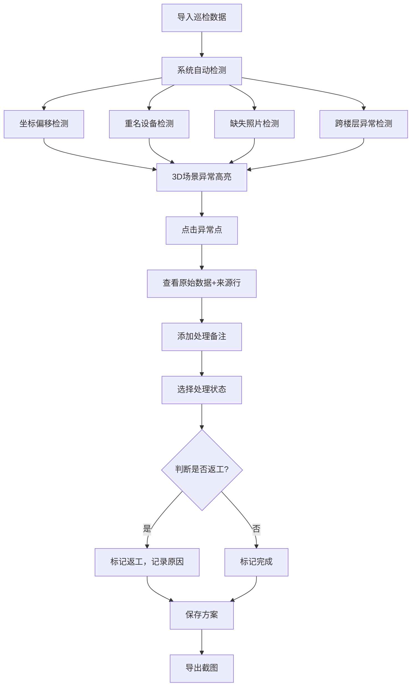
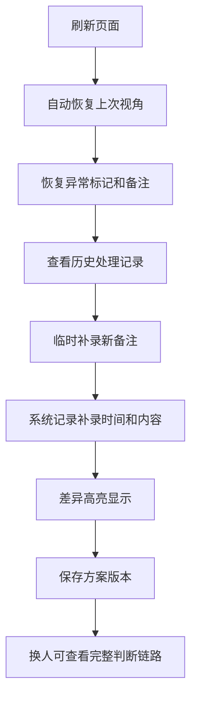

## 1. 产品概述

桥梁施工吊装预演3D可视化系统，解决巡检数据人工核对效率低、坐标系混乱导致分析不可信的问题。通过3D空间位置展示、异常高亮、方案留存和可追溯的判断过程，让数据分析同事阿乔无需手工二次核对。

- **核心目标**：将巡检数据与3D空间模型绑定，保留完整判断链路，异常可追溯到原始记录
- **目标用户**：数据分析人员（阿乔）、施工质量管理人员
- **核心价值**：坐标系统一、异常不丢失、判断过程可回溯、换人交接无障碍

## 2. 核心 Features

### 2.1 Feature Module

1. **3D场景主页面**：桥梁简化模型、吊装设备、异常点高亮、视角控制
2. **异常详情面板**：点击异常点查看原始数据、来源行、处理状态、历史备注
3. **数据检查面板**：自动检测坐标偏移、重名设备、缺失照片、跨楼层异常
4. **方案管理**：方案保存、方案切换、方案对比、截图导出
5. **补录与差异**：临时补录备注、变更历史、差异高亮显示

### 2.3 Page Details

| 页面名称 | 模块名称 | Feature description |
|----------|----------|--------------------|
| 3D场景主页 | 桥梁模型 | 简化桥梁结构，桥墩、桥面、吊装区域分层显示 |
| 3D场景主页 | 设备标记 | 塔吊、起重机等设备位置，支持重名检测提示 |
| 3D场景主页 | 异常高亮 | 红色闪烁标记，按严重程度分级显示 |
| 3D场景主页 | 视角控制 | 旋转、缩放、平移，支持预设视角保存 |
| 异常详情面板 | 原始数据 | 显示来源行号、完整字段、照片缩略图 |
| 异常详情面板 | 处理备注 | 显示历次处理记录、处理人、时间戳 |
| 异常详情面板 | 状态切换 | 待处理/处理中/已完成/返工 |
| 数据检查面板 | 质量检测 | 自动扫描坐标偏移、重名、缺照片、跨楼层异常 |
| 数据检查面板 | 统计汇总 | 分类计数，点击可跳转对应异常点 |
| 方案管理面板 | 方案保存 | 保存当前视角、异常标记、备注 |
| 方案管理面板 | 截图导出 | 导出当前3D视角为PNG，附带标注信息 |
| 补录面板 | 备注补录 | 临时添加备注，记录变更原因 |
| 补录面板 | 差异对比 | 高亮显示补录前后差异，保留完整历史 |

## 3. 核心流程

### 3.1 主流程
阿乔导入一小包预演材料 → 系统自动检测数据质量问题 → 3D场景显示异常高亮 → 点击异常点查看原始数据和来源 → 标记处理状态并添加备注 → 保存方案和截图 → 补录临时备注时系统自动记录差异

### 3.2 异常处理流程

### 3.3 补录与交接流程

## 4. 样例数据设计

样例数据需覆盖以下场景：

| 场景类型 | 具体内容 | 预期行为 |
|----------|----------|----------|
| 坐标偏移 | 设备A上报坐标(x:100,y:200)，实际应为(x:105,y:195) | 系统检测偏移量，3D中虚线连接标注位置和实际位置 |
| 重名设备 | 同一塔吊在表中出现为"塔吊-1号"和"1号塔吊" | 系统提示重名，3D中用相同颜色标记，可合并处理 |
| 缺失照片 | 异常点ID:003无巡检照片 | 显示缺照片警告，提供补上传入口占位 |
| 跨楼层异常 | 异常点同时涉及桥面(2层)和桥墩底部(1层) | 3D中用连线显示跨楼层关联 |
| 顺利处理 | 异常点ID:001：焊缝轻微裂纹，现场已修复 | 标记为已完成，绿色对勾 |
| 返工处理 | 异常点ID:002：吊装偏移超差，第一次处理不合格 | 标记为返工，橙色警告，显示两次处理记录 |
| 空值测试 | 某条记录缺少"设备类型"字段 | 显示空值提示，不崩溃，可手动补填 |
| 重复项测试 | 异常点ID:004和ID:005内容完全相同 | 系统检测重复，提示合并，保留一条记录 |
| 边界记录 | 异常点坐标恰好位于两个区域边界 | 系统正确归属，不出现坐标漂移 |

## 5. 用户界面设计

### 5.1 设计风格
- **主色调**：深工业蓝 (#1e3a5f) 作为背景，体现工程专业感
- **强调色**：异常红 (#e63946)、完成绿 (#2a9d8f)、返工橙 (#f4a261)、提示黄 (#e9c46a)
- **字体**：标题使用 "JetBrains Mono" 等宽字体强化工程感，正文使用 "Noto Sans SC" 保证中文可读性
- **布局**：左侧数据检查面板 + 中央3D场景 + 右侧详情/补录面板的三栏式布局
- **视觉风格**：工业风、低饱和度、高对比度、网格化背景、科技感HUD元素
- **按钮风格**：方角、细边框、点击时微缩+发光反馈

### 5.2 页面设计概述

| 页面名称 | 模块名称 | UI Elements |
|----------|----------|-------------|
| 3D场景主页 | 桥梁模型 | 灰色金属质感，分层半透明显示，线框叠加实体 |
| 3D场景主页 | 异常标记 | 发光球体，呼吸动画，红色闪烁表示未处理 |
| 3D场景主页 | 坐标网格 | 地面网格线，标注坐标刻度，悬浮显示当前坐标 |
| 左侧面板 | 数据检查 | 卡片式布局，每类问题一个卡片，数字醒目 |
| 左侧面板 | 方案列表 | 垂直列表，选中项高亮，显示保存时间 |
| 右侧面板 | 异常详情 | 原始数据表格，来源行号用红色边框标注 |
| 右侧面板 | 补录区域 | 文本输入框，底部显示历史记录时间线 |
| 底部工具栏 | 操作按钮 | 保存方案、导出截图、重置视角、切换视图 |

### 5.3 响应式
- **桌面端优先**：三栏布局，最小支持1280px宽度
- **平板适配**：左右面板可折叠，中央3D区域自适应
- **触摸优化**：3D场景支持手势旋转缩放，按钮最小尺寸44px

### 5.4 3D Scene Guidance
- **环境**：深色工业背景，微弱环境光 + 方向性主光，制造清晰阴影
- **HDRI**：使用偏冷的工业环境贴图，反射在桥梁金属表面
- **光照**：主光从右上方45度照射，辅光补亮底部，异常点自发光
- **相机**：初始视角为45度俯视，可自由旋转，限制最大俯角防止穿模
- **动画**：异常点呼吸灯效果（缩放+透明度变化），选中时弹跳放大
- **后处理**：轻微Bloom效果让异常发光更自然，边缘描边突出选中对象
- **性能**：模型面数控制在5000面以内，实例化渲染重复元素，保持60fps

### 5.5 关键交互细节
1. **悬停异常点**：显示 tooltip 包含异常ID、类型、位置
2. **点击异常点**：相机平滑飞行到最佳视角，右侧面板展开详情
3. **来源行定位**：点击"查看来源"，面板滚动到原始数据对应行，黄色高亮闪烁
4. **状态变更**：下拉选择状态时，自动弹出备注输入框，记录变更原因
5. **补录差异**：新增备注后，历史记录中用绿色背景标注新增内容，左侧显示"补录"标签
6. **方案保存**：自动记录当前相机参数、所有异常状态、备注内容，生成时间戳
7. **截图导出**：在图片右下角自动叠加方案名称、导出时间、异常统计水印
8. **页面刷新**：自动从 localStorage 恢复最后一次方案，包括视角和所有标记
