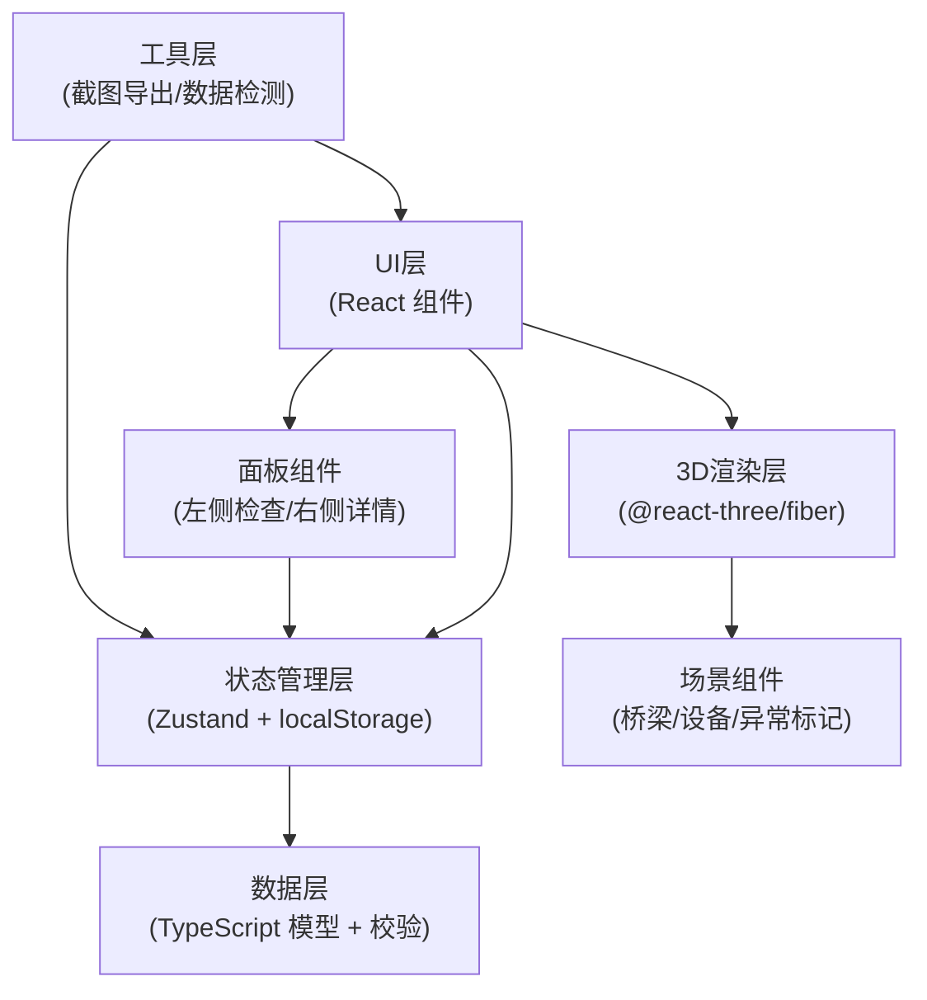
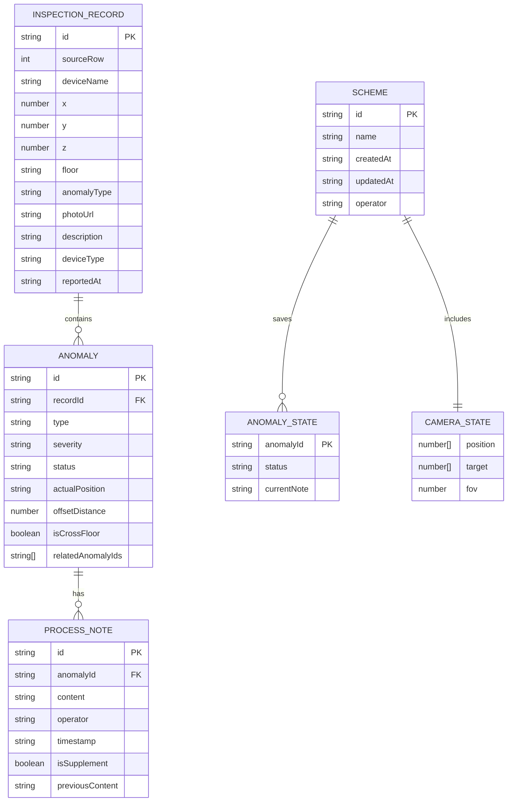

## 1. 架构设计

纯前端单页应用，无后端服务，数据和状态全部存储在浏览器 localStorage。采用分层架构，确保逻辑清晰、可维护。



## 2. 技术描述

- **前端框架**：React@18 + TypeScript
- **构建工具**：Vite@5
- **样式方案**：TailwindCSS@3 + CSS Variables
- **3D引擎**：three@0.160 + @react-three/fiber@8 + @react-three/drei@9
- **状态管理**：Zustand@4（轻量，支持持久化）
- **后处理**：@react-three/postprocessing@2
- **日期处理**：date-fns@3
- **图标**：lucide-react@0.294
- **数据存储**：localStorage（持久化方案、视角、备注）

## 3. 目录结构

```
src/
├── types/              # TypeScript 类型定义
│   └── index.ts
├── store/              # Zustand 状态管理
│   └── useStore.ts
├── data/               # 样例数据和数据检测
│   ├── sampleData.ts
│   └── dataChecker.ts
├── components/
│   ├── ui/             # 通用UI组件
│   ├── three/          # 3D场景组件
│   │   ├── Scene.tsx
│   │   ├── Bridge.tsx
│   │   ├── Equipment.tsx
│   │   └── AnomalyMarker.tsx
│   ├── panels/         # 面板组件
│   │   ├── LeftPanel.tsx
│   │   ├── RightPanel.tsx
│   │   ├── DataCheckCard.tsx
│   │   ├── AnomalyDetail.tsx
│   │   └── SchemeList.tsx
│   └── toolbar/        # 底部工具栏
├── hooks/              # 自定义Hooks
│   ├── useCameraPosition.ts
│   └── useScreenshot.ts
├── utils/              # 工具函数
│   ├── export.ts
│   ├── diff.ts
│   └── coordinate.ts
├── App.tsx
├── main.tsx
└── index.css
```

## 4. 数据模型

### 4.1 核心数据结构



### 4.2 TypeScript 类型定义

```typescript
// 巡检原始记录
interface InspectionRecord {
  id: string;
  sourceRow: number;
  deviceName: string;
  x: number;
  y: number;
  z: number;
  floor: string;
  anomalyType: string;
  photoUrl: string | null;
  description: string;
  deviceType: string | null;
  reportedAt: string;
  _raw: Record<string, unknown>;
}

// 异常点
interface Anomaly {
  id: string;
  recordId: string;
  type: 'coordinate_offset' | 'duplicate_name' | 'missing_photo' | 'cross_floor' | 'normal';
  severity: 'critical' | 'warning' | 'info';
  status: 'pending' | 'processing' | 'completed' | 'rework';
  reportedPosition: { x: number; y: number; z: number };
  actualPosition?: { x: number; y: number; z: number };
  offsetDistance?: number;
  isCrossFloor: boolean;
  relatedFloor?: string[];
  relatedAnomalyIds: string[];
  isDuplicate?: boolean;
  duplicateOf?: string;
  notes: ProcessNote[];
}

// 处理备注
interface ProcessNote {
  id: string;
  anomalyId: string;
  content: string;
  operator: string;
  timestamp: string;
  isSupplement: boolean;
  previousContent?: string;
  statusChange?: string;
}

// 方案
interface Scheme {
  id: string;
  name: string;
  createdAt: string;
  updatedAt: string;
  operator: string;
  cameraState: CameraState;
  anomalyStates: Record<string, AnomalyState>;
}

// 相机状态
interface CameraState {
  position: [number, number, number];
  target: [number, number, number];
  fov: number;
}

// 异常状态
interface AnomalyState {
  status: Anomaly['status'];
  notes: ProcessNote[];
}

// 数据质量检测结果
interface DataCheckResult {
  coordinateOffsets: Array<{ anomaly: Anomaly; distance: number }>;
  duplicateNames: Array<{ names: string[]; anomalyIds: string[] }>;
  missingPhotos: Anomaly[];
  crossFloor: Anomaly[];
  nullValues: Array<{ recordId: string; field: string }>;
  duplicates: Array<{ anomalyIds: string[]; similarity: number }>;
  boundaryRecords: Anomaly[];
}
```

## 5. 状态管理设计

```typescript
// Zustand Store
interface AppState {
  // 数据
  records: InspectionRecord[];
  anomalies: Anomaly[];
  dataCheckResult: DataCheckResult | null;
  
  // 视图
  selectedAnomalyId: string | null;
  hoveredAnomalyId: string | null;
  cameraState: CameraState;
  leftPanelCollapsed: boolean;
  rightPanelCollapsed: boolean;
  
  // 方案
  schemes: Scheme[];
  currentSchemeId: string | null;
  
  // 操作
  loadSampleData: () => void;
  runDataCheck: () => void;
  selectAnomaly: (id: string | null) => void;
  updateAnomalyStatus: (id: string, status: Anomaly['status'], note: string) => void;
  addSupplementNote: (anomalyId: string, content: string) => void;
  saveScheme: (name: string) => void;
  loadScheme: (id: string) => void;
  deleteScheme: (id: string) => void;
  exportScreenshot: () => void;
  setCameraState: (state: CameraState) => void;
  toggleLeftPanel: () => void;
  toggleRightPanel: () => void;
  mergeDuplicateAnomalies: (ids: string[]) => void;
  resetView: () => void;
}
```

## 6. 关键技术实现点

### 6.1 数据质量检测算法

```typescript
// 坐标偏移检测
function detectCoordinateOffset(records: InspectionRecord[]): Anomaly[] {
  // 计算两点间欧氏距离，超过阈值5米标记为偏移
}

// 重名设备检测
function detectDuplicateNames(records: InspectionRecord[]): string[][] {
  // 标准化名称（去符号、转半角）后比较，相似度>0.8视为重名
}

// 缺失照片检测
function detectMissingPhotos(records: InspectionRecord[]): Anomaly[] {
  // photoUrl 为 null 或空字符串
}

// 跨楼层异常检测
function detectCrossFloor(records: InspectionRecord[]): Anomaly[] {
  // z值跨越楼层阈值，或floor字段包含多个楼层
}

// 空值检测
function detectNullValues(records: InspectionRecord[]): Array<{recordId: string; field: string}> {
  // 遍历所有字段，检测null/undefined/空字符串
}

// 重复记录检测
function detectDuplicateRecords(records: InspectionRecord[]): string[][] {
  // 比较关键字段相似度，>0.95视为重复
}

// 边界记录检测
function detectBoundaryRecords(records: InspectionRecord[]): Anomaly[] {
  // 坐标恰好落在区域边界±0.1范围内
}
```

### 6.2 3D 场景实现要点

1. **桥梁模型**：使用 Three.js 基础几何体组合（BoxGeometry、CylinderGeometry），无需外部模型文件
2. **坐标系统**：统一使用米为单位，x轴横向，y轴竖向（高度），z轴纵向
3. **异常标记**：使用 InstancedMesh 批量渲染，提升性能
4. **选中效果**：使用后处理 OutlinePass 实现边缘发光
5. **相机控制**：使用 OrbitControls，限制俯仰角 [10°, 85°]
6. **坐标偏移可视化**：虚线连接上报位置和实际位置，中间显示偏移距离标签

### 6.3 持久化策略

1. **自动保存**：状态变更后 500ms 防抖写入 localStorage
2. **存储键名**：`bridge-hoisting-preview-state`
3. **恢复策略**：页面加载时优先恢复当前方案，无方案时加载样例数据
4. **存储空间**：限制最大 5MB，超出时提示清理旧方案

### 6.4 截图导出实现

1. 使用 `html2canvas` 或直接读取 Three.js renderer.domElement
2. 右下角叠加水印（方案名、时间、异常统计）
3. 导出格式为 PNG，文件名包含时间戳
4. 支持复制到剪贴板和下载到本地

### 6.5 差异对比实现

1. 新增备注时保存 `previousContent` 字段
2. 显示时使用 `diff` 算法计算差异
3. 新增内容用绿色背景高亮，删除内容用红色删除线
4. 补录标记在时间线中用特殊图标区分

## 7. 性能优化

1. **3D 渲染**：
   - 禁用阴影接收（简化模型不需要）
   - 使用 frustumCulling 剔除不可见物体
   - 异常标记使用 InstancedMesh 合并绘制
   - 像素比限制为 1，避免高DPI设备性能损耗

2. **UI 渲染**：
   - 面板内容使用 React.memo 优化重渲染
   - 长列表使用虚拟滚动
   - 状态更新批量处理，减少重渲染次数

3. **存储优化**：
   - 方案数据压缩存储（可选）
   - 定期清理超过 30 天的临时方案
