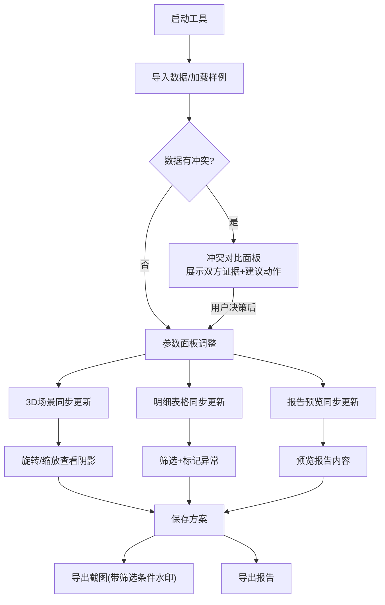

## 1. 产品概述

光伏园区阴影模型是一款面向方案经理的光伏园区阴影分析工具，用于统一管理园区设备参数、可视化阴影分布、自动生成一致性报告，消除手工对数据的二次核对工作。

- 核心问题：周会截图里的参数、明细表和报告数字经常对不上，方案经理需要反复手工校验
- 目标用户：方案经理（如许姐），需要快速导入现场数据、旋转查看3D阴影、导出带条件的截图和报告
- 价值：参数改一处、三处同步变；导入冲突不替用户拍板，摆出证据和建议；筛选截图自带条件标注

## 2. 核心功能

### 2.1 用户角色

| 角色 | 使用方式 | 核心权限 |
|------|---------|---------|
| 方案经理 | 直接使用 | 导入数据、调整参数、查看场景、生成报告、导出截图 |

### 2.2 功能模块

1. **主工作台**：参数面板 + 3D场景视图 + 明细表格 + 报告预览，四区联动
2. **数据导入页**：CSV/JSON导入、冲突检测与对比展示
3. **方案管理页**：保存/加载/切换方案

### 2.3 页面详情

| 页面名称 | 模块名称 | 功能描述 |
|---------|---------|---------|
| 主工作台 | 参数面板 | 编辑园区经纬度、建筑高度、光伏板倾角、朝向、时间日期等参数，修改后实时同步场景/明细/报告 |
| 主工作台 | 3D场景视图 | Three.js渲染光伏园区3D模型，含建筑遮挡阴影，支持旋转/缩放/平移查看 |
| 主工作台 | 明细表格 | 展示每块光伏板/建筑的参数明细，标注空值(灰色)、重复项(橙色)、边界异常(红色) |
| 主工作台 | 报告预览 | 自动生成阴影分析报告，含汇总统计、问题清单、建议，语气像同事之间沟通 |
| 主工作台 | 筛选与导出 | 按条件筛选设备，导出截图自动叠加当前筛选条件水印 |
| 数据导入 | 导入面板 | 拖拽上传CSV/JSON，解析后展示数据预览 |
| 数据导入 | 冲突检测 | 检测与现有数据的冲突（坐标偏移、同名异写等），双方证据并列展示，提供建议动作 |
| 数据导入 | 异常标记 | 标记空值、重复项、跨楼层异常等，不自动修正 |
| 方案管理 | 方案列表 | 展示已保存方案，支持加载/删除/重命名 |
| 方案管理 | 方案保存 | 保存当前参数+数据+场景状态为方案，支持追加备注 |

## 3. 核心流程

用户核心工作流：导入现场数据 → 调整参数面板 → 旋转查看3D阴影 → 确认明细表格 → 保存方案 → 导出带条件截图/报告

## 4. 用户界面设计

### 4.1 设计风格

- 主色调：深蓝灰（#1e293b）+ 暖橙强调色（#f59e0b），工业感+专业感
- 辅助色：石板灰（#64748b）用于面板背景，绿（#22c55e）标记正常，橙（#f97316）标记重复，红（#ef4444）标记异常
- 按钮风格：圆角8px，扁平化，hover时微上浮+阴影
- 字体：标题用 Source Serif 4，正文用 DM Sans，数据用 JetBrains Mono
- 布局：桌面端四区布局，左侧参数面板、中央3D场景、右下明细表格、右侧报告预览

### 4.2 页面设计概览

| 页面名称 | 模块名称 | UI元素 |
|---------|---------|--------|
| 主工作台 | 参数面板 | 深色侧边栏，分组折叠输入框，数字步进器，时间日期选择器 |
| 主工作台 | 3D场景视图 | 中央大面积画布，工具栏(旋转/重置视角/截图)，地面网格，建筑白色半透明，阴影渐变 |
| 主工作台 | 明细表格 | 紧凑表格，行hover高亮，状态标签(空值灰/重复橙/异常红)，内联筛选 |
| 主工作台 | 报告预览 | 右侧抽屉面板，富文本预览，导出按钮组 |
| 数据导入 | 导入面板 | 居中拖拽区，进度条，预览表格，冲突对比卡片 |
| 数据导入 | 冲突对比 | 左右分栏对比，差异高亮，建议动作按钮 |

### 4.3 响应式

桌面优先设计（1920×1080），最小支持1366×768。移动端暂不适配。

### 4.4 3D场景指导

- 环境：清晨/傍晚暖光HDRI，突出阴影效果
- 灯光：方向光模拟太阳光，角度随时间参数变化，开启阴影映射
- 相机：透视相机，初始45度俯视角，OrbitControls旋转/缩放
- 地面：浅灰网格平面，带标尺
- 建筑：白色半透明Box几何体，高度按参数
- 光伏板：深蓝色倾斜平面，按行列排列
- 阴影：实时计算建筑对光伏板的阴影覆盖区域，阴影区域用红色半透明叠加
- 性能：光伏板实例化渲染（InstancedMesh），限制最大5000块

## 5. 数据样例说明

内置一组小样例数据，刻意包含以下问题：
1. **坐标偏移**：某建筑坐标偏移50米（疑似测量错误），系统标记为橙色
2. **同名异写**："逆变器A-01"和"逆变A01"实为同一设备，系统标记为疑似重复
3. **缺照片**：某光伏板photoUrl为空，系统显示灰色占位
4. **跨楼层异常**：一条设备记录的floor字段为"2-3"，跨两个楼层，系统标记为红色边界异常
