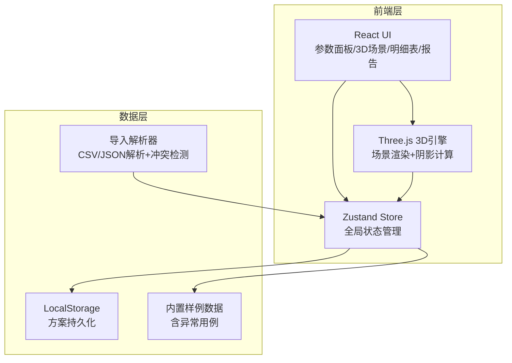
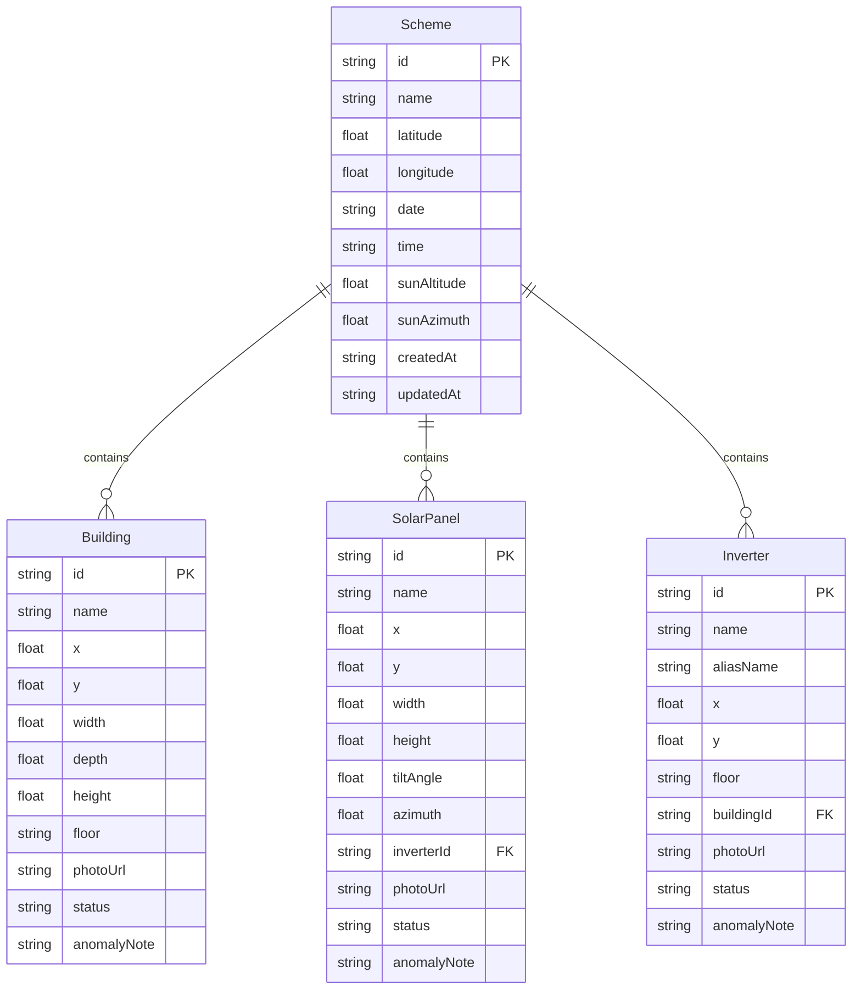

## 1. 架构设计



纯前端架构，无需后端服务。数据通过LocalStorage持久化，3D渲染基于Three.js。

## 2. 技术说明

- 前端：React@18 + TypeScript + Tailwind CSS@3 + Vite
- 3D渲染：Three.js + @react-three/fiber + @react-three/drei
- 状态管理：Zustand
- 初始化工具：vite-init
- 后端：无
- 数据库：无（LocalStorage + 内存）

## 3. 路由定义

| 路由 | 用途 |
|------|------|
| / | 主工作台（参数面板+3D场景+明细表+报告） |
| /import | 数据导入页（上传+冲突检测） |
| /schemes | 方案管理页（保存/加载/删除） |

## 4. 数据模型

### 4.1 数据模型定义



### 4.2 状态枚举

| status值 | 含义 | 显示颜色 |
|----------|------|---------|
| normal | 数据正常 | 绿色 #22c55e |
| duplicate | 疑似重复（同名异写） | 橙色 #f97316 |
| offset | 坐标偏移异常 | 橙色 #f97316 |
| missing_photo | 缺少照片 | 灰色 #94a3b8 |
| boundary | 边界异常（如跨楼层） | 红色 #ef4444 |
| empty_value | 存在空值 | 灰色 #94a3b8 |

### 4.3 冲突记录模型

```typescript
interface ConflictRecord {
  id: string
  type: "coordinate_offset" | "name_mismatch" | "missing_field" | "boundary_cross"
  existingData: Record<string, unknown>
  importedData: Record<string, unknown>
  description: string
  suggestion: string
  resolved: boolean
  userDecision?: "keep_existing" | "use_imported" | "merge"
}
```

## 5. 核心同步机制

参数面板 → Zustand Store → 三方订阅更新：

1. 参数面板修改 → 更新Store → 3D场景重算阴影 → 明细表重算标注 → 报告重新生成
2. 所有计算在内存中完成，无异步请求
3. 冲突数据不自动修正，等用户决策后写入Store

## 6. 截图导出机制

使用 html2canvas 或 Three.js renderer.domElement.toDataURL() 截图，叠加水印层：
- 左上角：当前筛选条件文本
- 右下角：方案名称 + 导出时间
- 底部：工具版本号

## 7. 项目文件结构

```
src/
  components/
    ParameterPanel/       # 参数面板
    Scene3D/              # 3D场景视图
    DetailTable/          # 明细表格
    ReportPreview/        # 报告预览
    ImportPanel/          # 数据导入
    ConflictPanel/        # 冲突对比
    SchemeManager/        # 方案管理
    FilterBar/            # 筛选条件栏
    ExportWatermark/      # 截图水印
  hooks/
    useShadowCalc.ts      # 阴影计算逻辑
    useConflictDetect.ts  # 冲突检测逻辑
    useExportImage.ts     # 截图导出逻辑
  store/
    useSchemeStore.ts     # 方案数据状态
    useUIStore.ts         # UI状态（筛选、当前视图等）
  utils/
    sampleData.ts         # 内置样例数据
    dataValidator.ts      # 数据校验（空值/重复/边界）
    reportGenerator.ts    # 报告文本生成
    importParser.ts       # CSV/JSON解析
  pages/
    Workspace.tsx          # 主工作台
    ImportPage.tsx         # 数据导入
    SchemePage.tsx         # 方案管理
  types/
    index.ts              # 全局类型定义
```
