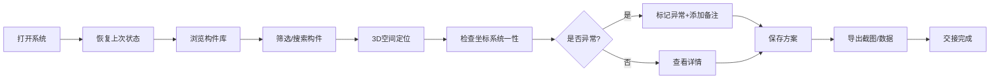

## 1. 产品概述

古建筑修缮构件库是一个3D可视化管理系统，专为方案经理许姐设计，解决CAD导出点位人工核对效率低、坐标系混乱、证据追溯困难的问题。系统支持3D点位空间展示、异常高亮、方案保存与截图导出，每条记录均可追溯来源。

核心价值：
- 减少重复翻查旧记录，提升交接效率
- 直观展示空间位置，避免坐标系混淆
- 完整保留证据链，便于后续追溯

## 2. 核心功能

### 2.1 用户角色

| 角色 | 注册方式 | 核心权限 |
|------|----------|----------|
| 方案经理 | 无需注册 | 点位管理、方案编辑、异常标记、数据导出 |

### 2.2 功能模块

1. **3D可视化主界面**：构件点位展示、视角控制、坐标系切换
2. **构件库管理面板**：点位列表、搜索筛选、来源追溯
3. **方案管理**：方案保存、方案加载、版本对比
4. **异常标记系统**：异常高亮、备注添加、空值/重复项处理
5. **导出功能**：截图导出、数据导出

### 2.3 页面详情

| 页面名称 | 模块名称 | 功能描述 |
|---------|---------|----------|
| 主界面 | 3D场景区 | 展示构件点位空间位置、支持旋转缩放、异常红色高亮、不同坐标系分组显示 |
| 主界面 | 左侧构件库面板 | 列表展示所有构件、支持搜索筛选、显示来源信息、点击定位到3D空间 |
| 主界面 | 右侧详情面板 | 展示选中构件详细信息、可编辑备注、显示处理时间和原始来源 |
| 主界面 | 顶部工具栏 | 方案保存/加载、截图导出、坐标系切换、视角重置 |
| 主界面 | 底部状态栏 | 显示当前坐标系、选中数量、异常数量统计 |

## 3. 核心流程

用户操作流程：
1. 方案经理打开系统，自动加载上次保存的方案和视角
2. 在左侧构件库浏览或搜索构件，可按来源、坐标系、异常状态筛选
3. 点击构件在3D空间定位查看，不同坐标系用不同颜色区分
4. 对空值、重复项、边界记录进行标记和备注
5. 保存当前方案，导出截图用于交接
6. 刷新页面后，所有标记和视角自动恢复

## 4. 用户界面设计

### 4.1 设计风格

- **主色调**：深灰蓝 (#1a1f2e) 作为背景，营造专业沉稳的工程氛围
- **强调色**：古铜金 (#c9a227) 代表古建筑，砖红 (#c94c4c) 标记异常
- **辅助色**：不同坐标系用不同色系区分（蓝、绿、紫）
- **按钮风格**：微立体、圆角8px、悬停有轻微上浮动效
- **字体**：标题用思源宋体（呼应古建筑气质），正文用思源黑体
- **布局**：三栏布局，左中右结构，顶部工具栏
- **图标**：线性图标风格，配色统一

### 4.2 页面设计概述

| 页面名称 | 模块名称 | UI元素 |
|---------|---------|--------|
| 主界面 | 3D场景区 | 深色背景、网格地面、半透明坐标轴、构件球体、异常发光效果、悬浮信息卡 |
| 主界面 | 左侧面板 | 卡片式列表、搜索框、筛选标签、滚动条美化 |
| 主界面 | 右侧面板 | 信息分组展示、来源链接高亮、时间戳、备注编辑区 |
| 主界面 | 顶部工具栏 | 图标按钮、分隔线、方案名称下拉 |

### 4.3 响应性

- Desktop-first 设计，主适配1920×1080分辨率
- 面板可折叠，小屏幕下自动调整布局
- 3D场景始终占据最大可用空间

### 4.4 3D场景指引

- **环境**：深色工程风格背景，低多边形地面网格
- **光照**：主方向光 + 环境光，构件有柔和阴影
- **摄像机**：透视相机，支持轨道控制、自动适配视角
- **动画**：构件选中时有缩放动画，异常标记有呼吸发光效果
- **后处理**：轻微泛光效果增强异常标记视觉
- **性能**：使用实例化渲染，支持1000+构件流畅显示
