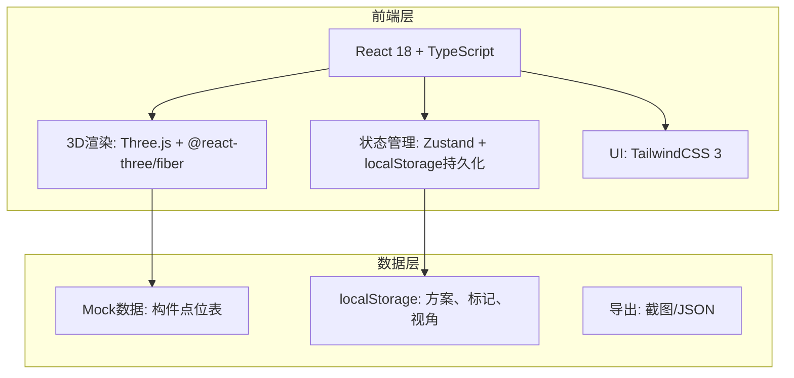
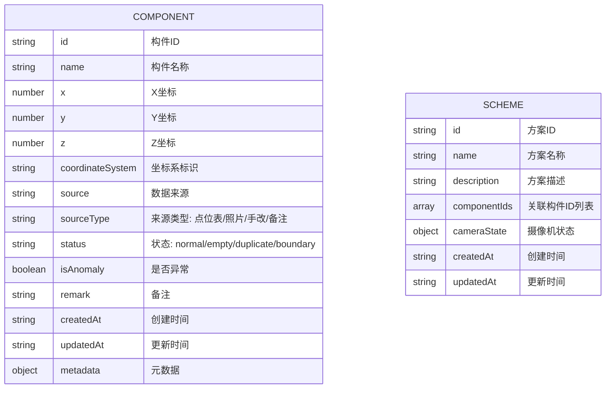

## 1. 架构设计



## 2. 技术描述

- **前端框架**: React@18 + TypeScript + Vite@5
- **3D引擎**: Three@0.160 + @react-three/fiber@8.15 + @react-three/drei@9.92
- **状态管理**: Zustand@4.4 (轻量，支持持久化)
- **UI框架**: TailwindCSS@3.4
- **数据存储**: localStorage (方案保存、异常标记、视角状态)
- **截图导出**: html2canvas + 原生Canvas

## 3. 路由定义

| 路由 | 用途 |
|-----|------|
| / | 主界面 - 3D可视化 + 构件库管理 |

单页应用，无额外路由。

## 4. 数据模型

### 4.1 数据模型定义



### 4.2 TypeScript 类型定义

```typescript
// 构件类型
interface HeritageComponent {
  id: string;
  name: string;
  x: number | null;
  y: number | null;
  z: number | null;
  coordinateSystem: string;
  source: string;
  sourceType: 'point_table' | 'photo' | 'manual_edit' | 'remark';
  status: 'normal' | 'empty' | 'duplicate' | 'boundary';
  isAnomaly: boolean;
  remark: string;
  createdAt: string;
  updatedAt: string;
  metadata: Record<string, any>;
}

// 方案类型
interface Scheme {
  id: string;
  name: string;
  description: string;
  componentIds: string[];
  cameraState: {
    position: [number, number, number];
    target: [number, number, number];
  };
  createdAt: string;
  updatedAt: string;
}

// 应用状态
interface AppState {
  components: HeritageComponent[];
  selectedComponentId: string | null;
  currentScheme: Scheme | null;
  schemes: Scheme[];
  filter: {
    coordinateSystem?: string;
    sourceType?: string;
    isAnomaly?: boolean;
    search?: string;
  };
}
```

## 5. 目录结构

```
src/
├── components/
│   ├── ThreeScene/        # 3D场景组件
│   │   ├── Scene.tsx
│   │   ├── Components.tsx
│   │   └── Ground.tsx
│   ├── Panel/             # 面板组件
│   │   ├── LeftPanel.tsx  # 构件库列表
│   │   ├── RightPanel.tsx # 详情面板
│   │   └── Toolbar.tsx    # 顶部工具栏
│   └── common/            # 通用组件
├── store/
│   └── useStore.ts        # Zustand状态管理
├── types/
│   └── index.ts           # 类型定义
├── data/
│   └── mockData.ts        # 样例数据
├── utils/
│   ├── export.ts          # 导出工具
│   └── coordinate.ts      # 坐标处理
├── App.tsx
├── main.tsx
└── index.css
```

## 6. 核心功能实现要点

1. **坐标系处理**: 不同坐标系的构件用不同颜色分组渲染，坐标系不统一时显示警告标识
2. **状态持久化**: Zustand + localStorage 自动保存方案、标记、视角
3. **异常检测**: 自动检测空值、重复坐标、边界位置构件
4. **截图导出**: 使用 html2canvas 截取整个界面（含3D场景）
5. **来源追溯**: 每条构件记录显示完整来源链路和时间戳
