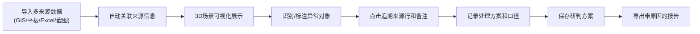

## 1. 产品概述

"无人机编队避障舱"是面向运维工程师的3D可视化运维工具，解决周会材料散乱、追溯困难的问题。通过空间位置可视化、异常高亮、来源追溯和方案保存，让何工无需反复翻找周会截图和历史记录。

- 核心用户：运维工程师（何工）
- 解决痛点：多来源材料（GIS、巡检平板、Excel）命名不统一、异常追溯困难、导出结果与原始材料脱节
- 核心价值：每条避障记录可追溯来源、异常处理有据可依、方案可保存复用

## 2. 核心功能

### 2.1 用户角色

| 角色 | 注册方式 | 核心权限 |
|------|----------|----------|
| 运维工程师 | 本地工具，无需注册 | 导入数据、查看3D场景、标注异常、保存方案、导出报告 |

### 2.2 功能模块

1. **主工作台**：3D场景视图、侧边数据面板、顶部操作工具栏
2. **数据导入**：支持多来源（GIS/平板/Excel/周会截图）数据导入，自动关联来源信息
3. **3D可视化**：无人机编队空间位置展示、避障路径、异常对象高亮
4. **异常追溯**：点击异常对象跳转来源行、显示处理备注和历史记录
5. **方案管理**：保存/加载研判方案、记录处理口径
6. **报告导出**：带原因说明的截图和报告导出，保持与周会材料一致

### 2.3 页面详情

| 页面名称 | 模块名称 | 功能描述 |
|---------|----------|----------|
| 主工作台 | 顶部工具栏 | 数据导入、保存方案、导出报告、视图重置 |
| 主工作台 | 3D场景区 | 无人机编队和障碍物3D展示、旋转/缩放/平移、异常高亮闪烁 |
| 主工作台 | 左侧数据面板 | 编队列表、避障记录、来源标识、状态筛选 |
| 主工作台 | 右侧详情面板 | 选中对象详情、来源追溯、处理备注、历史口径 |
| 主工作台 | 底部状态栏 | 当前方案名称、数据统计、异常计数 |

## 3. 核心流程

### 3.1 主业务流程

### 3.2 异常处理流程

## 4. 用户界面设计

### 4.1 设计风格

- **主色调**：深空蓝 (#0A1628) 背景，科技蓝 (#1E88E5) 为主色，警示红 (#E53935) 用于异常高亮，确认绿 (#43A047) 用于正常状态，待确认橙 (#FB8C00) 用于人工确认
- **按钮风格**：扁平化工业风，细边框，悬停时发光效果，异常按钮带脉冲动画
- **字体**：JetBrains Mono 等宽字体用于数据展示，Noto Sans SC 用于中文说明
- **布局风格**：三栏式工业控制台布局，左侧数据树、中间3D场景、右侧详情卡，深色主题配合网格线背景
- **图标风格**：线性科技感图标，异常状态使用闪烁动效

### 4.2 页面设计概览

| 页面名称 | 模块名称 | UI元素 |
|---------|----------|--------|
| 主工作台 | 3D场景区 | 深空背景、网格地面、无人机立方体模型、障碍物线框模型、异常红色脉冲光晕、选中黄色边框 |
| 主工作台 | 数据面板 | 树形列表、来源标签（GIS/平板/Excel/截图）、状态色块、筛选按钮 |
| 主工作台 | 详情面板 | 卡片式布局、来源追溯区（可点击跳转）、备注输入框、历史口径时间线 |
| 主工作台 | 工具栏 | 图标按钮组、分割线、当前方案名称面包屑 |

### 4.3 响应式

- Desktop-first设计，优先适配1920×1080运维大屏
- 3D场景区自适应，最小宽度800px
- 侧边面板可折叠，支持窄屏查看

### 4.4 3D场景指引

- **环境**：深空蓝背景 + 半透明网格地面，营造科技运维舱氛围
- **光照**：平行主光 + 环境光 + 异常点光源，异常对象有红色光晕
- **相机**：透视相机，支持轨道控制器旋转、缩放、平移，默认45°俯视角
- **交互**：点击对象高亮、悬浮显示tooltip、双击聚焦到对象
- **动画**：异常对象脉冲闪烁、无人机轻微悬浮动画、选中对象边框呼吸效果
- **后期处理**：Bloom发光效果增强科技感，适当的雾效营造空间感
- **模型**：无人机使用简洁立方体+四轴标识，障碍物使用线框立方体，不追求精细度，重点在位置和状态区分

## 5. 数据样例要求

### 5.1 标准样例（3条）

1. **顺利记录**：编号UAV-001，来源GIS图层，状态正常，避障路径清晰
2. **需人工确认**：编号UAV-007，来源巡检平板第23行，状态橙色预警，备注"疑似信号遮挡，需现场确认"
3. **旧口径补录**：编号UAV-012，来源周会截图2026-05-20，状态灰色历史，备注"按2026-05-20周会口径处理，放宽避障距离至5米"

### 5.2 边界测试样例（3条）

1. **空值记录**：缺少坐标或来源信息，界面友好提示，不崩溃
2. **重复项**：同编号多条记录，界面标注重叠冲突，支持合并处理
3. **边界记录**：坐标超出正常范围，显示红色边界警告，支持裁剪或标注

