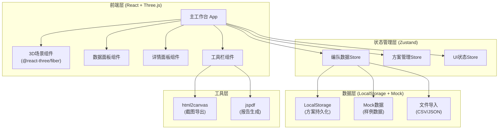

## 1. 架构设计



## 2. 技术选型

- **前端框架**：React@18 + TypeScript
- **构建工具**：Vite@5
- **样式方案**：TailwindCSS@3
- **3D引擎**：Three.js + @react-three/fiber + @react-three/drei
- **3D后处理**：@react-three/postprocessing
- **状态管理**：Zustand
- **导出工具**：html2canvas + jspdf
- **图标**：Lucide React

## 3. 目录结构

```
src/
├── components/
│   ├── Toolbar/           # 顶部工具栏
│   ├── Scene3D/           # 3D场景组件
│   ├── DataPanel/         # 左侧数据面板
│   ├── DetailPanel/       # 右侧详情面板
│   ├── StatusBar/         # 底部状态栏
│   └── common/            # 通用组件
├── store/
│   ├── formationStore.ts  # 编队数据状态
│   ├── schemeStore.ts     # 方案管理状态
│   └── uiStore.ts         # UI状态
├── types/
│   └── index.ts           # TypeScript类型定义
├── data/
│   └── mockData.ts        # 样例数据
├── utils/
│   ├── export.ts          # 导出工具函数
│   └── import.ts          # 导入工具函数
├── App.tsx
├── main.tsx
└── index.css
```

## 4. 路由定义

| 路由 | 用途 |
|------|------|
| / | 主工作台（单页应用，无多路由） |

## 5. 数据模型

### 5.1 TypeScript类型定义

```typescript
// 数据来源类型
type SourceType = 'GIS' | 'TABLET' | 'EXCEL' | 'SCREENSHOT';

// 状态类型
type StatusType = 'NORMAL' | 'WARNING' | 'CONFIRM' | 'HISTORY' | 'ERROR';

// 三维坐标
interface Position3D {
  x: number;
  y: number;
  z: number;
}

// 来源信息
interface SourceInfo {
  type: SourceType;
  name: string;
  reference: string;      // 来源引用：行号/单元格/图层名
  rawData?: string;       // 原始数据快照
}

// 历史口径
interface HistoryNote {
  id: string;
  date: string;
  author: string;
  content: string;
  source: string;         // 历史来源：周会/邮件/现场记录
}

// 无人机对象
interface Drone {
  id: string;
  name: string;
  position: Position3D;
  status: StatusType;
  obstacleDistance: number;   // 避障距离
  source: SourceInfo;
  currentNote: string;        // 当前处理备注
  historyNotes: HistoryNote[];
  createdAt: string;
  updatedAt: string;
}

// 障碍物
interface Obstacle {
  id: string;
  name: string;
  position: Position3D;
  size: Position3D;          // 障碍物尺寸
  source: SourceInfo;
}

// 避障路径
interface AvoidPath {
  id: string;
  droneId: string;
  points: Position3D[];
}

// 研判方案
interface Scheme {
  id: string;
  name: string;
  description: string;
  drones: Drone[];
  obstacles: Obstacle[];
  createdAt: string;
  updatedAt: string;
  author: string;
}
```

### 5.2 数据验证规则

- 空值处理：`position` 为空时标记 `ERROR` 状态，显示占位坐标
- 重复检测：同 `id` 多条记录时标记冲突，保留最新并在备注中标注
- 边界检测：坐标超出 ±100 范围时标记 `WARNING`，在3D场景中显示边界警告

### 5.3 本地存储

- 使用 `localStorage` 存储方案数据，key 为 `uav_schemes`
- 自动保存最近一次方案到 `uav_last_scheme`
- 导出格式支持 JSON（完整数据）和 CSV（仅关键信息）

## 6. 3D场景实现要点

### 6.1 组件结构

- `Scene3D.tsx`：主场景容器
- `DroneModel.tsx`：无人机模型组件
- `ObstacleModel.tsx`：障碍物模型组件
- `PathLine.tsx`：避障路径线
- `GridFloor.tsx`：网格地面

### 6.2 视觉效果实现

1. **异常高亮**：使用 `useFrame` 实现脉冲动画，`EffectComposer` + `Bloom` 实现发光效果
2. **选中状态**：添加黄色线框边框，呼吸动画
3. **避障距离**：使用 `LineSegments` 绘制距离连接线，根据距离变色（<3m红，<5m橙，≥5m绿）
4. **来源标识**：悬浮时显示悬浮卡片，包含来源信息

### 6.3 交互逻辑

- 单击：选中对象，更新右侧详情面板
- 双击：相机平滑聚焦到对象
- 右键拖拽：平移场景
- 滚轮：缩放场景
- 左键拖拽：旋转场景

## 7. 核心功能实现方案

### 7.1 数据导入

- 支持拖拽上传 CSV/JSON 文件
- CSV 格式：`id,name,x,y,z,status,sourceType,sourceRef,obstacleDistance,note`
- 自动解析并关联来源信息
- 导入前预览数据，标注空值和重复项

### 7.2 来源追溯

- 点击来源标签时，在详情面板高亮显示原始数据
- 历史口径按时间倒序展示，可折叠
- 每条追溯记录可复制引用信息

### 7.3 方案保存

- 方案名称必填，描述可选
- 保存时自动记录时间和作者（默认"何工"）
- 支持保存多版本，列表展示所有方案
- 加载方案时自动恢复3D场景视角

### 7.4 报告导出

- **截图导出**：使用 `html2canvas` 捕获3D场景，自动叠加异常说明
- **PDF报告**：使用 `jspdf` 生成，包含：
  - 方案基本信息
  - 3D场景截图
  - 异常列表及原因说明
  - 来源追溯清单
  - 处理口径汇总
- 文件名格式：`无人机编队避障舱_方案名_YYYYMMDD.pdf`

