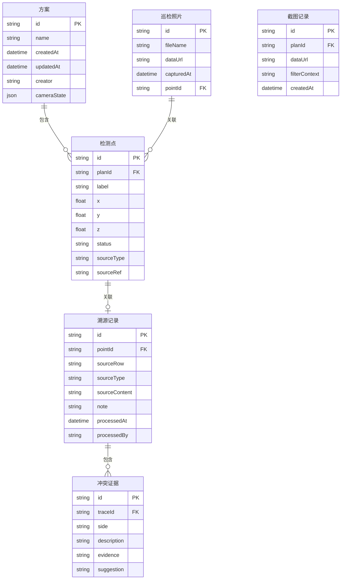

## 1. 架构设计

```mermaid
graph TB
    subgraph "前端层"
        "3D场景" --- "溯源面板"
        "3D场景" --- "截图工具"
        "溯源面板" --- "冲突检测"
        "数据管理" --- "冲突检测"
        "方案工作台" --- "报告视图"
    end
    subgraph "状态层"
        "Zustand Store" --- "IndexedDB 持久化"
    end
    subgraph "数据层"
        "点位表CSV" --> "数据解析器"
        "巡检照片" --> "照片关联器"
        "方案JSON" --> "方案加载器"
    end
    "前端层" --> "状态层"
    "状态层" --> "数据层"
```

## 2. 技术说明

- **前端框架**：React@18 + TypeScript + Vite
- **样式方案**：Tailwind CSS@3
- **3D渲染**：Three.js + @react-three/fiber + @react-three/drei + @react-three/postprocessing
- **状态管理**：Zustand（含 persist 中间件，自动持久化到 IndexedDB）
- **持久化**：idb（IndexedDB 封装），存储方案数据、异常标注、视角状态
- **数据导入**：PapaParse（CSV解析）、xlsx（Excel解析）
- **截图导出**：html2canvas + Three.js renderer.domElement.toDataURL
- **报告导出**：浏览器原生 window.print() + @media print 样式
- **初始化工具**：vite-init（react-ts 模板）
- **后端**：无（纯前端，所有数据本地存储）

## 3. 路由定义

| 路由 | 用途 |
|------|------|
| `/` | 作业立方主界面（3D场景 + 溯源面板 + 工具栏） |
| `/data` | 数据管理面板（点位表导入 + 照片关联 + 冲突检测） |
| `/plans` | 方案工作台（方案列表 + 保存/加载） |
| `/report` | 报告视图（预览 + 导出） |

## 4. 数据模型

### 4.1 核心数据模型定义



### 4.2 数据定义

#### 方案（Plan）

| 字段 | 类型 | 说明 |
|------|------|------|
| id | string | UUID |
| name | string | 方案名称 |
| createdAt | string | 创建时间 ISO8601 |
| updatedAt | string | 更新时间 ISO8601 |
| creator | string | 创建人 |
| cameraState | object | { position: [x,y,z], target: [x,y,z] } |
| viewPreset | string | 当前视角预设名称 |

#### 检测点（InspectionPoint）

| 字段 | 类型 | 说明 |
|------|------|------|
| id | string | UUID，亦为溯源ID |
| planId | string | 所属方案ID |
| label | string | 点位标签 |
| x / y / z | number | 3D空间坐标 |
| status | enum | "normal" / "anomaly" / "conflict" / "pending" |
| sourceType | string | 来源类型："point_table" / "photo" / "manual" |
| sourceRef | string | 来源引用（行号/照片ID等） |

#### 溯源记录（TraceRecord）

| 字段 | 类型 | 说明 |
|------|------|------|
| id | string | UUID |
| pointId | string | 关联检测点ID |
| sourceRow | string | 原始数据行标识 |
| sourceType | string | 来源类型 |
| sourceContent | string | 来源原始内容摘要 |
| note | string | 处理备注（可编辑） |
| processedAt | string | 处理时间 |
| processedBy | string | 处理人 |

#### 冲突证据（ConflictEvidence）

| 字段 | 类型 | 说明 |
|------|------|------|
| id | string | UUID |
| traceId | string | 关联溯源记录ID |
| side | enum | "photo" / "data" |
| description | string | 该侧说法描述 |
| evidence | string | 证据内容（文字/图片URL） |
| suggestion | string | 建议动作 |

## 5. 样例数据设计

为验证"港口岸桥作业立方"参与判断的真实性，内置一套样例数据：

- **岸桥简化模型**：6个主构件（主梁、左立柱、右立柱、前大梁、后大梁、小车），用Box/Cylinder几何体拼接
- **20个检测点**：分布在6个构件上，含5个异常点、2个冲突点
- **点位表CSV**：预置 header = [序号, 构件, 检测项, 测量值, 标准值, 判定, 备注, X, Y, Z]
- **3张模拟巡检照片**：用占位图，其中1张与数据冲突（照片描述"无明显锈蚀" vs 数据判定"锈蚀超标"）
- **2版方案备注**：V1（初版标注）和 V2（修正后），体现续办过程

## 6. 关键技术决策

### 6.1 持久化策略

使用 Zustand + `zustand/middleware` 的 `persist` 中间件，存储介质为 IndexedDB：
- 方案数据（含检测点状态、备注）
- 相机视角状态
- 异常标注状态
- 刷新页面后自动恢复

### 6.2 截图策略

- 3D场景截图：`renderer.domElement.toDataURL('image/png')`
- 叠加水印：Canvas 2D 绘制筛选条件文字 + 时间戳
- 全页截图：html2canvas（用于报告）

### 6.3 冲突检测策略

- 导入点位表时，逐行与已有关联照片的描述字段做文本比对
- 关键字段（判定、测量值）不一致时生成冲突证据
- 冲突展示为左右分栏，不自动解决

### 6.4 报告一致性

- 报告数据直接从 Store 读取，不做二次转换
- 生成报告时运行一致性校验函数，比对汇总数与明细数
- 有差异时在报告中标注红色警告
